# K8s-Install
> https://blog.csdn.net/m0_51720581/article/details/131153894
# 环境规划

**K8s 版本：1.23.6**

**docker 版本：20.10.0**

**容器运行时：docker**

| 主机名    | IP地址        | 机器参数 |
| --------- | ------------- | -------- |
| k8smaster | 192.168.7.100 | 2C 2G    |
| k8snode01 | 192.168.7.101 | 2C 2G    |
| k8snode02 | 192.168.7.102 | 2C 2G    |

# 主机初始化

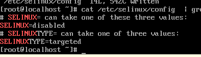

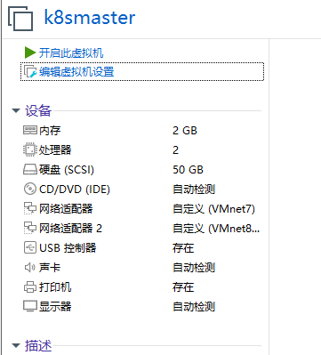

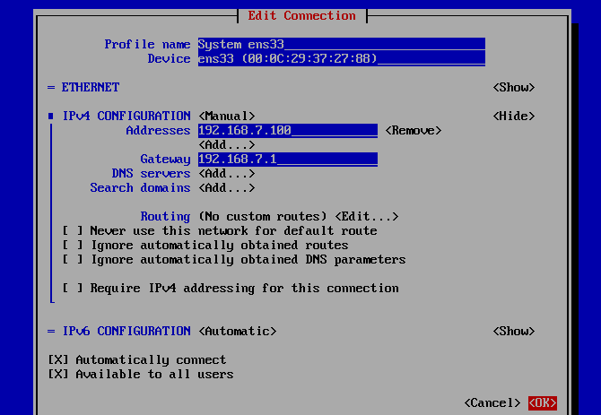


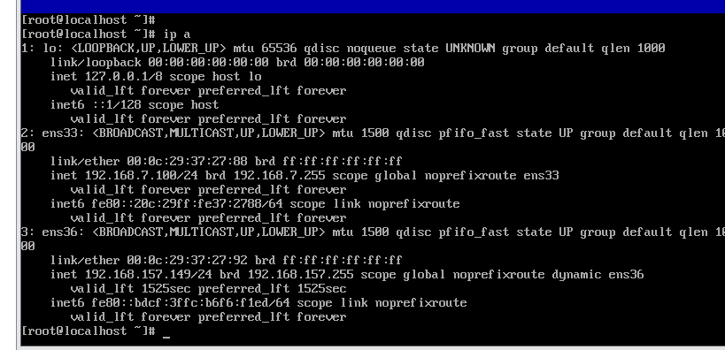

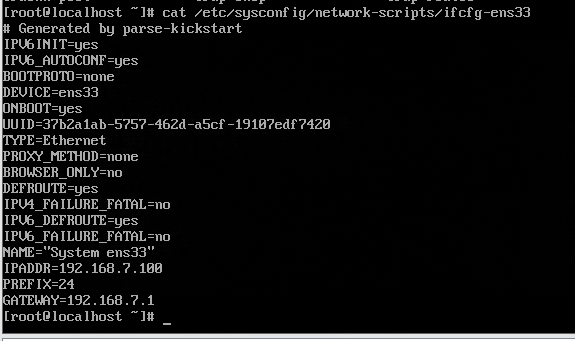

# 集群初始化

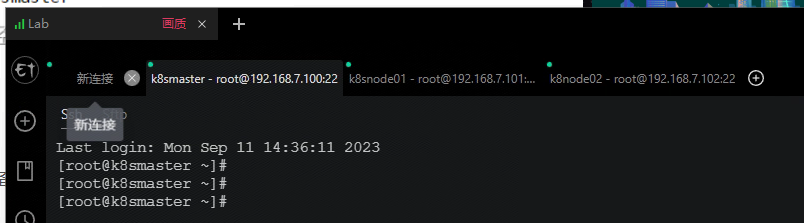

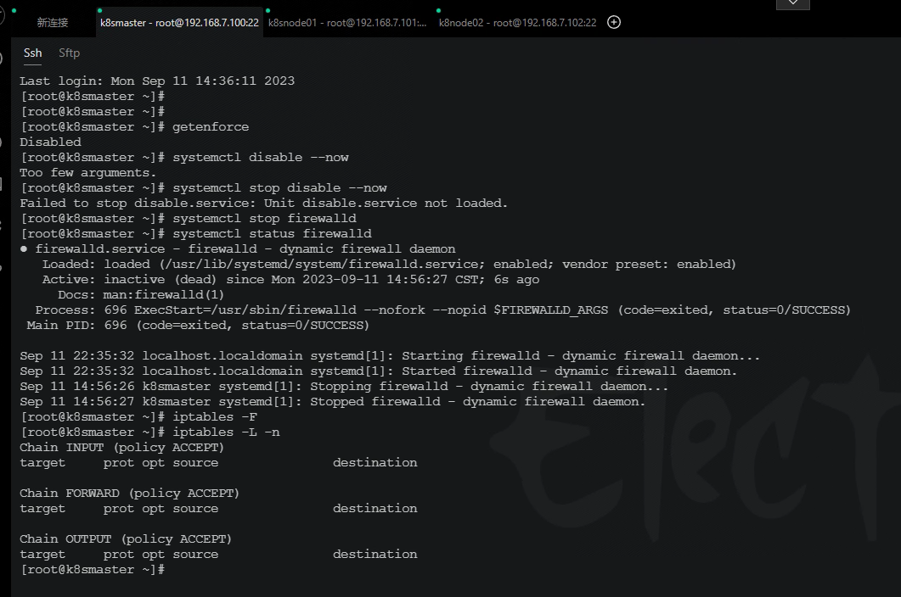

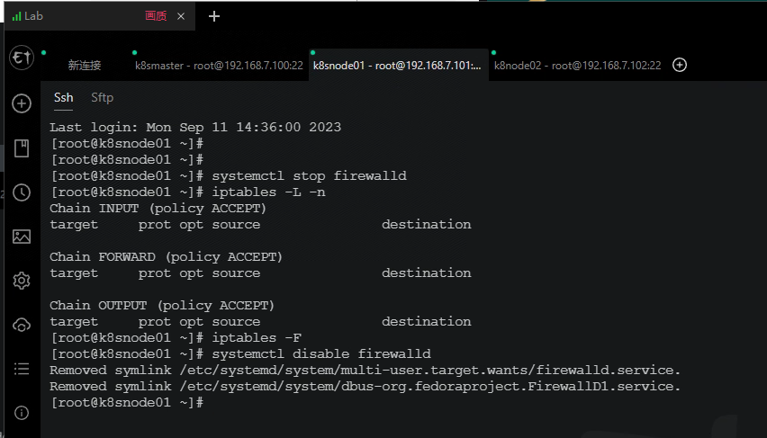

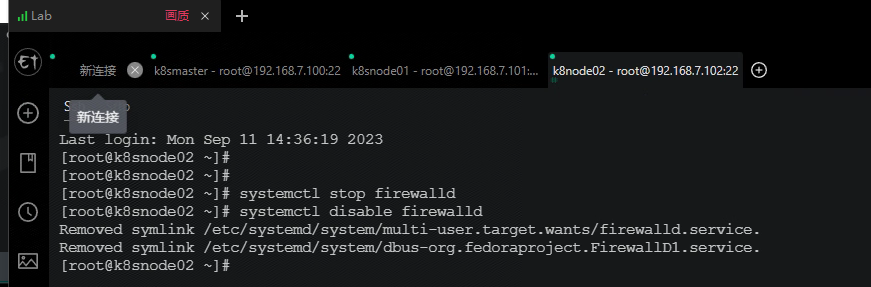

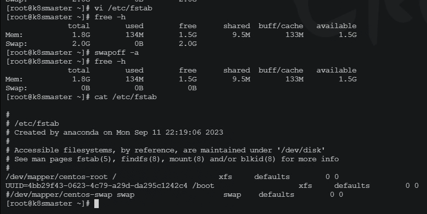

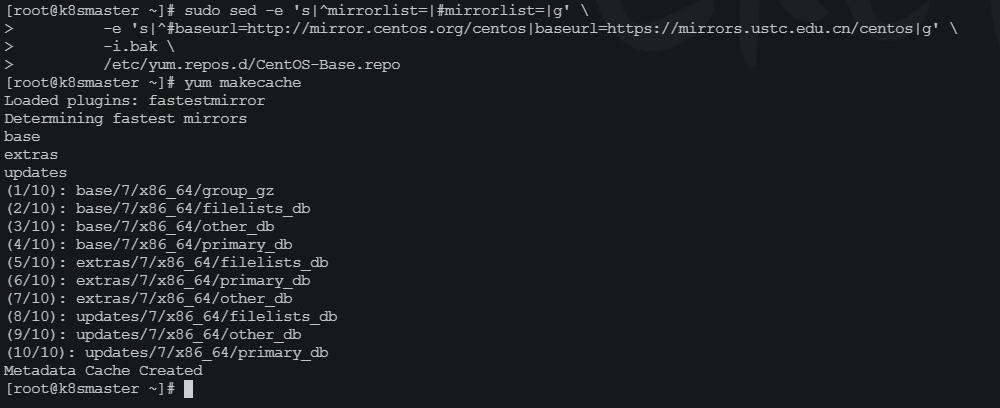

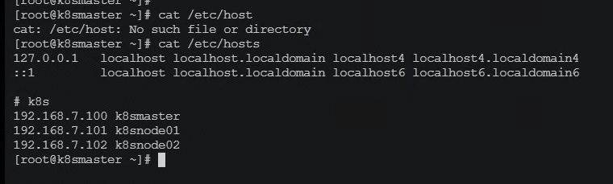

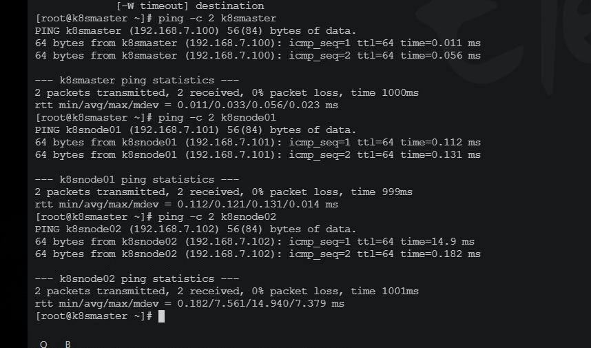

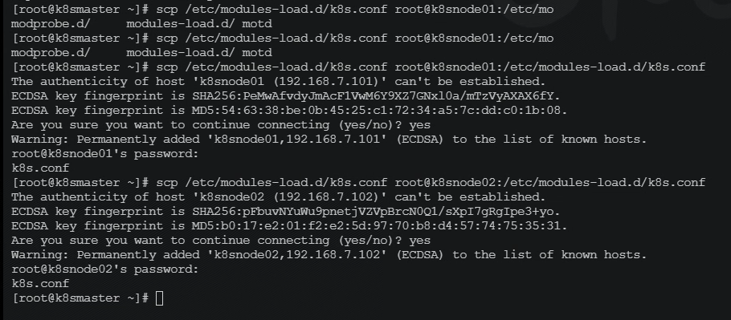

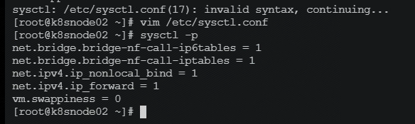

## 安装docker

```powershell
   49  sudo yum install -y yum-utils device-mapper-persistent-data lvm2
   50  sudo yum-config-manager --add-repo https://mirrors.aliyun.com/docker-ce/linux/centos/docker-ce.repo
   51  sudo sed -i 's+download.docker.com+mirrors.aliyun.com/docker-ce+' /etc/yum.repos.d/docker-ce.repo
   52  yum makecache fast
   53  yum install -y docker-ce-20.10.0 docker-ce-cli-20.10.0 containerd.io
   54  history
   
```

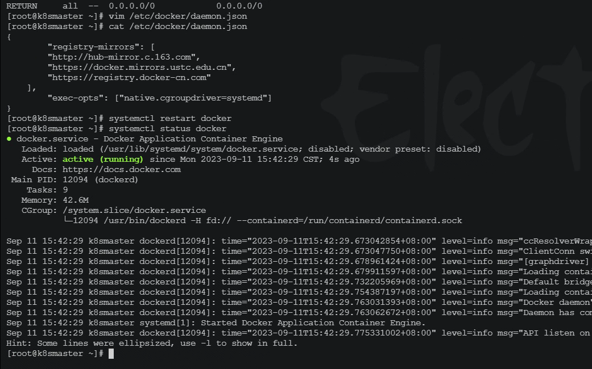

## K8S instll

```shell
cat <<EOF > /etc/yum.repos.d/kubernetes.repo
[kubernetes]
name=Kubernetes
baseurl=https://mirrors.aliyun.com/kubernetes/yum/repos/kubernetes-el7-x86_64/
enabled=1
gpgcheck=1
repo_gpgcheck=1
gpgkey=https://mirrors.aliyun.com/kubernetes/yum/doc/yum-key.gpg https://mirrors.aliyun.com/kubernetes/yum/doc/rpm-package-key.gpg
EOF

yum install -y kubelet-1.23.6 kubeadm-1.23.6 kubectl-1.23.6


# 拉取镜像
docker pull coredns/coredns:1.8.4

# 将镜像改名
docker tag coredns/coredns:1.8.4 registry.aliyuncs.com/google_containers/coredns:v1.8.4

```

## Master 集群初始化

```shell
# 记得改变IP，只要改第一行的IP地址，一般改为master节点地址
kubeadm init \
--apiserver-advertise-address=192.168.7.100 \
--image-repository registry.aliyuncs.com/google_containers \
--service-cidr=10.1.0.0/16 \
--pod-network-cidr=10.244.0.0/16
#--pod-network-cidr=192.168.0.0/16

```

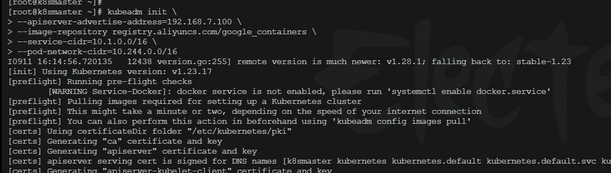

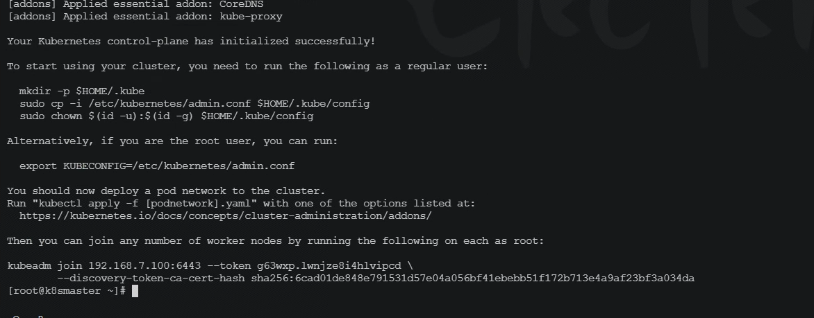

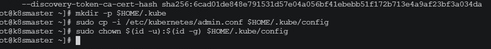

```shell

Your Kubernetes control-plane has initialized successfully!

To start using your cluster, you need to run the following as a regular user:

  mkdir -p $HOME/.kube
  sudo cp -i /etc/kubernetes/admin.conf $HOME/.kube/config
  sudo chown $(id -u):$(id -g) $HOME/.kube/config

Alternatively, if you are the root user, you can run:

  export KUBECONFIG=/etc/kubernetes/admin.conf

You should now deploy a pod network to the cluster.
Run "kubectl apply -f [podnetwork].yaml" with one of the options listed at:
  https://kubernetes.io/docs/concepts/cluster-administration/addons/

Then you can join any number of worker nodes by running the following on each as root:

kubeadm join 192.168.7.100:6443 --token g63wxp.lwnjze8i4hlvipcd \
        --discovery-token-ca-cert-hash sha256:6cad01de848e791531d57e04a056bf41ebebb51f172b713e4a9af23bf3a034da 
```

## node 主机设置

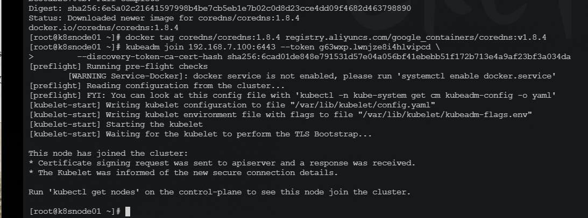

## 完成

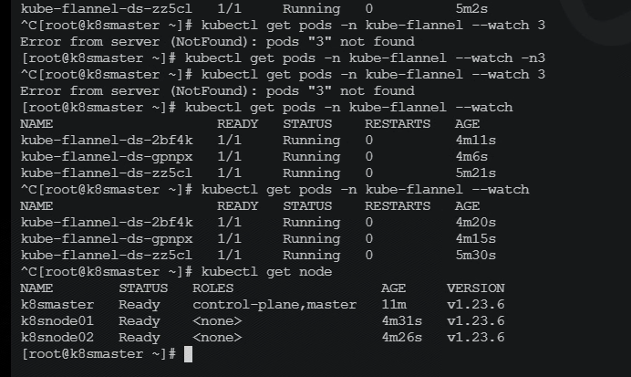

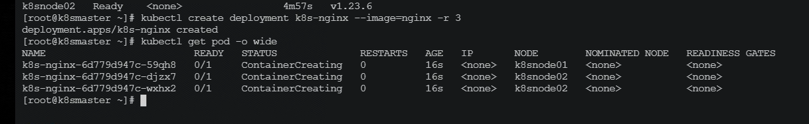

## 其他

###命令补全

```powershell
yum -y install bash-completion
source /usr/share/bash-completion/bash_completion
source <(kubectl completion bash)
echo "source <(kubectl completion bash)" >> ~/.bashrc
```

###NGINX 主机设置 VPN设置

```shell
    1  vi /etc/selinux/config 
    2  init 0
    3  nmtui
    4  exit
    5  ip a
    6  cd /opt/
    7  ls
    8  mkdir pritunl-client
    9  cd pritunl-client/
   10  yum install -y wget
   11  wget https://note.heike07.cn/key/445bc78904f944ea8326527ed9b88424.tar
   12  ls
   13  sudo tee -a /etc/yum.repos.d/pritunl.repo << EOF
[pritunl]
name=Pritunl Stable Repository
baseurl=https://repo.pritunl.com/stable/yum/centos/8/
gpgcheck=1
enabled=1
EOF

   14  cd /etc/yum.repos.d/
   15  ls
   16  ll
   17  cd pritunl.repo 
   18  yum install -y vim
   19  vi pritunl.repo 
   20  yum install -y vim
   21  gpg --keyserver hkp://keyserver.ubuntu.com --recv-keys 7568D9BB55FF9E5287D586017AE645C0CF8E292A
   22  gpg --armor --export 7568D9BB55FF9E5287D586017AE645C0CF8E292A > key.tmp; sudo rpm --import key.tmp; rm -f key.tmp
   23  yum install pritunl-client
   24  yum install pritunl-client Error: Package: pritunl-openvpn-2.5.8-1.el7.centos.x86_64 (pritunl)
   25             Requires: libpkcs11-helper.so.1()(64bit)
   26   You could try using --skip-broken to work around the problem
   27   You could try running: rpm -Va --nofiles --nodigest
   28  yum install libpkcs11-helper
   29  yum install libpkcs11
   30  yum install openssl
   31  yum install pritunl-client
   32  yum install libp11
   33  yum remove openssl
   34  yum install -y epel-release
   35  yum install -y openssl-devel openssl11 openssl1-devel
   36  yum install pritunl-client
   37  cd /opt/pritunl-client/
   38  ls
   39  pritunl-client add 445bc78904f944ea8326527ed9b88424.tar 
   40  pritunl-client list
   41  pritunl-client start cj9gz4mb5jxjpkwx
   42  pritunl-client list
   43  firewall-cmd --list-all
   44  systemctl stop firewalld
   45  systemctl disabled firewalld
   46  systemctl disable firewalld
   47  iptables -L -n
   48  pritunl-client list
   49  pritunl-client stop cj9gz4mb5jxjpkw
   50  pritunl-client list
   51  curl heike07.cn
   52  curl note.heike07.cn
   53  pritunl-client list
   54  pritunl-client start cj9gz4mb5jxjpkwx
   55  pritunl-client list
   56  cd /var/log/
   57  ls
   58  ll
   59  date
   60  tail pritunl-client.log
   61  tail pritunl-client.log.1 
   62  ls
   63  ll
   64  vim pritunl-client.log
   65  tail pritunl-client.log
   66  ss -lnpt | grep openvpn
   67  top
   68* ss -
   69  pritunl-client list
   70  ls
   71  ll
   72  cd /opt/pritunl-client/
   73  ls
   74  ll
   75  vim 445bc78904f944ea8326527ed9b88424.tar 
   76  pritunl-client list
   77  rpm -qa | grep openvpn
   78  rpm -qa | grep pritunl
   79  yum remove pritunl-openvpn-2.5.8-1.el7.centos.x86_64
   80  yum install openvpn
   81  yum install pritunl-openvpn
   82  yum install pritunl-client-1.3.3484
   83  yum install pritunl-client
   84  rpm -qa | grep pritunl
   85  pritunl-client list
   86  ping 192.168.239.10
   87  ip a
   88  history
```

###nginx steam 模块加载代理

```shell
  142  history |grep configure
  143  ./configure --with-http_v2_module --with-http_ssl_module --with-http_sub_module --with-http_stub_status_module --with-http_gzip_static_module --with-pcre --with-stream --with-stream=dynamic --with-stream_ssl_module --with-stream_realip_module
  
 [root@nginx conf]# cat nginx.conf |grep load
load_module /usr/local/nginx/modules/ngx_stream_module.so;
[root@nginx conf]# 

[root@nginx sbin]# ./nginx -V
nginx version: nginx/1.24.0
built by gcc 4.8.5 20150623 (Red Hat 4.8.5-44) (GCC) 
built with OpenSSL 1.0.2k-fips  26 Jan 2017
TLS SNI support enabled
configure arguments: --with-http_v2_module --with-http_ssl_module --with-http_sub_module --with-http_stub_status_module --with-http_gzip_static_module --with-pcre --with-stream --with-stream=dynamic --with-stream_ssl_module --with-stream_realip_module
[root@nginx sbin]#

```

