# K8s rescue plan

## cause

Directly power off all nodes and set Docker to not start up

## Can it be reproduced

Yes, the number of replicates is 2

##Analysis process

Restore the virtual machine to the normal state of the k8s cluster, observe the results of "Docker ps - a" and record it

### master

```shell
# masternode
[root@k8smaster ~]# kubectl get node
NAME        STATUS   ROLES                  AGE     VERSION
k8smaster   Ready    control-plane,master   7d21h   v1.23.6
k8snode01   Ready    <none>                 7d21h   v1.23.6
k8snode02   Ready    <none>                 7d21h   v1.23.6
[root@k8smaster ~]# 
[root@k8smaster ~]# docker ps
CONTAINER ID   IMAGE                                               COMMAND                  CREATED      STATUS      PORTS     NAMES
c12f3abcf771   a4ca41631cc7                                        "/coredns -conf /etc…"   7 days ago   Up 7 days             k8s_coredns_coredns-6d8c4cb4d-6jjh5_kube-system_5880858e-7211-4bbb-8c93-90c928f68622_0
95edcbc13770   a4ca41631cc7                                        "/coredns -conf /etc…"   7 days ago   Up 7 days             k8s_coredns_coredns-6d8c4cb4d-d7st4_kube-system_078cc83a-b061-4e81-bcf6-cf21073cdd4e_0
5b0e34035658   registry.aliyuncs.com/google_containers/pause:3.6   "/pause"                 7 days ago   Up 7 days             k8s_POD_coredns-6d8c4cb4d-6jjh5_kube-system_5880858e-7211-4bbb-8c93-90c928f68622_0
e78106ac1966   registry.aliyuncs.com/google_containers/pause:3.6   "/pause"                 7 days ago   Up 7 days             k8s_POD_coredns-6d8c4cb4d-d7st4_kube-system_078cc83a-b061-4e81-bcf6-cf21073cdd4e_0
68aba3e09b9b   d73868a08083                                        "/opt/bin/flanneld -…"   7 days ago   Up 7 days             k8s_kube-flannel_kube-flannel-ds-zz5cl_kube-flannel_24b1f309-0143-4627-8770-b78a7de603b0_0
95c152dd0190   registry.aliyuncs.com/google_containers/pause:3.6   "/pause"                 7 days ago   Up 7 days             k8s_POD_kube-flannel-ds-zz5cl_kube-flannel_24b1f309-0143-4627-8770-b78a7de603b0_0
d011952c4be9   f21c8d21558c                                        "/usr/local/bin/kube…"   7 days ago   Up 7 days             k8s_kube-proxy_kube-proxy-2g5ql_kube-system_5d508d75-495a-4159-87ee-20a29d9061e7_0
47da71089e8e   registry.aliyuncs.com/google_containers/pause:3.6   "/pause"                 7 days ago   Up 7 days             k8s_POD_kube-proxy-2g5ql_kube-system_5d508d75-495a-4159-87ee-20a29d9061e7_0
282fbf54321f   bc6794cb54ac                                        "kube-scheduler --au…"   7 days ago   Up 7 days             k8s_kube-scheduler_kube-scheduler-k8smaster_kube-system_c02a11b9d6ed102dae71c2a5ba394332_0
c650a0a82e8f   25f8c7f3da61                                        "etcd --advertise-cl…"   7 days ago   Up 7 days             k8s_etcd_etcd-k8smaster_kube-system_3b9b93edf9e5751a1bf3a1e147cce967_0
81b1b2d16921   1dab4fc7b6e0                                        "kube-controller-man…"   7 days ago   Up 7 days             k8s_kube-controller-manager_kube-controller-manager-k8smaster_kube-system_62f82849ccf351f48be952f05e36c490_0
3ddac11bfee8   62bc5d8258d6                                        "kube-apiserver --ad…"   7 days ago   Up 7 days             k8s_kube-apiserver_kube-apiserver-k8smaster_kube-system_ab1948dc99a13b01ea539c462d17491c_0
5b5d34542b36   registry.aliyuncs.com/google_containers/pause:3.6   "/pause"                 7 days ago   Up 7 days             k8s_POD_kube-scheduler-k8smaster_kube-system_c02a11b9d6ed102dae71c2a5ba394332_0
a9bfe6ec50de   registry.aliyuncs.com/google_containers/pause:3.6   "/pause"                 7 days ago   Up 7 days             k8s_POD_kube-controller-manager-k8smaster_kube-system_62f82849ccf351f48be952f05e36c490_0
754226687c2f   registry.aliyuncs.com/google_containers/pause:3.6   "/pause"                 7 days ago   Up 7 days             k8s_POD_kube-apiserver-k8smaster_kube-system_ab1948dc99a13b01ea539c462d17491c_0
4d09932ad92f   registry.aliyuncs.com/google_containers/pause:3.6   "/pause"                 7 days ago   Up 7 days             k8s_POD_etcd-k8smaster_kube-system_3b9b93edf9e5751a1bf3a1e147cce967_0
[root@k8smaster ~]#


[root@k8smaster ~]# docker ps -a
CONTAINER ID   IMAGE                                               COMMAND                  CREATED      STATUS                  PORTS     NAMES
c12f3abcf771   a4ca41631cc7                                        "/coredns -conf /etc…"   7 days ago   Up 7 days                         k8s_coredns_coredns-6d8c4cb4d-6jjh5_kube-system_5880858e-7211-4bbb-8c93-90c928f68622_0
95edcbc13770   a4ca41631cc7                                        "/coredns -conf /etc…"   7 days ago   Up 7 days                         k8s_coredns_coredns-6d8c4cb4d-d7st4_kube-system_078cc83a-b061-4e81-bcf6-cf21073cdd4e_0
5b0e34035658   registry.aliyuncs.com/google_containers/pause:3.6   "/pause"                 7 days ago   Up 7 days                         k8s_POD_coredns-6d8c4cb4d-6jjh5_kube-system_5880858e-7211-4bbb-8c93-90c928f68622_0
e78106ac1966   registry.aliyuncs.com/google_containers/pause:3.6   "/pause"                 7 days ago   Up 7 days                         k8s_POD_coredns-6d8c4cb4d-d7st4_kube-system_078cc83a-b061-4e81-bcf6-cf21073cdd4e_0
68aba3e09b9b   d73868a08083                                        "/opt/bin/flanneld -…"   7 days ago   Up 7 days                         k8s_kube-flannel_kube-flannel-ds-zz5cl_kube-flannel_24b1f309-0143-4627-8770-b78a7de603b0_0
0936e9013449   flannel/flannel                                     "cp -f /etc/kube-fla…"   7 days ago   Exited (0) 7 days ago             k8s_install-cni_kube-flannel-ds-zz5cl_kube-flannel_24b1f309-0143-4627-8770-b78a7de603b0_0
88cf1da60660   flannel/flannel-cni-plugin                          "cp -f /flannel /opt…"   7 days ago   Exited (0) 7 days ago             k8s_install-cni-plugin_kube-flannel-ds-zz5cl_kube-flannel_24b1f309-0143-4627-8770-b78a7de603b0_0
95c152dd0190   registry.aliyuncs.com/google_containers/pause:3.6   "/pause"                 7 days ago   Up 7 days                         k8s_POD_kube-flannel-ds-zz5cl_kube-flannel_24b1f309-0143-4627-8770-b78a7de603b0_0
d011952c4be9   f21c8d21558c                                        "/usr/local/bin/kube…"   7 days ago   Up 7 days                         k8s_kube-proxy_kube-proxy-2g5ql_kube-system_5d508d75-495a-4159-87ee-20a29d9061e7_0
47da71089e8e   registry.aliyuncs.com/google_containers/pause:3.6   "/pause"                 7 days ago   Up 7 days                         k8s_POD_kube-proxy-2g5ql_kube-system_5d508d75-495a-4159-87ee-20a29d9061e7_0
282fbf54321f   bc6794cb54ac                                        "kube-scheduler --au…"   7 days ago   Up 7 days                         k8s_kube-scheduler_kube-scheduler-k8smaster_kube-system_c02a11b9d6ed102dae71c2a5ba394332_0
c650a0a82e8f   25f8c7f3da61                                        "etcd --advertise-cl…"   7 days ago   Up 7 days                         k8s_etcd_etcd-k8smaster_kube-system_3b9b93edf9e5751a1bf3a1e147cce967_0
81b1b2d16921   1dab4fc7b6e0                                        "kube-controller-man…"   7 days ago   Up 7 days                         k8s_kube-controller-manager_kube-controller-manager-k8smaster_kube-system_62f82849ccf351f48be952f05e36c490_0
3ddac11bfee8   62bc5d8258d6                                        "kube-apiserver --ad…"   7 days ago   Up 7 days                         k8s_kube-apiserver_kube-apiserver-k8smaster_kube-system_ab1948dc99a13b01ea539c462d17491c_0
5b5d34542b36   registry.aliyuncs.com/google_containers/pause:3.6   "/pause"                 7 days ago   Up 7 days                         k8s_POD_kube-scheduler-k8smaster_kube-system_c02a11b9d6ed102dae71c2a5ba394332_0
a9bfe6ec50de   registry.aliyuncs.com/google_containers/pause:3.6   "/pause"                 7 days ago   Up 7 days                         k8s_POD_kube-controller-manager-k8smaster_kube-system_62f82849ccf351f48be952f05e36c490_0
754226687c2f   registry.aliyuncs.com/google_containers/pause:3.6   "/pause"                 7 days ago   Up 7 days                         k8s_POD_kube-apiserver-k8smaster_kube-system_ab1948dc99a13b01ea539c462d17491c_0
4d09932ad92f   registry.aliyuncs.com/google_containers/pause:3.6   "/pause"                 7 days ago   Up 7 days                         k8s_POD_etcd-k8smaster_kube-system_3b9b93edf9e5751a1bf3a1e147cce967_0
[root@k8smaster ~]# 

[root@k8smaster ~]# docker ps -a | grep Exited
0936e9013449   flannel/flannel                                     "cp -f /etc/kube-fla…"   7 days ago   Exited (0) 7 days ago             k8s_install-cni_kube-flannel-ds-zz5cl_kube-flannel_24b1f309-0143-4627-8770-b78a7de603b0_0
88cf1da60660   flannel/flannel-cni-plugin                          "cp -f /flannel /opt…"   7 days ago   Exited (0) 7 days ago             k8s_install-cni-plugin_kube-flannel-ds-zz5cl_kube-flannel_24b1f309-0143-4627-8770-b78a7de603b0_0
[root@k8smaster ~]#

[root@k8smaster ~]# kubectl get all
NAME                             READY   STATUS    RESTARTS   AGE
pod/k8s-nginx-6d779d947c-59qh8   1/1     Running   0          7d21h
pod/k8s-nginx-6d779d947c-djzx7   1/1     Running   0          7d21h
pod/k8s-nginx-6d779d947c-wxhx2   1/1     Running   0          7d21h

NAME                 TYPE        CLUSTER-IP   EXTERNAL-IP   PORT(S)   AGE
service/kubernetes   ClusterIP   10.1.0.1     <none>        443/TCP   7d21h

NAME                        READY   UP-TO-DATE   AVAILABLE   AGE
deployment.apps/k8s-nginx   3/3     3            3           7d21h

NAME                                   DESIRED   CURRENT   READY   AGE
replicaset.apps/k8s-nginx-6d779d947c   3         3         3       7d21h
[root@k8smaster ~]# 

[root@k8smaster ~]# systemctl status kubelet
● kubelet.service - kubelet: The Kubernetes Node Agent
   Loaded: loaded (/usr/lib/systemd/system/kubelet.service; enabled; vendor preset: disabled)
  Drop-In: /usr/lib/systemd/system/kubelet.service.d
           └─10-kubeadm.conf
   Active: active (running) since Mon 2023-09-11 16:15:43 CST; 1 weeks 0 days ago
     Docs: https://kubernetes.io/docs/
 Main PID: 13497 (kubelet)
    Tasks: 15
   Memory: 68.3M
   CGroup: /system.slice/kubelet.service
           └─13497 /usr/bin/kubelet --bootstrap-kubeconfig=/etc/kubernetes/bootstrap-kubelet.conf --kubeconfig=/etc/kubernetes/kubelet.conf --config=/var/lib/kubelet/config.yaml --network-plugin=cni --po...

Sep 11 16:24:44 k8smaster kubelet[13497]: I0911 16:24:44.189915   13497 reconciler.go:221] "operationExecutor.VerifyControllerAttachedVolume started for volume \"config-volume\" (UniqueName: \"kubernetes...
Sep 11 16:24:44 k8smaster kubelet[13497]: I0911 16:24:44.189968   13497 reconciler.go:221] "operationExecutor.VerifyControllerAttachedVolume started for volume \"kube-api-access-jrpx5\" (UniqueName: \"ku...
Sep 11 16:24:44 k8smaster kubelet[13497]: I0911 16:24:44.190014   13497 reconciler.go:221] "operationExecutor.VerifyControllerAttachedVolume started for volume \"kube-api-access-pmkws\" (UniqueName: \"ku...
Sep 11 16:24:44 k8smaster kubelet[13497]: I0911 16:24:44.190036   13497 reconciler.go:221] "operationExecutor.VerifyControllerAttachedVolume started for volume \"config-volume\" (UniqueName: \"kubernetes...
Sep 11 16:24:44 k8smaster kubelet[13497]: I0911 16:24:44.711527   13497 pod_container_deletor.go:79] "Container not found in pod's containers" containerID="e78106ac1966087346b4b511a425ac7a3...6b1130cab1b65"
Sep 11 16:24:44 k8smaster kubelet[13497]: map[string]interface {}{"cniVersion":"0.3.1", "hairpinMode":true, "ipMasq":false, "ipam":map[string]interface {}{"ranges":[][]map[string]interface {}{[]map[strin...
Sep 11 16:24:44 k8smaster kubelet[13497]: delegateAdd: netconf sent to delegate plugin:
Sep 11 16:24:44 k8smaster kubelet[13497]: {"cniVersion":"0.3.1","hairpinMode":true,"ipMasq":false,"ipam":{"ranges":[[{"subnet":"10.244.0.0/24"}]],"routes":[{"dst":"10.244.0.0/16"}],"type":"...ype":"bridge"}
Sep 11 16:24:44 k8smaster kubelet[13497]: map[string]interface {}{"cniVersion":"0.3.1", "hairpinMode":true, "ipMasq":false, "ipam":map[string]interface {}{"ranges":[][]map[string]interface {}{[]map[strin...
Sep 11 16:24:44 k8smaster kubelet[13497]: delegateAdd: netconf sent to delegate plugin:
Hint: Some lines were ellipsized, use -l to show in full.
[root@k8smaster ~]# 

[root@k8smaster ~]# ip a
1: lo: <LOOPBACK,UP,LOWER_UP> mtu 65536 qdisc noqueue state UNKNOWN group default qlen 1000
    link/loopback 00:00:00:00:00:00 brd 00:00:00:00:00:00
    inet 127.0.0.1/8 scope host lo
       valid_lft forever preferred_lft forever
    inet6 ::1/128 scope host 
       valid_lft forever preferred_lft forever
2: ens33: <BROADCAST,MULTICAST,UP,LOWER_UP> mtu 1500 qdisc pfifo_fast state UP group default qlen 1000
    link/ether 00:0c:29:37:27:88 brd ff:ff:ff:ff:ff:ff
    inet 192.168.7.100/24 brd 192.168.7.255 scope global noprefixroute ens33
       valid_lft forever preferred_lft forever
    inet6 fe80::20c:29ff:fe37:2788/64 scope link noprefixroute 
       valid_lft forever preferred_lft forever
3: ens36: <BROADCAST,MULTICAST,UP,LOWER_UP> mtu 1500 qdisc pfifo_fast state UP group default qlen 1000
    link/ether 00:0c:29:37:27:92 brd ff:ff:ff:ff:ff:ff
    inet 192.168.157.149/24 brd 192.168.157.255 scope global noprefixroute dynamic ens36
       valid_lft 1671sec preferred_lft 1671sec
    inet6 fe80::bdcf:3ffc:b6f6:f1ed/64 scope link noprefixroute 
       valid_lft forever preferred_lft forever
4: docker0: <NO-CARRIER,BROADCAST,MULTICAST,UP> mtu 1500 qdisc noqueue state DOWN group default 
    link/ether 02:42:e0:e8:64:12 brd ff:ff:ff:ff:ff:ff
    inet 172.17.0.1/16 brd 172.17.255.255 scope global docker0
       valid_lft forever preferred_lft forever
5: flannel.1: <BROADCAST,MULTICAST,UP,LOWER_UP> mtu 1450 qdisc noqueue state UNKNOWN group default 
    link/ether f2:94:58:2b:80:92 brd ff:ff:ff:ff:ff:ff
    inet 10.244.0.0/32 scope global flannel.1
       valid_lft forever preferred_lft forever
    inet6 fe80::f094:58ff:fe2b:8092/64 scope link 
       valid_lft forever preferred_lft forever
6: cni0: <BROADCAST,MULTICAST,UP,LOWER_UP> mtu 1450 qdisc noqueue state UP group default qlen 1000
    link/ether 4e:41:5e:15:b7:62 brd ff:ff:ff:ff:ff:ff
    inet 10.244.0.1/24 brd 10.244.0.255 scope global cni0
       valid_lft forever preferred_lft forever
    inet6 fe80::4c41:5eff:fe15:b762/64 scope link 
       valid_lft forever preferred_lft forever
7: vetha9ed6409@if2: <BROADCAST,MULTICAST,UP,LOWER_UP> mtu 1450 qdisc noqueue master cni0 state UP group default 
    link/ether 76:e0:63:90:81:7d brd ff:ff:ff:ff:ff:ff link-netnsid 0
    inet6 fe80::74e0:63ff:fe90:817d/64 scope link 
       valid_lft forever preferred_lft forever
8: veth7a07689e@if2: <BROADCAST,MULTICAST,UP,LOWER_UP> mtu 1450 qdisc noqueue master cni0 state UP group default 
    link/ether c6:66:fb:c0:75:cd brd ff:ff:ff:ff:ff:ff link-netnsid 1
    inet6 fe80::c466:fbff:fec0:75cd/64 scope link 
       valid_lft forever preferred_lft forever
[root@k8smaster ~]# 

[root@k8smaster ~]# route
-bash: route: command not found
[root@k8smaster ~]# 

[root@k8smaster ~]# iptables -L -n
Chain INPUT (policy ACCEPT)
target     prot opt source               destination         
KUBE-NODEPORTS  all  --  0.0.0.0/0            0.0.0.0/0            /* kubernetes health check service ports */
KUBE-EXTERNAL-SERVICES  all  --  0.0.0.0/0            0.0.0.0/0            ctstate NEW /* kubernetes externally-visible service portals */
KUBE-FIREWALL  all  --  0.0.0.0/0            0.0.0.0/0           

Chain FORWARD (policy ACCEPT)
target     prot opt source               destination         
KUBE-FORWARD  all  --  0.0.0.0/0            0.0.0.0/0            /* kubernetes forwarding rules */
KUBE-SERVICES  all  --  0.0.0.0/0            0.0.0.0/0            ctstate NEW /* kubernetes service portals */
KUBE-EXTERNAL-SERVICES  all  --  0.0.0.0/0            0.0.0.0/0            ctstate NEW /* kubernetes externally-visible service portals */
DOCKER-USER  all  --  0.0.0.0/0            0.0.0.0/0           
DOCKER-ISOLATION-STAGE-1  all  --  0.0.0.0/0            0.0.0.0/0           
ACCEPT     all  --  0.0.0.0/0            0.0.0.0/0            ctstate RELATED,ESTABLISHED
DOCKER     all  --  0.0.0.0/0            0.0.0.0/0           
ACCEPT     all  --  0.0.0.0/0            0.0.0.0/0           
ACCEPT     all  --  0.0.0.0/0            0.0.0.0/0           
FLANNEL-FWD  all  --  0.0.0.0/0            0.0.0.0/0            /* flanneld forward */

Chain OUTPUT (policy ACCEPT)
target     prot opt source               destination         
KUBE-SERVICES  all  --  0.0.0.0/0            0.0.0.0/0            ctstate NEW /* kubernetes service portals */
KUBE-FIREWALL  all  --  0.0.0.0/0            0.0.0.0/0           

Chain DOCKER (1 references)
target     prot opt source               destination         

Chain DOCKER-ISOLATION-STAGE-1 (1 references)
target     prot opt source               destination         
DOCKER-ISOLATION-STAGE-2  all  --  0.0.0.0/0            0.0.0.0/0           
RETURN     all  --  0.0.0.0/0            0.0.0.0/0           

Chain DOCKER-ISOLATION-STAGE-2 (1 references)
target     prot opt source               destination         
DROP       all  --  0.0.0.0/0            0.0.0.0/0           
RETURN     all  --  0.0.0.0/0            0.0.0.0/0           

Chain DOCKER-USER (1 references)
target     prot opt source               destination         
RETURN     all  --  0.0.0.0/0            0.0.0.0/0           

Chain FLANNEL-FWD (1 references)
target     prot opt source               destination         
ACCEPT     all  --  10.244.0.0/16        0.0.0.0/0            /* flanneld forward */
ACCEPT     all  --  0.0.0.0/0            10.244.0.0/16        /* flanneld forward */

Chain KUBE-EXTERNAL-SERVICES (2 references)
target     prot opt source               destination         

Chain KUBE-FIREWALL (2 references)
target     prot opt source               destination         
DROP       all  --  0.0.0.0/0            0.0.0.0/0            /* kubernetes firewall for dropping marked packets */ mark match 0x8000/0x8000
DROP       all  -- !127.0.0.0/8          127.0.0.0/8          /* block incoming localnet connections */ ! ctstate RELATED,ESTABLISHED,DNAT

Chain KUBE-FORWARD (1 references)
target     prot opt source               destination         
DROP       all  --  0.0.0.0/0            0.0.0.0/0            ctstate INVALID
ACCEPT     all  --  0.0.0.0/0            0.0.0.0/0            /* kubernetes forwarding rules */ mark match 0x4000/0x4000
ACCEPT     all  --  0.0.0.0/0            0.0.0.0/0            /* kubernetes forwarding conntrack rule */ ctstate RELATED,ESTABLISHED

Chain KUBE-KUBELET-CANARY (0 references)
target     prot opt source               destination         

Chain KUBE-NODEPORTS (1 references)
target     prot opt source               destination         

Chain KUBE-PROXY-CANARY (0 references)
target     prot opt source               destination         

Chain KUBE-SERVICES (2 references)
target     prot opt source               destination         
[root@k8smaster ~]# 
```

Analysis shows that in a normal cluster, k8s can see that there are two initialization containers in the node node that are generated by copying files, while the others are all in the up state

### node01

```shell
#node01

[root@k8snode01 ~]# kubectl get node
The connection to the server localhost:8080 was refused - did you specify the right host or port?
[root@k8snode01 ~]#

[root@k8snode01 ~]# docker ps
CONTAINER ID   IMAGE                                                COMMAND                  CREATED      STATUS      PORTS     NAMES
02d1b7ed4d94   nginx                                                "/docker-entrypoint.…"   7 days ago   Up 7 days             k8s_nginx_k8s-nginx-6d779d947c-59qh8_default_056c7a0e-ac54-40f0-ad4d-70d5ec6f2a92_0
ad3c063c2818   registry.aliyuncs.com/google_containers/pause:3.6    "/pause"                 7 days ago   Up 7 days             k8s_POD_k8s-nginx-6d779d947c-59qh8_default_056c7a0e-ac54-40f0-ad4d-70d5ec6f2a92_0
df414c590b55   d73868a08083                                         "/opt/bin/flanneld -…"   7 days ago   Up 7 days             k8s_kube-flannel_kube-flannel-ds-2bf4k_kube-flannel_5e1afce5-b4d3-45fd-9c58-4cace2b43283_0
25d0c45d1b2d   registry.aliyuncs.com/google_containers/kube-proxy   "/usr/local/bin/kube…"   7 days ago   Up 7 days             k8s_kube-proxy_kube-proxy-zr2m6_kube-system_7e2bdbc0-11ee-4263-8752-5342d93e9c5f_0
f426822aee9e   registry.aliyuncs.com/google_containers/pause:3.6    "/pause"                 7 days ago   Up 7 days             k8s_POD_kube-proxy-zr2m6_kube-system_7e2bdbc0-11ee-4263-8752-5342d93e9c5f_0
f8f25a24e78f   registry.aliyuncs.com/google_containers/pause:3.6    "/pause"                 7 days ago   Up 7 days             k8s_POD_kube-flannel-ds-2bf4k_kube-flannel_5e1afce5-b4d3-45fd-9c58-4cace2b43283_0
[root@k8snode01 ~]#

[root@k8snode01 ~]# docker ps -a
CONTAINER ID   IMAGE                                                COMMAND                  CREATED      STATUS                  PORTS     NAMES
02d1b7ed4d94   nginx                                                "/docker-entrypoint.…"   7 days ago   Up 7 days                         k8s_nginx_k8s-nginx-6d779d947c-59qh8_default_056c7a0e-ac54-40f0-ad4d-70d5ec6f2a92_0
ad3c063c2818   registry.aliyuncs.com/google_containers/pause:3.6    "/pause"                 7 days ago   Up 7 days                         k8s_POD_k8s-nginx-6d779d947c-59qh8_default_056c7a0e-ac54-40f0-ad4d-70d5ec6f2a92_0
df414c590b55   d73868a08083                                         "/opt/bin/flanneld -…"   7 days ago   Up 7 days                         k8s_kube-flannel_kube-flannel-ds-2bf4k_kube-flannel_5e1afce5-b4d3-45fd-9c58-4cace2b43283_0
70d322520704   flannel/flannel                                      "cp -f /etc/kube-fla…"   7 days ago   Exited (0) 7 days ago             k8s_install-cni_kube-flannel-ds-2bf4k_kube-flannel_5e1afce5-b4d3-45fd-9c58-4cace2b43283_0
abac9835c972   flannel/flannel-cni-plugin                           "cp -f /flannel /opt…"   7 days ago   Exited (0) 7 days ago             k8s_install-cni-plugin_kube-flannel-ds-2bf4k_kube-flannel_5e1afce5-b4d3-45fd-9c58-4cace2b43283_0
25d0c45d1b2d   registry.aliyuncs.com/google_containers/kube-proxy   "/usr/local/bin/kube…"   7 days ago   Up 7 days                         k8s_kube-proxy_kube-proxy-zr2m6_kube-system_7e2bdbc0-11ee-4263-8752-5342d93e9c5f_0
f426822aee9e   registry.aliyuncs.com/google_containers/pause:3.6    "/pause"                 7 days ago   Up 7 days                         k8s_POD_kube-proxy-zr2m6_kube-system_7e2bdbc0-11ee-4263-8752-5342d93e9c5f_0
f8f25a24e78f   registry.aliyuncs.com/google_containers/pause:3.6    "/pause"                 7 days ago   Up 7 days                         k8s_POD_kube-flannel-ds-2bf4k_kube-flannel_5e1afce5-b4d3-45fd-9c58-4cace2b43283_0
[root@k8snode01 ~]# 

[root@k8snode01 ~]# docker ps -a | grep Exited
70d322520704   flannel/flannel                                      "cp -f /etc/kube-fla…"   7 days ago   Exited (0) 7 days ago             k8s_install-cni_kube-flannel-ds-2bf4k_kube-flannel_5e1afce5-b4d3-45fd-9c58-4cace2b43283_0
abac9835c972   flannel/flannel-cni-plugin                           "cp -f /flannel /opt…"   7 days ago   Exited (0) 7 days ago             k8s_install-cni-plugin_kube-flannel-ds-2bf4k_kube-flannel_5e1afce5-b4d3-45fd-9c58-4cace2b43283_0
[root@k8snode01 ~]#

[root@k8snode01 ~]# route
-bash: route: command not found
[root@k8snode01 ~]# 

[root@k8snode01 ~]# ip a
1: lo: <LOOPBACK,UP,LOWER_UP> mtu 65536 qdisc noqueue state UNKNOWN group default qlen 1000
    link/loopback 00:00:00:00:00:00 brd 00:00:00:00:00:00
    inet 127.0.0.1/8 scope host lo
       valid_lft forever preferred_lft forever
    inet6 ::1/128 scope host 
       valid_lft forever preferred_lft forever
2: ens33: <BROADCAST,MULTICAST,UP,LOWER_UP> mtu 1500 qdisc pfifo_fast state UP group default qlen 1000
    link/ether 00:0c:29:06:ce:c8 brd ff:ff:ff:ff:ff:ff
    inet 192.168.7.101/24 brd 192.168.7.255 scope global noprefixroute ens33
       valid_lft forever preferred_lft forever
    inet6 fe80::20c:29ff:fe06:cec8/64 scope link noprefixroute 
       valid_lft forever preferred_lft forever
3: ens36: <BROADCAST,MULTICAST,UP,LOWER_UP> mtu 1500 qdisc pfifo_fast state UP group default qlen 1000
    link/ether 00:0c:29:06:ce:d2 brd ff:ff:ff:ff:ff:ff
    inet 192.168.157.150/24 brd 192.168.157.255 scope global noprefixroute dynamic ens36
       valid_lft 1083sec preferred_lft 1083sec
    inet6 fe80::2bba:1bc9:5ff2:c21a/64 scope link noprefixroute 
       valid_lft forever preferred_lft forever
4: docker0: <NO-CARRIER,BROADCAST,MULTICAST,UP> mtu 1500 qdisc noqueue state DOWN group default 
    link/ether 02:42:7b:05:53:6f brd ff:ff:ff:ff:ff:ff
    inet 172.17.0.1/16 brd 172.17.255.255 scope global docker0
       valid_lft forever preferred_lft forever
5: flannel.1: <BROADCAST,MULTICAST,UP,LOWER_UP> mtu 1450 qdisc noqueue state UNKNOWN group default 
    link/ether 7a:b7:34:d3:fa:f1 brd ff:ff:ff:ff:ff:ff
    inet 10.244.1.0/32 scope global flannel.1
       valid_lft forever preferred_lft forever
    inet6 fe80::78b7:34ff:fed3:faf1/64 scope link 
       valid_lft forever preferred_lft forever
6: cni0: <BROADCAST,MULTICAST,UP,LOWER_UP> mtu 1450 qdisc noqueue state UP group default qlen 1000
    link/ether c6:41:f3:f6:6b:39 brd ff:ff:ff:ff:ff:ff
    inet 10.244.1.1/24 brd 10.244.1.255 scope global cni0
       valid_lft forever preferred_lft forever
    inet6 fe80::c441:f3ff:fef6:6b39/64 scope link 
       valid_lft forever preferred_lft forever
7: vethdffd1800@if2: <BROADCAST,MULTICAST,UP,LOWER_UP> mtu 1450 qdisc noqueue master cni0 state UP group default 
    link/ether 6e:f9:14:ca:b7:3a brd ff:ff:ff:ff:ff:ff link-netnsid 0
    inet6 fe80::6cf9:14ff:feca:b73a/64 scope link 
       valid_lft forever preferred_lft forever
[root@k8snode01 ~]# 

[root@k8snode01 ~]# iptables -L -n
Chain INPUT (policy ACCEPT)
target     prot opt source               destination         
KUBE-NODEPORTS  all  --  0.0.0.0/0            0.0.0.0/0            /* kubernetes health check service ports */
KUBE-EXTERNAL-SERVICES  all  --  0.0.0.0/0            0.0.0.0/0            ctstate NEW /* kubernetes externally-visible service portals */
KUBE-FIREWALL  all  --  0.0.0.0/0            0.0.0.0/0           

Chain FORWARD (policy ACCEPT)
target     prot opt source               destination         
KUBE-FORWARD  all  --  0.0.0.0/0            0.0.0.0/0            /* kubernetes forwarding rules */
KUBE-SERVICES  all  --  0.0.0.0/0            0.0.0.0/0            ctstate NEW /* kubernetes service portals */
KUBE-EXTERNAL-SERVICES  all  --  0.0.0.0/0            0.0.0.0/0            ctstate NEW /* kubernetes externally-visible service portals */
DOCKER-USER  all  --  0.0.0.0/0            0.0.0.0/0           
DOCKER-ISOLATION-STAGE-1  all  --  0.0.0.0/0            0.0.0.0/0           
ACCEPT     all  --  0.0.0.0/0            0.0.0.0/0            ctstate RELATED,ESTABLISHED
DOCKER     all  --  0.0.0.0/0            0.0.0.0/0           
ACCEPT     all  --  0.0.0.0/0            0.0.0.0/0           
ACCEPT     all  --  0.0.0.0/0            0.0.0.0/0           
FLANNEL-FWD  all  --  0.0.0.0/0            0.0.0.0/0            /* flanneld forward */

Chain OUTPUT (policy ACCEPT)
target     prot opt source               destination         
KUBE-SERVICES  all  --  0.0.0.0/0            0.0.0.0/0            ctstate NEW /* kubernetes service portals */
KUBE-FIREWALL  all  --  0.0.0.0/0            0.0.0.0/0           

Chain DOCKER (1 references)
target     prot opt source               destination         

Chain DOCKER-ISOLATION-STAGE-1 (1 references)
target     prot opt source               destination         
DOCKER-ISOLATION-STAGE-2  all  --  0.0.0.0/0            0.0.0.0/0           
RETURN     all  --  0.0.0.0/0            0.0.0.0/0           

Chain DOCKER-ISOLATION-STAGE-2 (1 references)
target     prot opt source               destination         
DROP       all  --  0.0.0.0/0            0.0.0.0/0           
RETURN     all  --  0.0.0.0/0            0.0.0.0/0           

Chain DOCKER-USER (1 references)
target     prot opt source               destination         
RETURN     all  --  0.0.0.0/0            0.0.0.0/0           

Chain FLANNEL-FWD (1 references)
target     prot opt source               destination         
ACCEPT     all  --  10.244.0.0/16        0.0.0.0/0            /* flanneld forward */
ACCEPT     all  --  0.0.0.0/0            10.244.0.0/16        /* flanneld forward */

Chain KUBE-EXTERNAL-SERVICES (2 references)
target     prot opt source               destination         

Chain KUBE-FIREWALL (2 references)
target     prot opt source               destination         
DROP       all  --  0.0.0.0/0            0.0.0.0/0            /* kubernetes firewall for dropping marked packets */ mark match 0x8000/0x8000
DROP       all  -- !127.0.0.0/8          127.0.0.0/8          /* block incoming localnet connections */ ! ctstate RELATED,ESTABLISHED,DNAT

Chain KUBE-FORWARD (1 references)
target     prot opt source               destination         
DROP       all  --  0.0.0.0/0            0.0.0.0/0            ctstate INVALID
ACCEPT     all  --  0.0.0.0/0            0.0.0.0/0            /* kubernetes forwarding rules */ mark match 0x4000/0x4000
ACCEPT     all  --  0.0.0.0/0            0.0.0.0/0            /* kubernetes forwarding conntrack rule */ ctstate RELATED,ESTABLISHED

Chain KUBE-KUBELET-CANARY (0 references)
target     prot opt source               destination         

Chain KUBE-NODEPORTS (1 references)
target     prot opt source               destination         

Chain KUBE-PROXY-CANARY (0 references)
target     prot opt source               destination         

Chain KUBE-SERVICES (2 references)
target     prot opt source               destination         
[root@k8snode01 ~]# 

```
Analysis shows that in a normal cluster, k8s can see that there are two initialization containers in the node node that are generated by copying files, while the others are all in the up state

### node02

```shell
#node02

[root@k8snode02 ~]# kubectl get node
The connection to the server localhost:8080 was refused - did you specify the right host or port?
[root@k8snode02 ~]# 
[root@k8snode02 ~]# docker ps
CONTAINER ID   IMAGE                                                COMMAND                  CREATED      STATUS      PORTS     NAMES
3e4b9444378b   nginx                                                "/docker-entrypoint.…"   7 days ago   Up 7 days             k8s_nginx_k8s-nginx-6d779d947c-wxhx2_default_43a547de-284a-4055-879b-7ecd926d0a41_0
25593b6e2880   nginx                                                "/docker-entrypoint.…"   7 days ago   Up 7 days             k8s_nginx_k8s-nginx-6d779d947c-djzx7_default_01b1b881-d996-478c-bf7d-4f9491d0d63f_0
c4bba5dbdfb3   registry.aliyuncs.com/google_containers/pause:3.6    "/pause"                 7 days ago   Up 7 days             k8s_POD_k8s-nginx-6d779d947c-djzx7_default_01b1b881-d996-478c-bf7d-4f9491d0d63f_0
d42203824011   registry.aliyuncs.com/google_containers/pause:3.6    "/pause"                 7 days ago   Up 7 days             k8s_POD_k8s-nginx-6d779d947c-wxhx2_default_43a547de-284a-4055-879b-7ecd926d0a41_0
befe5b6209fd   d73868a08083                                         "/opt/bin/flanneld -…"   7 days ago   Up 7 days             k8s_kube-flannel_kube-flannel-ds-gpnpx_kube-flannel_c6a1656c-d0cf-4026-b0d7-ff8885f24c1a_0
eb8137f30356   registry.aliyuncs.com/google_containers/kube-proxy   "/usr/local/bin/kube…"   7 days ago   Up 7 days             k8s_kube-proxy_kube-proxy-n95s6_kube-system_dee6cae8-47a8-4b79-8eb9-1aeea3f673dd_0
9de41647ef33   registry.aliyuncs.com/google_containers/pause:3.6    "/pause"                 7 days ago   Up 7 days             k8s_POD_kube-flannel-ds-gpnpx_kube-flannel_c6a1656c-d0cf-4026-b0d7-ff8885f24c1a_0
fa5300178a42   registry.aliyuncs.com/google_containers/pause:3.6    "/pause"                 7 days ago   Up 7 days             k8s_POD_kube-proxy-n95s6_kube-system_dee6cae8-47a8-4b79-8eb9-1aeea3f673dd_0
[root@k8snode02 ~]# 
[root@k8snode02 ~]# 
[root@k8snode02 ~]# docker ps -a
CONTAINER ID   IMAGE                                                COMMAND                  CREATED      STATUS                  PORTS     NAMES
3e4b9444378b   nginx                                                "/docker-entrypoint.…"   7 days ago   Up 7 days                         k8s_nginx_k8s-nginx-6d779d947c-wxhx2_default_43a547de-284a-4055-879b-7ecd926d0a41_0
25593b6e2880   nginx                                                "/docker-entrypoint.…"   7 days ago   Up 7 days                         k8s_nginx_k8s-nginx-6d779d947c-djzx7_default_01b1b881-d996-478c-bf7d-4f9491d0d63f_0
c4bba5dbdfb3   registry.aliyuncs.com/google_containers/pause:3.6    "/pause"                 7 days ago   Up 7 days                         k8s_POD_k8s-nginx-6d779d947c-djzx7_default_01b1b881-d996-478c-bf7d-4f9491d0d63f_0
d42203824011   registry.aliyuncs.com/google_containers/pause:3.6    "/pause"                 7 days ago   Up 7 days                         k8s_POD_k8s-nginx-6d779d947c-wxhx2_default_43a547de-284a-4055-879b-7ecd926d0a41_0
befe5b6209fd   d73868a08083                                         "/opt/bin/flanneld -…"   7 days ago   Up 7 days                         k8s_kube-flannel_kube-flannel-ds-gpnpx_kube-flannel_c6a1656c-d0cf-4026-b0d7-ff8885f24c1a_0
80713a3f68d4   flannel/flannel                                      "cp -f /etc/kube-fla…"   7 days ago   Exited (0) 7 days ago             k8s_install-cni_kube-flannel-ds-gpnpx_kube-flannel_c6a1656c-d0cf-4026-b0d7-ff8885f24c1a_0
354424bed696   flannel/flannel-cni-plugin                           "cp -f /flannel /opt…"   7 days ago   Exited (0) 7 days ago             k8s_install-cni-plugin_kube-flannel-ds-gpnpx_kube-flannel_c6a1656c-d0cf-4026-b0d7-ff8885f24c1a_0
eb8137f30356   registry.aliyuncs.com/google_containers/kube-proxy   "/usr/local/bin/kube…"   7 days ago   Up 7 days                         k8s_kube-proxy_kube-proxy-n95s6_kube-system_dee6cae8-47a8-4b79-8eb9-1aeea3f673dd_0
9de41647ef33   registry.aliyuncs.com/google_containers/pause:3.6    "/pause"                 7 days ago   Up 7 days                         k8s_POD_kube-flannel-ds-gpnpx_kube-flannel_c6a1656c-d0cf-4026-b0d7-ff8885f24c1a_0
fa5300178a42   registry.aliyuncs.com/google_containers/pause:3.6    "/pause"                 7 days ago   Up 7 days                         k8s_POD_kube-proxy-n95s6_kube-system_dee6cae8-47a8-4b79-8eb9-1aeea3f673dd_0
[root@k8snode02 ~]# 
[root@k8snode02 ~]# 
[root@k8snode02 ~]# docker ps -a | grep Exited
80713a3f68d4   flannel/flannel                                      "cp -f /etc/kube-fla…"   7 days ago   Exited (0) 7 days ago             k8s_install-cni_kube-flannel-ds-gpnpx_kube-flannel_c6a1656c-d0cf-4026-b0d7-ff8885f24c1a_0
354424bed696   flannel/flannel-cni-plugin                           "cp -f /flannel /opt…"   7 days ago   Exited (0) 7 days ago             k8s_install-cni-plugin_kube-flannel-ds-gpnpx_kube-flannel_c6a1656c-d0cf-4026-b0d7-ff8885f24c1a_0
[root@k8snode02 ~]# 
[root@k8snode02 ~]# 

[root@k8snode02 ~]# route
-bash: route: command not found
[root@k8snode02 ~]# ip a
1: lo: <LOOPBACK,UP,LOWER_UP> mtu 65536 qdisc noqueue state UNKNOWN group default qlen 1000
    link/loopback 00:00:00:00:00:00 brd 00:00:00:00:00:00
    inet 127.0.0.1/8 scope host lo
       valid_lft forever preferred_lft forever
    inet6 ::1/128 scope host 
       valid_lft forever preferred_lft forever
2: ens33: <BROADCAST,MULTICAST,UP,LOWER_UP> mtu 1500 qdisc pfifo_fast state UP group default qlen 1000
    link/ether 00:0c:29:a4:87:a1 brd ff:ff:ff:ff:ff:ff
    inet 192.168.7.102/24 brd 192.168.7.255 scope global noprefixroute ens33
       valid_lft forever preferred_lft forever
    inet6 fe80::20c:29ff:fea4:87a1/64 scope link noprefixroute 
       valid_lft forever preferred_lft forever
3: ens36: <BROADCAST,MULTICAST,UP,LOWER_UP> mtu 1500 qdisc pfifo_fast state UP group default qlen 1000
    link/ether 00:0c:29:a4:87:ab brd ff:ff:ff:ff:ff:ff
    inet 192.168.157.148/24 brd 192.168.157.255 scope global noprefixroute dynamic ens36
       valid_lft 1193sec preferred_lft 1193sec
    inet6 fe80::ba59:a533:42da:cbfc/64 scope link noprefixroute 
       valid_lft forever preferred_lft forever
4: docker0: <NO-CARRIER,BROADCAST,MULTICAST,UP> mtu 1500 qdisc noqueue state DOWN group default 
    link/ether 02:42:e1:ee:f1:b8 brd ff:ff:ff:ff:ff:ff
    inet 172.17.0.1/16 brd 172.17.255.255 scope global docker0
       valid_lft forever preferred_lft forever
5: flannel.1: <BROADCAST,MULTICAST,UP,LOWER_UP> mtu 1450 qdisc noqueue state UNKNOWN group default 
    link/ether fa:c3:b3:14:5d:1b brd ff:ff:ff:ff:ff:ff
    inet 10.244.2.0/32 scope global flannel.1
       valid_lft forever preferred_lft forever
    inet6 fe80::f8c3:b3ff:fe14:5d1b/64 scope link 
       valid_lft forever preferred_lft forever
6: cni0: <BROADCAST,MULTICAST,UP,LOWER_UP> mtu 1450 qdisc noqueue state UP group default qlen 1000
    link/ether aa:6c:34:ed:3b:28 brd ff:ff:ff:ff:ff:ff
    inet 10.244.2.1/24 brd 10.244.2.255 scope global cni0
       valid_lft forever preferred_lft forever
    inet6 fe80::a86c:34ff:feed:3b28/64 scope link 
       valid_lft forever preferred_lft forever
7: veth3f1fc914@if2: <BROADCAST,MULTICAST,UP,LOWER_UP> mtu 1450 qdisc noqueue master cni0 state UP group default 
    link/ether 12:74:54:3c:ef:77 brd ff:ff:ff:ff:ff:ff link-netnsid 0
    inet6 fe80::1074:54ff:fe3c:ef77/64 scope link 
       valid_lft forever preferred_lft forever
8: veth1b04c2fb@if2: <BROADCAST,MULTICAST,UP,LOWER_UP> mtu 1450 qdisc noqueue master cni0 state UP group default 
    link/ether 82:01:af:6c:ef:d9 brd ff:ff:ff:ff:ff:ff link-netnsid 1
    inet6 fe80::8001:afff:fe6c:efd9/64 scope link 
       valid_lft forever preferred_lft forever
[root@k8snode02 ~]# 


[root@k8snode02 ~]# iptables -L -n
Chain INPUT (policy ACCEPT)
target     prot opt source               destination         
KUBE-NODEPORTS  all  --  0.0.0.0/0            0.0.0.0/0            /* kubernetes health check service ports */
KUBE-EXTERNAL-SERVICES  all  --  0.0.0.0/0            0.0.0.0/0            ctstate NEW /* kubernetes externally-visible service portals */
KUBE-FIREWALL  all  --  0.0.0.0/0            0.0.0.0/0           

Chain FORWARD (policy ACCEPT)
target     prot opt source               destination         
KUBE-FORWARD  all  --  0.0.0.0/0            0.0.0.0/0            /* kubernetes forwarding rules */
KUBE-SERVICES  all  --  0.0.0.0/0            0.0.0.0/0            ctstate NEW /* kubernetes service portals */
KUBE-EXTERNAL-SERVICES  all  --  0.0.0.0/0            0.0.0.0/0            ctstate NEW /* kubernetes externally-visible service portals */
DOCKER-USER  all  --  0.0.0.0/0            0.0.0.0/0           
DOCKER-ISOLATION-STAGE-1  all  --  0.0.0.0/0            0.0.0.0/0           
ACCEPT     all  --  0.0.0.0/0            0.0.0.0/0            ctstate RELATED,ESTABLISHED
DOCKER     all  --  0.0.0.0/0            0.0.0.0/0           
ACCEPT     all  --  0.0.0.0/0            0.0.0.0/0           
ACCEPT     all  --  0.0.0.0/0            0.0.0.0/0           
FLANNEL-FWD  all  --  0.0.0.0/0            0.0.0.0/0            /* flanneld forward */

Chain OUTPUT (policy ACCEPT)
target     prot opt source               destination         
KUBE-SERVICES  all  --  0.0.0.0/0            0.0.0.0/0            ctstate NEW /* kubernetes service portals */
KUBE-FIREWALL  all  --  0.0.0.0/0            0.0.0.0/0           

Chain DOCKER (1 references)
target     prot opt source               destination         

Chain DOCKER-ISOLATION-STAGE-1 (1 references)
target     prot opt source               destination         
DOCKER-ISOLATION-STAGE-2  all  --  0.0.0.0/0            0.0.0.0/0           
RETURN     all  --  0.0.0.0/0            0.0.0.0/0           

Chain DOCKER-ISOLATION-STAGE-2 (1 references)
target     prot opt source               destination         
DROP       all  --  0.0.0.0/0            0.0.0.0/0           
RETURN     all  --  0.0.0.0/0            0.0.0.0/0           

Chain DOCKER-USER (1 references)
target     prot opt source               destination         
RETURN     all  --  0.0.0.0/0            0.0.0.0/0           

Chain FLANNEL-FWD (1 references)
target     prot opt source               destination         
ACCEPT     all  --  10.244.0.0/16        0.0.0.0/0            /* flanneld forward */
ACCEPT     all  --  0.0.0.0/0            10.244.0.0/16        /* flanneld forward */

Chain KUBE-EXTERNAL-SERVICES (2 references)
target     prot opt source               destination         

Chain KUBE-FIREWALL (2 references)
target     prot opt source               destination         
DROP       all  --  0.0.0.0/0            0.0.0.0/0            /* kubernetes firewall for dropping marked packets */ mark match 0x8000/0x8000
DROP       all  -- !127.0.0.0/8          127.0.0.0/8          /* block incoming localnet connections */ ! ctstate RELATED,ESTABLISHED,DNAT

Chain KUBE-FORWARD (1 references)
target     prot opt source               destination         
DROP       all  --  0.0.0.0/0            0.0.0.0/0            ctstate INVALID
ACCEPT     all  --  0.0.0.0/0            0.0.0.0/0            /* kubernetes forwarding rules */ mark match 0x4000/0x4000
ACCEPT     all  --  0.0.0.0/0            0.0.0.0/0            /* kubernetes forwarding conntrack rule */ ctstate RELATED,ESTABLISHED

Chain KUBE-KUBELET-CANARY (0 references)
target     prot opt source               destination         

Chain KUBE-NODEPORTS (1 references)
target     prot opt source               destination         

Chain KUBE-PROXY-CANARY (0 references)
target     prot opt source               destination         

Chain KUBE-SERVICES (2 references)
target     prot opt source               destination         
[root@k8snode02 ~]# 
```

Analysis shows that in a normal cluster, k8s can see that there are two initialization containers in the node node that are generated by copying files, while the others are all in the up state

## Recurrence of destructive operations

Directly turn off the virtual machine power!!!!!!!!!!!!!!!!!!!!!!!!!!!!!!!!!!!!!!!!!!!!!!!!!!!

## Fault viewing

### master

```powershell
[root@k8smaster ~]# docker ps 
Cannot connect to the Docker daemon at unix:///var/run/docker.sock. Is the docker daemon running?
[root@k8smaster ~]# ip a
1: lo: <LOOPBACK,UP,LOWER_UP> mtu 65536 qdisc noqueue state UNKNOWN group default qlen 1000
    link/loopback 00:00:00:00:00:00 brd 00:00:00:00:00:00
    inet 127.0.0.1/8 scope host lo
       valid_lft forever preferred_lft forever
    inet6 ::1/128 scope host 
       valid_lft forever preferred_lft forever
2: ens33: <BROADCAST,MULTICAST,UP,LOWER_UP> mtu 1500 qdisc pfifo_fast state UP group default qlen 1000
    link/ether 00:0c:29:37:27:88 brd ff:ff:ff:ff:ff:ff
    inet 192.168.7.100/24 brd 192.168.7.255 scope global noprefixroute ens33
       valid_lft forever preferred_lft forever
    inet6 fe80::20c:29ff:fe37:2788/64 scope link noprefixroute 
       valid_lft forever preferred_lft forever
3: ens36: <BROADCAST,MULTICAST,UP,LOWER_UP> mtu 1500 qdisc pfifo_fast state UP group default qlen 1000
    link/ether 00:0c:29:37:27:92 brd ff:ff:ff:ff:ff:ff
    inet 192.168.157.149/24 brd 192.168.157.255 scope global noprefixroute dynamic ens36
       valid_lft 1377sec preferred_lft 1377sec
    inet6 fe80::bdcf:3ffc:b6f6:f1ed/64 scope link noprefixroute 
       valid_lft forever preferred_lft forever
[root@k8smaster ~]# 
[root@k8smaster ~]# systemctl status kubelet docker
● kubelet.service - kubelet: The Kubernetes Node Agent
   Loaded: loaded (/usr/lib/systemd/system/kubelet.service; enabled; vendor preset: disabled)
  Drop-In: /usr/lib/systemd/system/kubelet.service.d
           └─10-kubeadm.conf
   Active: active (running) since Tue 2023-09-19 14:42:32 CST; 2s ago
     Docs: https://kubernetes.io/docs/
 Main PID: 2543 (kubelet)
   CGroup: /system.slice/kubelet.service
           └─2543 /usr/bin/kubelet --bootstrap-kubeconfig=/etc/kubernetes/bootstrap-kubelet.conf --kubeconfig=/etc/kubernetes/kubelet.conf --config=/var/lib/kubelet/config.yaml --network-plugin=cni --pod...

Sep 19 14:42:32 k8smaster systemd[1]: Started kubelet: The Kubernetes Node Agent.
Sep 19 14:42:32 k8smaster kubelet[2543]: Flag --network-plugin has been deprecated, will be removed along with dockershim.
Sep 19 14:42:32 k8smaster kubelet[2543]: Flag --network-plugin has been deprecated, will be removed along with dockershim.
Sep 19 14:42:32 k8smaster kubelet[2543]: I0919 14:42:32.479965    2543 server.go:446] "Kubelet version" kubeletVersion="v1.23.6"
Sep 19 14:42:32 k8smaster kubelet[2543]: I0919 14:42:32.480268    2543 server.go:874] "Client rotation is on, will bootstrap in background"
Sep 19 14:42:32 k8smaster kubelet[2543]: I0919 14:42:32.481390    2543 certificate_store.go:130] Loading cert/key pair from "/var/lib/kubelet/pki/kubelet-client-current.pem".
Sep 19 14:42:32 k8smaster kubelet[2543]: I0919 14:42:32.481926    2543 container_manager_linux.go:980] "CPUAccounting not enabled for process" pid=2543
Sep 19 14:42:32 k8smaster kubelet[2543]: I0919 14:42:32.481944    2543 container_manager_linux.go:983] "MemoryAccounting not enabled for process" pid=2543
Sep 19 14:42:32 k8smaster kubelet[2543]: I0919 14:42:32.483097    2543 dynamic_cafile_content.go:156] "Starting controller" name="client-ca-bundle::/etc/kubernetes/pki/ca.crt"

● docker.service - Docker Application Container Engine
   Loaded: loaded (/usr/lib/systemd/system/docker.service; disabled; vendor preset: disabled)
   Active: inactive (dead)
     Docs: https://docs.docker.com
[root@k8smaster ~]# 

[root@k8smaster ~]# systemctl start docker
[root@k8smaster ~]# docker ps
CONTAINER ID   IMAGE                                               COMMAND                  CREATED         STATUS         PORTS     NAMES
61007ddfd298   1dab4fc7b6e0                                        "kube-controller-man…"   4 seconds ago   Up 2 seconds             k8s_kube-controller-manager_kube-controller-manager-k8smaster_kube-system_62f82849ccf351f48be952f05e36c490_1
bc94f55df066   25f8c7f3da61                                        "etcd --advertise-cl…"   4 seconds ago   Up 2 seconds             k8s_etcd_etcd-k8smaster_kube-system_3b9b93edf9e5751a1bf3a1e147cce967_1
29be213bf69f   bc6794cb54ac                                        "kube-scheduler --au…"   4 seconds ago   Up 2 seconds             k8s_kube-scheduler_kube-scheduler-k8smaster_kube-system_c02a11b9d6ed102dae71c2a5ba394332_1
e09382fa2fce   62bc5d8258d6                                        "kube-apiserver --ad…"   4 seconds ago   Up 2 seconds             k8s_kube-apiserver_kube-apiserver-k8smaster_kube-system_ab1948dc99a13b01ea539c462d17491c_1
29fbd7229e15   registry.aliyuncs.com/google_containers/pause:3.6   "/pause"                 4 seconds ago   Up 3 seconds             k8s_POD_kube-controller-manager-k8smaster_kube-system_62f82849ccf351f48be952f05e36c490_1
5905e7bf22c2   registry.aliyuncs.com/google_containers/pause:3.6   "/pause"                 4 seconds ago   Up 3 seconds             k8s_POD_kube-apiserver-k8smaster_kube-system_ab1948dc99a13b01ea539c462d17491c_1
7660c37f7ab4   registry.aliyuncs.com/google_containers/pause:3.6   "/pause"                 4 seconds ago   Up 3 seconds             k8s_POD_etcd-k8smaster_kube-system_3b9b93edf9e5751a1bf3a1e147cce967_1
1fef5f49bf03   registry.aliyuncs.com/google_containers/pause:3.6   "/pause"                 4 seconds ago   Up 3 seconds             k8s_POD_kube-scheduler-k8smaster_kube-system_c02a11b9d6ed102dae71c2a5ba394332_1
[root@k8smaster ~]#

[root@k8smaster ~]# docker ps -a
CONTAINER ID   IMAGE                                               COMMAND                  CREATED          STATUS                        PORTS     NAMES
b7baab148674   a4ca41631cc7                                        "/coredns -conf /etc…"   6 seconds ago    Up 6 seconds                            k8s_coredns_coredns-6d8c4cb4d-6jjh5_kube-system_5880858e-7211-4bbb-8c93-90c928f68622_1
51cca9e839e7   a4ca41631cc7                                        "/coredns -conf /etc…"   6 seconds ago    Up 6 seconds                            k8s_coredns_coredns-6d8c4cb4d-d7st4_kube-system_078cc83a-b061-4e81-bcf6-cf21073cdd4e_1
0b5ecf412e01   registry.aliyuncs.com/google_containers/pause:3.6   "/pause"                 7 seconds ago    Up 7 seconds                            k8s_POD_coredns-6d8c4cb4d-d7st4_kube-system_078cc83a-b061-4e81-bcf6-cf21073cdd4e_4
4726be40178d   registry.aliyuncs.com/google_containers/pause:3.6   "/pause"                 7 seconds ago    Up 7 seconds                            k8s_POD_coredns-6d8c4cb4d-6jjh5_kube-system_5880858e-7211-4bbb-8c93-90c928f68622_4
49ecfb9cd7d1   registry.aliyuncs.com/google_containers/pause:3.6   "/pause"                 8 seconds ago    Exited (0) 7 seconds ago                k8s_POD_coredns-6d8c4cb4d-6jjh5_kube-system_5880858e-7211-4bbb-8c93-90c928f68622_3
3cc5915add6a   registry.aliyuncs.com/google_containers/pause:3.6   "/pause"                 8 seconds ago    Exited (0) 7 seconds ago                k8s_POD_coredns-6d8c4cb4d-d7st4_kube-system_078cc83a-b061-4e81-bcf6-cf21073cdd4e_3
bbcf4f026453   d73868a08083                                        "/opt/bin/flanneld -…"   8 seconds ago    Up 8 seconds                            k8s_kube-flannel_kube-flannel-ds-zz5cl_kube-flannel_24b1f309-0143-4627-8770-b78a7de603b0_1
07e604e95fa6   registry.aliyuncs.com/google_containers/pause:3.6   "/pause"                 9 seconds ago    Exited (0) 8 seconds ago                k8s_POD_coredns-6d8c4cb4d-6jjh5_kube-system_5880858e-7211-4bbb-8c93-90c928f68622_2
ebd43583fa27   registry.aliyuncs.com/google_containers/pause:3.6   "/pause"                 9 seconds ago    Exited (0) 8 seconds ago                k8s_POD_coredns-6d8c4cb4d-d7st4_kube-system_078cc83a-b061-4e81-bcf6-cf21073cdd4e_2
669fcfdd1c5a   d73868a08083                                        "cp -f /etc/kube-fla…"   9 seconds ago    Exited (0) 9 seconds ago                k8s_install-cni_kube-flannel-ds-zz5cl_kube-flannel_24b1f309-0143-4627-8770-b78a7de603b0_0
eee076d3738a   f21c8d21558c                                        "/usr/local/bin/kube…"   9 seconds ago    Up 9 seconds                            k8s_kube-proxy_kube-proxy-2g5ql_kube-system_5d508d75-495a-4159-87ee-20a29d9061e7_1
e9c10c5eacf7   registry.aliyuncs.com/google_containers/pause:3.6   "/pause"                 9 seconds ago    Up 9 seconds                            k8s_POD_kube-proxy-2g5ql_kube-system_5d508d75-495a-4159-87ee-20a29d9061e7_1
56391bbdf1b5   a55d1bad692b                                        "cp -f /flannel /opt…"   9 seconds ago    Exited (0) 9 seconds ago                k8s_install-cni-plugin_kube-flannel-ds-zz5cl_kube-flannel_24b1f309-0143-4627-8770-b78a7de603b0_1
bfa5c6c496d2   registry.aliyuncs.com/google_containers/pause:3.6   "/pause"                 10 seconds ago   Exited (0) 9 seconds ago                k8s_POD_coredns-6d8c4cb4d-6jjh5_kube-system_5880858e-7211-4bbb-8c93-90c928f68622_1
2aba2679cd64   registry.aliyuncs.com/google_containers/pause:3.6   "/pause"                 10 seconds ago   Up 9 seconds                            k8s_POD_kube-flannel-ds-zz5cl_kube-flannel_24b1f309-0143-4627-8770-b78a7de603b0_1
f3efdac0a5cf   registry.aliyuncs.com/google_containers/pause:3.6   "/pause"                 10 seconds ago   Exited (0) 9 seconds ago                k8s_POD_coredns-6d8c4cb4d-d7st4_kube-system_078cc83a-b061-4e81-bcf6-cf21073cdd4e_1
61007ddfd298   1dab4fc7b6e0                                        "kube-controller-man…"   16 seconds ago   Up 15 seconds                           k8s_kube-controller-manager_kube-controller-manager-k8smaster_kube-system_62f82849ccf351f48be952f05e36c490_1
bc94f55df066   25f8c7f3da61                                        "etcd --advertise-cl…"   16 seconds ago   Up 15 seconds                           k8s_etcd_etcd-k8smaster_kube-system_3b9b93edf9e5751a1bf3a1e147cce967_1
29be213bf69f   bc6794cb54ac                                        "kube-scheduler --au…"   16 seconds ago   Up 15 seconds                           k8s_kube-scheduler_kube-scheduler-k8smaster_kube-system_c02a11b9d6ed102dae71c2a5ba394332_1
e09382fa2fce   62bc5d8258d6                                        "kube-apiserver --ad…"   16 seconds ago   Up 15 seconds                           k8s_kube-apiserver_kube-apiserver-k8smaster_kube-system_ab1948dc99a13b01ea539c462d17491c_1
29fbd7229e15   registry.aliyuncs.com/google_containers/pause:3.6   "/pause"                 16 seconds ago   Up 16 seconds                           k8s_POD_kube-controller-manager-k8smaster_kube-system_62f82849ccf351f48be952f05e36c490_1
5905e7bf22c2   registry.aliyuncs.com/google_containers/pause:3.6   "/pause"                 16 seconds ago   Up 16 seconds                           k8s_POD_kube-apiserver-k8smaster_kube-system_ab1948dc99a13b01ea539c462d17491c_1
7660c37f7ab4   registry.aliyuncs.com/google_containers/pause:3.6   "/pause"                 16 seconds ago   Up 16 seconds                           k8s_POD_etcd-k8smaster_kube-system_3b9b93edf9e5751a1bf3a1e147cce967_1
1fef5f49bf03   registry.aliyuncs.com/google_containers/pause:3.6   "/pause"                 16 seconds ago   Up 16 seconds                           k8s_POD_kube-scheduler-k8smaster_kube-system_c02a11b9d6ed102dae71c2a5ba394332_1
c12f3abcf771   a4ca41631cc7                                        "/coredns -conf /etc…"   7 days ago       Exited (255) 22 seconds ago             k8s_coredns_coredns-6d8c4cb4d-6jjh5_kube-system_5880858e-7211-4bbb-8c93-90c928f68622_0
95edcbc13770   a4ca41631cc7                                        "/coredns -conf /etc…"   7 days ago       Exited (255) 22 seconds ago             k8s_coredns_coredns-6d8c4cb4d-d7st4_kube-system_078cc83a-b061-4e81-bcf6-cf21073cdd4e_0
5b0e34035658   registry.aliyuncs.com/google_containers/pause:3.6   "/pause"                 7 days ago       Exited (255) 22 seconds ago             k8s_POD_coredns-6d8c4cb4d-6jjh5_kube-system_5880858e-7211-4bbb-8c93-90c928f68622_0
e78106ac1966   registry.aliyuncs.com/google_containers/pause:3.6   "/pause"                 7 days ago       Exited (255) 22 seconds ago             k8s_POD_coredns-6d8c4cb4d-d7st4_kube-system_078cc83a-b061-4e81-bcf6-cf21073cdd4e_0
68aba3e09b9b   d73868a08083                                        "/opt/bin/flanneld -…"   7 days ago       Exited (255) 22 seconds ago             k8s_kube-flannel_kube-flannel-ds-zz5cl_kube-flannel_24b1f309-0143-4627-8770-b78a7de603b0_0
95c152dd0190   registry.aliyuncs.com/google_containers/pause:3.6   "/pause"                 7 days ago       Exited (255) 22 seconds ago             k8s_POD_kube-flannel-ds-zz5cl_kube-flannel_24b1f309-0143-4627-8770-b78a7de603b0_0
d011952c4be9   f21c8d21558c                                        "/usr/local/bin/kube…"   7 days ago       Exited (255) 22 seconds ago             k8s_kube-proxy_kube-proxy-2g5ql_kube-system_5d508d75-495a-4159-87ee-20a29d9061e7_0
47da71089e8e   registry.aliyuncs.com/google_containers/pause:3.6   "/pause"                 7 days ago       Exited (255) 22 seconds ago             k8s_POD_kube-proxy-2g5ql_kube-system_5d508d75-495a-4159-87ee-20a29d9061e7_0
282fbf54321f   bc6794cb54ac                                        "kube-scheduler --au…"   7 days ago       Exited (255) 22 seconds ago             k8s_kube-scheduler_kube-scheduler-k8smaster_kube-system_c02a11b9d6ed102dae71c2a5ba394332_0
c650a0a82e8f   25f8c7f3da61                                        "etcd --advertise-cl…"   7 days ago       Exited (255) 22 seconds ago             k8s_etcd_etcd-k8smaster_kube-system_3b9b93edf9e5751a1bf3a1e147cce967_0
81b1b2d16921   1dab4fc7b6e0                                        "kube-controller-man…"   7 days ago       Exited (255) 22 seconds ago             k8s_kube-controller-manager_kube-controller-manager-k8smaster_kube-system_62f82849ccf351f48be952f05e36c490_0
3ddac11bfee8   62bc5d8258d6                                        "kube-apiserver --ad…"   7 days ago       Exited (255) 22 seconds ago             k8s_kube-apiserver_kube-apiserver-k8smaster_kube-system_ab1948dc99a13b01ea539c462d17491c_0
5b5d34542b36   registry.aliyuncs.com/google_containers/pause:3.6   "/pause"                 7 days ago       Exited (255) 22 seconds ago             k8s_POD_kube-scheduler-k8smaster_kube-system_c02a11b9d6ed102dae71c2a5ba394332_0
a9bfe6ec50de   registry.aliyuncs.com/google_containers/pause:3.6   "/pause"                 7 days ago       Exited (255) 22 seconds ago             k8s_POD_kube-controller-manager-k8smaster_kube-system_62f82849ccf351f48be952f05e36c490_0
754226687c2f   registry.aliyuncs.com/google_containers/pause:3.6   "/pause"                 7 days ago       Exited (255) 22 seconds ago             k8s_POD_kube-apiserver-k8smaster_kube-system_ab1948dc99a13b01ea539c462d17491c_0
4d09932ad92f   registry.aliyuncs.com/google_containers/pause:3.6   "/pause"                 7 days ago       Exited (255) 22 seconds ago             k8s_POD_etcd-k8smaster_kube-system_3b9b93edf9e5751a1bf3a1e147cce967_0
[root@k8smaster ~]# 

[root@k8smaster ~]# systemctl status kubelet docker
● kubelet.service - kubelet: The Kubernetes Node Agent
   Loaded: loaded (/usr/lib/systemd/system/kubelet.service; enabled; vendor preset: disabled)
  Drop-In: /usr/lib/systemd/system/kubelet.service.d
           └─10-kubeadm.conf
   Active: active (running) since Tue 2023-09-19 14:43:18 CST; 4min 24s ago
     Docs: https://kubernetes.io/docs/
 Main PID: 2926 (kubelet)
    Tasks: 15
   Memory: 70.0M
   CGroup: /system.slice/kubelet.service
           └─2926 /usr/bin/kubelet --bootstrap-kubeconfig=/etc/kubernetes/bootstrap-kubelet.conf --kubeconfig=/etc/kubernetes/kubelet.conf --config=/var/lib/kubelet/config.yaml --network-plugin=cni --pod...

Sep 19 14:43:28 k8smaster kubelet[2926]: I0919 14:43:28.543348    2926 docker_sandbox.go:402] "Failed to read pod IP from plugin/docker" err="networkPlugin cni failed on the status hook for pod \"coredns...
Sep 19 14:43:28 k8smaster kubelet[2926]: I0919 14:43:28.546332    2926 pod_container_deletor.go:79] "Container not found in pod's containers" containerID="3cc5915add6a07d17f00241d6495fcb9a2...b23a7dafaf914"
Sep 19 14:43:28 k8smaster kubelet[2926]: I0919 14:43:28.551466    2926 cni.go:334] "CNI failed to retrieve network namespace path" err="cannot find network namespace for the terminated cont...3a7dafaf914\""
Sep 19 14:43:29 k8smaster kubelet[2926]: map[string]interface {}{"cniVersion":"0.3.1", "hairpinMode":true, "ipMasq":false, "ipam":map[string]interface {}{"ranges":[][]map[string]interface {}{[]map[string...
Sep 19 14:43:29 k8smaster kubelet[2926]: delegateAdd: netconf sent to delegate plugin:
Sep 19 14:43:29 k8smaster kubelet[2926]: {"cniVersion":"0.3.1","hairpinMode":true,"ipMasq":false,"ipam":{"ranges":[[{"subnet":"10.244.0.0/24"}]],"routes":[{"dst":"10.244.0.0/16"}],"type":"h...ype":"bridge"}
Sep 19 14:43:29 k8smaster kubelet[2926]: map[string]interface {}{"cniVersion":"0.3.1", "hairpinMode":true, "ipMasq":false, "ipam":map[string]interface {}{"ranges":[][]map[string]interface {}{[]map[string...
Sep 19 14:43:29 k8smaster kubelet[2926]: delegateAdd: netconf sent to delegate plugin:
Sep 19 14:43:30 k8smaster kubelet[2926]: {"cniVersion":"0.3.1","hairpinMode":true,"ipMasq":false,"ipam":{"ranges":[[{"subnet":"10.244.0.0/24"}]],"routes":[{"dst":"10.244.0.0/16"}],"type":"host-local"},"i...
Sep 19 14:43:32 k8smaster kubelet[2926]: I0919 14:43:32.068917    2926 prober_manager.go:255] "Failed to trigger a manual run" probe="Readiness"

● docker.service - Docker Application Container Engine
   Loaded: loaded (/usr/lib/systemd/system/docker.service; disabled; vendor preset: disabled)
   Active: active (running) since Tue 2023-09-19 14:43:15 CST; 4min 27s ago
     Docs: https://docs.docker.com
 Main PID: 2626 (dockerd)
    Tasks: 21
   Memory: 165.3M
   CGroup: /system.slice/docker.service
           └─2626 /usr/bin/dockerd -H fd:// --containerd=/run/containerd/containerd.sock

Sep 19 14:43:15 k8smaster systemd[1]: Started Docker Application Container Engine.
Sep 19 14:43:15 k8smaster dockerd[2626]: time="2023-09-19T14:43:15.386707328+08:00" level=info msg="API listen on /var/run/docker.sock"
Sep 19 14:43:26 k8smaster dockerd[2626]: time="2023-09-19T14:43:26.101236753+08:00" level=info msg="ignoring event" container=f3efdac0a5cfa700dd513abf08c3845d809609e3b0dab0295a0dcae1207cc5d...ts.TaskDelete"
Sep 19 14:43:26 k8smaster dockerd[2626]: time="2023-09-19T14:43:26.349189729+08:00" level=info msg="ignoring event" container=56391bbdf1b5c64c9bc63f28b0a3bf72477c3275b5a42d4eb67f377f8f63f56...ts.TaskDelete"
Sep 19 14:43:26 k8smaster dockerd[2626]: time="2023-09-19T14:43:26.363743777+08:00" level=info msg="ignoring event" container=bfa5c6c496d2f09e41b99266d9382b4d28fedd1e60358a0446907a78ddac220...ts.TaskDelete"
Sep 19 14:43:26 k8smaster dockerd[2626]: time="2023-09-19T14:43:26.819852805+08:00" level=info msg="ignoring event" container=669fcfdd1c5a1daf9fa8a1e1e338fc36da8901459ada730e651498ad36e70d8...ts.TaskDelete"
Sep 19 14:43:27 k8smaster dockerd[2626]: time="2023-09-19T14:43:27.165486084+08:00" level=info msg="ignoring event" container=ebd43583fa27be69c52f07a148a37765b69f3a44383947a2f939c169a87741e...ts.TaskDelete"
Sep 19 14:43:27 k8smaster dockerd[2626]: time="2023-09-19T14:43:27.201591691+08:00" level=info msg="ignoring event" container=07e604e95fa6c520825fa48c69f5b5e238e14823289cde77a61a7c40fa9e2d7...ts.TaskDelete"
Sep 19 14:43:28 k8smaster dockerd[2626]: time="2023-09-19T14:43:28.012276745+08:00" level=info msg="ignoring event" container=3cc5915add6a07d17f00241d6495fcb9a24cdb57930fdda60eeb23a7dafaf91...ts.TaskDelete"
Sep 19 14:43:28 k8smaster dockerd[2626]: time="2023-09-19T14:43:28.032541153+08:00" level=info msg="ignoring event" container=49ecfb9cd7d174f1991c0b998744c3f844beba3f0fef16e4eeafa4888344b04...ts.TaskDelete"
Hint: Some lines were ellipsized, use -l to show in full.
[root@k8smaster ~]# 
```

####problem

Found a large number of expired containers

####Attempt to repair

```powershell
[root@k8smaster ~]# docker ps -a | grep etcd
bc94f55df066   25f8c7f3da61                                        "etcd --advertise-cl…"   6 minutes ago   Up 6 minutes                           k8s_etcd_etcd-k8smaster_kube-system_3b9b93edf9e5751a1bf3a1e147cce967_1
7660c37f7ab4   registry.aliyuncs.com/google_containers/pause:3.6   "/pause"                 6 minutes ago   Up 6 minutes                           k8s_POD_etcd-k8smaster_kube-system_3b9b93edf9e5751a1bf3a1e147cce967_1
c650a0a82e8f   25f8c7f3da61                                        "etcd --advertise-cl…"   7 days ago      Exited (255) 6 minutes ago             k8s_etcd_etcd-k8smaster_kube-system_3b9b93edf9e5751a1bf3a1e147cce967_0
4d09932ad92f   registry.aliyuncs.com/google_containers/pause:3.6   "/pause"                 7 days ago      Exited (255) 6 minutes ago             k8s_POD_etcd-k8smaster_kube-system_3b9b93edf9e5751a1bf3a1e147cce967_0
[root@k8smaster ~]#

[root@k8smaster ~]# docker stop bc94f55df066 7660c37f7ab4
bc94f55df066
7660c37f7ab4
[root@k8smaster ~]# docker ps -a | grep etcd
026f3dbd3eff   registry.aliyuncs.com/google_containers/pause:3.6   "/pause"                 2 seconds ago   Up 1 second                            k8s_POD_etcd-k8smaster_kube-system_3b9b93edf9e5751a1bf3a1e147cce967_2
bc94f55df066   25f8c7f3da61                                        "etcd --advertise-cl…"   6 minutes ago   Exited (0) 2 seconds ago               k8s_etcd_etcd-k8smaster_kube-system_3b9b93edf9e5751a1bf3a1e147cce967_1
7660c37f7ab4   registry.aliyuncs.com/google_containers/pause:3.6   "/pause"                 6 minutes ago   Exited (0) 2 seconds ago               k8s_POD_etcd-k8smaster_kube-system_3b9b93edf9e5751a1bf3a1e147cce967_1
4d09932ad92f   registry.aliyuncs.com/google_containers/pause:3.6   "/pause"                 7 days ago      Exited (255) 6 minutes ago             k8s_POD_etcd-k8smaster_kube-system_3b9b93edf9e5751a1bf3a1e147cce967_0
[root@k8smaster ~]# docker ps -a | grep etcd
026f3dbd3eff   registry.aliyuncs.com/google_containers/pause:3.6   "/pause"                 13 seconds ago   Up 12 seconds                          k8s_POD_etcd-k8smaster_kube-system_3b9b93edf9e5751a1bf3a1e147cce967_2
bc94f55df066   25f8c7f3da61                                        "etcd --advertise-cl…"   6 minutes ago    Exited (0) 13 seconds ago              k8s_etcd_etcd-k8smaster_kube-system_3b9b93edf9e5751a1bf3a1e147cce967_1
7660c37f7ab4   registry.aliyuncs.com/google_containers/pause:3.6   "/pause"                 6 minutes ago    Exited (0) 13 seconds ago              k8s_POD_etcd-k8smaster_kube-system_3b9b93edf9e5751a1bf3a1e147cce967_1
4d09932ad92f   registry.aliyuncs.com/google_containers/pause:3.6   "/pause"                 7 days ago       Exited (255) 7 minutes ago             k8s_POD_etcd-k8smaster_kube-system_3b9b93edf9e5751a1bf3a1e147cce967_0
[root@k8smaster ~]# docker stop 026f3dbd3eff
026f3dbd3eff
[root@k8smaster ~]# docker ps -a | grep etcd
82afd46843db   25f8c7f3da61                                        "etcd --advertise-cl…"   1 second ago     Up Less than a second                   k8s_etcd_etcd-k8smaster_kube-system_3b9b93edf9e5751a1bf3a1e147cce967_3
abc19ac0a899   registry.aliyuncs.com/google_containers/pause:3.6   "/pause"                 1 second ago     Up Less than a second                   k8s_POD_etcd-k8smaster_kube-system_3b9b93edf9e5751a1bf3a1e147cce967_3
8bdb44ee5665   25f8c7f3da61                                        "etcd --advertise-cl…"   5 seconds ago    Exited (0) 1 second ago                 k8s_etcd_etcd-k8smaster_kube-system_3b9b93edf9e5751a1bf3a1e147cce967_2
026f3dbd3eff   registry.aliyuncs.com/google_containers/pause:3.6   "/pause"                 24 seconds ago   Exited (0) 1 second ago                 k8s_POD_etcd-k8smaster_kube-system_3b9b93edf9e5751a1bf3a1e147cce967_2
7660c37f7ab4   registry.aliyuncs.com/google_containers/pause:3.6   "/pause"                 7 minutes ago    Exited (0) 24 seconds ago               k8s_POD_etcd-k8smaster_kube-system_3b9b93edf9e5751a1bf3a1e147cce967_1
[root@k8smaster ~]# docker ps -a | grep etcd
82afd46843db   25f8c7f3da61                                        "etcd --advertise-cl…"   6 seconds ago    Up 4 seconds                            k8s_etcd_etcd-k8smaster_kube-system_3b9b93edf9e5751a1bf3a1e147cce967_3
abc19ac0a899   registry.aliyuncs.com/google_containers/pause:3.6   "/pause"                 6 seconds ago    Up 5 seconds                            k8s_POD_etcd-k8smaster_kube-system_3b9b93edf9e5751a1bf3a1e147cce967_3
8bdb44ee5665   25f8c7f3da61                                        "etcd --advertise-cl…"   10 seconds ago   Exited (0) 5 seconds ago                k8s_etcd_etcd-k8smaster_kube-system_3b9b93edf9e5751a1bf3a1e147cce967_2
026f3dbd3eff   registry.aliyuncs.com/google_containers/pause:3.6   "/pause"                 29 seconds ago   Exited (0) 6 seconds ago                k8s_POD_etcd-k8smaster_kube-system_3b9b93edf9e5751a1bf3a1e147cce967_2
7660c37f7ab4   registry.aliyuncs.com/google_containers/pause:3.6   "/pause"                 7 minutes ago    Exited (0) 28 seconds ago               k8s_POD_etcd-k8smaster_kube-system_3b9b93edf9e5751a1bf3a1e147cce967_1
[root@k8smaster ~]# 

'The ETCD seems to be healthy because when the ETCD container is stopped, the system creates a new ETCD and maintains the previous two managing one pod

[root@k8smaster ~]# kubectl get pod -n kube-system
NAME                                READY   STATUS    RESTARTS        AGE
coredns-6d8c4cb4d-6jjh5             0/1     Running   1 (12m ago)     7d22h
coredns-6d8c4cb4d-d7st4             0/1     Running   1 (12m ago)     7d22h
etcd-k8smaster                      1/1     Running   3 (5m8s ago)    7d22h
kube-apiserver-k8smaster            1/1     Running   1 (12m ago)     7d22h
kube-controller-manager-k8smaster   1/1     Running   2 (5m19s ago)   7d22h
kube-proxy-2g5ql                    1/1     Running   1 (12m ago)     7d22h
kube-proxy-n95s6                    1/1     Running   0               7d22h
kube-proxy-zr2m6                    1/1     Running   0               7d22h
kube-scheduler-k8smaster            1/1     Running   2 (5m19s ago)   7d22h
[root@k8smaster ~]# 

[root@k8smaster ~]# kubectl get pod -n kube-system -o wide
NAME                                READY   STATUS    RESTARTS        AGE     IP              NODE        NOMINATED NODE   READINESS GATES
coredns-6d8c4cb4d-6jjh5             0/1     Running   1 (13m ago)     7d22h   10.244.0.5      k8smaster   <none>           <none>
coredns-6d8c4cb4d-d7st4             0/1     Running   1 (13m ago)     7d22h   10.244.0.4      k8smaster   <none>           <none>
etcd-k8smaster                      1/1     Running   3 (6m14s ago)   7d22h   192.168.7.100   k8smaster   <none>           <none>
kube-apiserver-k8smaster            1/1     Running   1 (13m ago)     7d22h   192.168.7.100   k8smaster   <none>           <none>
kube-controller-manager-k8smaster   1/1     Running   2 (6m25s ago)   7d22h   192.168.7.100   k8smaster   <none>           <none>
kube-proxy-2g5ql                    1/1     Running   1 (13m ago)     7d22h   192.168.7.100   k8smaster   <none>           <none>
kube-proxy-n95s6                    1/1     Running   0               7d22h   192.168.7.102   k8snode02   <none>           <none>
kube-proxy-zr2m6                    1/1     Running   0               7d22h   192.168.7.101   k8snode01   <none>           <none>
kube-scheduler-k8smaster            1/1     Running   2 (6m25s ago)   7d22h   192.168.7.100   k8smaster   <none>           <none>
[root@k8smaster ~]# 

'It seems that the problem is not running on the kube proxy of the node node. Let's put this aside for now, take note of it, and continue to check the master

[root@k8smaster ~]# kubectl get pod -n kube-flannel -o wide
NAME                    READY   STATUS    RESTARTS      AGE     IP              NODE        NOMINATED NODE   READINESS GATES
kube-flannel-ds-2bf4k   1/1     Running   0             7d22h   192.168.7.101   k8snode01   <none>           <none>
kube-flannel-ds-gpnpx   1/1     Running   0             7d22h   192.168.7.102   k8snode02   <none>           <none>
kube-flannel-ds-zz5cl   1/1     Running   1 (17m ago)   7d22h   192.168.7.100   k8smaster   <none>           <none>
[root@k8smaster ~]# 

'Looks like it's still a network issue

[root@k8smaster ~]# docker ps -a | grep proxy
eee076d3738a   f21c8d21558c                                        "/usr/local/bin/kube…"   19 minutes ago   Up 19 minutes                           k8s_kube-proxy_kube-proxy-2g5ql_kube-system_5d508d75-495a-4159-87ee-20a29d9061e7_1
e9c10c5eacf7   registry.aliyuncs.com/google_containers/pause:3.6   "/pause"                 19 minutes ago   Up 19 minutes                           k8s_POD_kube-proxy-2g5ql_kube-system_5d508d75-495a-4159-87ee-20a29d9061e7_1
d011952c4be9   f21c8d21558c                                        "/usr/local/bin/kube…"   7 days ago       Exited (255) 19 minutes ago             k8s_kube-proxy_kube-proxy-2g5ql_kube-system_5d508d75-495a-4159-87ee-20a29d9061e7_0
47da71089e8e   registry.aliyuncs.com/google_containers/pause:3.6   "/pause"                 7 days ago       Exited (255) 19 minutes ago             k8s_POD_kube-proxy-2g5ql_kube-system_5d508d75-495a-4159-87ee-20a29d9061e7_0
[root@k8smaster ~]# 

[root@k8smaster ~]# docker ps -a | grep coredns
b7baab148674   a4ca41631cc7                                        "/coredns -conf /etc…"   19 minutes ago   Up 19 minutes                           k8s_coredns_coredns-6d8c4cb4d-6jjh5_kube-system_5880858e-7211-4bbb-8c93-90c928f68622_1
51cca9e839e7   a4ca41631cc7                                        "/coredns -conf /etc…"   19 minutes ago   Up 19 minutes                           k8s_coredns_coredns-6d8c4cb4d-d7st4_kube-system_078cc83a-b061-4e81-bcf6-cf21073cdd4e_1
0b5ecf412e01   registry.aliyuncs.com/google_containers/pause:3.6   "/pause"                 19 minutes ago   Up 19 minutes                           k8s_POD_coredns-6d8c4cb4d-d7st4_kube-system_078cc83a-b061-4e81-bcf6-cf21073cdd4e_4
4726be40178d   registry.aliyuncs.com/google_containers/pause:3.6   "/pause"                 19 minutes ago   Up 19 minutes                           k8s_POD_coredns-6d8c4cb4d-6jjh5_kube-system_5880858e-7211-4bbb-8c93-90c928f68622_4
c12f3abcf771   a4ca41631cc7                                        "/coredns -conf /etc…"   7 days ago       Exited (255) 20 minutes ago             k8s_coredns_coredns-6d8c4cb4d-6jjh5_kube-system_5880858e-7211-4bbb-8c93-90c928f68622_0
95edcbc13770   a4ca41631cc7                                        "/coredns -conf /etc…"   7 days ago       Exited (255) 20 minutes ago             k8s_coredns_coredns-6d8c4cb4d-d7st4_kube-system_078cc83a-b061-4e81-bcf6-cf21073cdd4e_0
5b0e34035658   registry.aliyuncs.com/google_containers/pause:3.6   "/pause"                 7 days ago       Exited (255) 20 minutes ago             k8s_POD_coredns-6d8c4cb4d-6jjh5_kube-system_5880858e-7211-4bbb-8c93-90c928f68622_0
e78106ac1966   registry.aliyuncs.com/google_containers/pause:3.6   "/pause"                 7 days ago       Exited (255) 20 minutes ago             k8s_POD_coredns-6d8c4cb4d-d7st4_kube-system_078cc83a-b061-4e81-bcf6-cf21073cdd4e_0

[root@k8smaster ~]# docker ps -a | grep flannel
bbcf4f026453   d73868a08083                                        "/opt/bin/flanneld -…"   20 minutes ago   Up 20 minutes                           k8s_kube-flannel_kube-flannel-ds-zz5cl_kube-flannel_24b1f309-0143-4627-8770-b78a7de603b0_1
669fcfdd1c5a   d73868a08083                                        "cp -f /etc/kube-fla…"   20 minutes ago   Exited (0) 20 minutes ago               k8s_install-cni_kube-flannel-ds-zz5cl_kube-flannel_24b1f309-0143-4627-8770-b78a7de603b0_0
56391bbdf1b5   a55d1bad692b                                        "cp -f /flannel /opt…"   20 minutes ago   Exited (0) 20 minutes ago               k8s_install-cni-plugin_kube-flannel-ds-zz5cl_kube-flannel_24b1f309-0143-4627-8770-b78a7de603b0_1
2aba2679cd64   registry.aliyuncs.com/google_containers/pause:3.6   "/pause"                 20 minutes ago   Up 20 minutes                           k8s_POD_kube-flannel-ds-zz5cl_kube-flannel_24b1f309-0143-4627-8770-b78a7de603b0_1
68aba3e09b9b   d73868a08083                                        "/opt/bin/flanneld -…"   7 days ago       Exited (255) 20 minutes ago             k8s_kube-flannel_kube-flannel-ds-zz5cl_kube-flannel_24b1f309-0143-4627-8770-b78a7de603b0_0
95c152dd0190   registry.aliyuncs.com/google_containers/pause:3.6   "/pause"                 7 days ago       Exited (255) 20 minutes ago             k8s_POD_kube-flannel-ds-zz5cl_kube-flannel_24b1f309-0143-4627-8770-b78a7de603b0_0
[root@k8smaster ~]# 

[root@k8smaster ~]# ip a
1: lo: <LOOPBACK,UP,LOWER_UP> mtu 65536 qdisc noqueue state UNKNOWN group default qlen 1000
    link/loopback 00:00:00:00:00:00 brd 00:00:00:00:00:00
    inet 127.0.0.1/8 scope host lo
       valid_lft forever preferred_lft forever
    inet6 ::1/128 scope host 
       valid_lft forever preferred_lft forever
2: ens33: <BROADCAST,MULTICAST,UP,LOWER_UP> mtu 1500 qdisc pfifo_fast state UP group default qlen 1000
    link/ether 00:0c:29:37:27:88 brd ff:ff:ff:ff:ff:ff
    inet 192.168.7.100/24 brd 192.168.7.255 scope global noprefixroute ens33
       valid_lft forever preferred_lft forever
    inet6 fe80::20c:29ff:fe37:2788/64 scope link noprefixroute 
       valid_lft forever preferred_lft forever
3: ens36: <BROADCAST,MULTICAST,UP,LOWER_UP> mtu 1500 qdisc pfifo_fast state UP group default qlen 1000
    link/ether 00:0c:29:37:27:92 brd ff:ff:ff:ff:ff:ff
    inet 192.168.157.149/24 brd 192.168.157.255 scope global noprefixroute dynamic ens36
       valid_lft 1635sec preferred_lft 1635sec
    inet6 fe80::bdcf:3ffc:b6f6:f1ed/64 scope link noprefixroute 
       valid_lft forever preferred_lft forever
4: docker0: <NO-CARRIER,BROADCAST,MULTICAST,UP> mtu 1500 qdisc noqueue state DOWN group default 
    link/ether 02:42:83:f1:27:cf brd ff:ff:ff:ff:ff:ff
    inet 172.17.0.1/16 brd 172.17.255.255 scope global docker0
       valid_lft forever preferred_lft forever
5: flannel.1: <BROADCAST,MULTICAST> mtu 1450 qdisc noqueue state DOWN group default 
    link/ether b2:3e:40:58:6f:d2 brd ff:ff:ff:ff:ff:ff
6: cni0: <BROADCAST,MULTICAST,UP,LOWER_UP> mtu 1450 qdisc noqueue state UP group default qlen 1000
    link/ether 96:de:ec:81:07:6b brd ff:ff:ff:ff:ff:ff
    inet 10.244.0.1/24 brd 10.244.0.255 scope global cni0
       valid_lft forever preferred_lft forever
    inet6 fe80::94de:ecff:fe81:76b/64 scope link 
       valid_lft forever preferred_lft forever
7: veth78e576be@if2: <BROADCAST,MULTICAST,UP,LOWER_UP> mtu 1450 qdisc noqueue master cni0 state UP group default 
    link/ether 5e:55:09:91:65:f5 brd ff:ff:ff:ff:ff:ff link-netnsid 0
    inet6 fe80::5c55:9ff:fe91:65f5/64 scope link 
       valid_lft forever preferred_lft forever
8: veth3c433dbb@if2: <BROADCAST,MULTICAST,UP,LOWER_UP> mtu 1450 qdisc noqueue master cni0 state UP group default 
    link/ether a6:67:c8:49:db:e7 brd ff:ff:ff:ff:ff:ff link-netnsid 1
    inet6 fe80::a467:c8ff:fe49:dbe7/64 scope link 
       valid_lft forever preferred_lft forever
[root@k8smaster ~]# 

[root@k8smaster ~]# route
-bash: route: command not found
[root@k8smaster ~]#

[root@k8smaster ~]# docker ps -a | grep apiserver
e09382fa2fce   62bc5d8258d6                                        "kube-apiserver --ad…"   22 minutes ago   Up 22 minutes                           k8s_kube-apiserver_kube-apiserver-k8smaster_kube-system_ab1948dc99a13b01ea539c462d17491c_1
5905e7bf22c2   registry.aliyuncs.com/google_containers/pause:3.6   "/pause"                 22 minutes ago   Up 22 minutes                           k8s_POD_kube-apiserver-k8smaster_kube-system_ab1948dc99a13b01ea539c462d17491c_1
3ddac11bfee8   62bc5d8258d6                                        "kube-apiserver --ad…"   7 days ago       Exited (255) 22 minutes ago             k8s_kube-apiserver_kube-apiserver-k8smaster_kube-system_ab1948dc99a13b01ea539c462d17491c_0
754226687c2f   registry.aliyuncs.com/google_containers/pause:3.6   "/pause"                 7 days ago       Exited (255) 22 minutes ago             k8s_POD_kube-apiserver-k8smaster_kube-system_ab1948dc99a13b01ea539c462d17491c_0
[root@k8smaster ~]#

[root@k8smaster ~]# docker ps -a | grep controller-manager
0dc5d779eb35   1dab4fc7b6e0                                        "kube-controller-man…"   15 minutes ago   Up 15 minutes                           k8s_kube-controller-manager_kube-controller-manager-k8smaster_kube-system_62f82849ccf351f48be952f05e36c490_2
61007ddfd298   1dab4fc7b6e0                                        "kube-controller-man…"   22 minutes ago   Exited (255) 15 minutes ago             k8s_kube-controller-manager_kube-controller-manager-k8smaster_kube-system_62f82849ccf351f48be952f05e36c490_1
29fbd7229e15   registry.aliyuncs.com/google_containers/pause:3.6   "/pause"                 22 minutes ago   Up 22 minutes                           k8s_POD_kube-controller-manager-k8smaster_kube-system_62f82849ccf351f48be952f05e36c490_1
[root@k8smaster ~]#


```

#### conclusion

Although there are a large number of exit containers in Docker PS - a, the quantity is consistent with that of Pod, so there is no problem with the master, network, and plugins. Based on the previously reserved issues, continue to check for node issues in the proxy

### node01

#### problem

```powershell
[root@k8snode01 ~]# ip a
1: lo: <LOOPBACK,UP,LOWER_UP> mtu 65536 qdisc noqueue state UNKNOWN group default qlen 1000
    link/loopback 00:00:00:00:00:00 brd 00:00:00:00:00:00
    inet 127.0.0.1/8 scope host lo
       valid_lft forever preferred_lft forever
    inet6 ::1/128 scope host 
       valid_lft forever preferred_lft forever
2: ens33: <BROADCAST,MULTICAST,UP,LOWER_UP> mtu 1500 qdisc pfifo_fast state UP group default qlen 1000
    link/ether 00:0c:29:06:ce:c8 brd ff:ff:ff:ff:ff:ff
    inet 192.168.7.101/24 brd 192.168.7.255 scope global noprefixroute ens33
       valid_lft forever preferred_lft forever
    inet6 fe80::20c:29ff:fe06:cec8/64 scope link noprefixroute 
       valid_lft forever preferred_lft forever
3: ens36: <BROADCAST,MULTICAST,UP,LOWER_UP> mtu 1500 qdisc pfifo_fast state UP group default qlen 1000
    link/ether 00:0c:29:06:ce:d2 brd ff:ff:ff:ff:ff:ff
    inet 192.168.157.150/24 brd 192.168.157.255 scope global noprefixroute dynamic ens36
       valid_lft 1335sec preferred_lft 1335sec
    inet6 fe80::2bba:1bc9:5ff2:c21a/64 scope link noprefixroute 
       valid_lft forever preferred_lft forever
[root@k8snode01 ~]#

'Checked and found that the network is incorrect, lacking a large number of virtual networks

[root@k8snode01 ~]# docker ps -a
Cannot connect to the Docker daemon at unix:///var/run/docker.sock. Is the docker daemon running?
[root@k8snode01 ~]# systemctl start docker
[root@k8snode01 ~]# systemctl status docker kubelet
● docker.service - Docker Application Container Engine
   Loaded: loaded (/usr/lib/systemd/system/docker.service; disabled; vendor preset: disabled)
   Active: active (running) since Tue 2023-09-19 15:11:15 CST; 12s ago
     Docs: https://docs.docker.com
 Main PID: 3723 (dockerd)
    Tasks: 12
   Memory: 158.6M
   CGroup: /system.slice/docker.service
           └─3723 /usr/bin/dockerd -H fd:// --containerd=/run/containerd/containerd.sock

Sep 19 15:11:14 k8snode01 dockerd[3723]: time="2023-09-19T15:11:14.969564492+08:00" level=info msg="Removing stale sandbox 9f4d14b033e94721e96463d7540a4cac4df899879ee0fda37545d0981f8f2fda (...70fb2c2e49a4)"
Sep 19 15:11:14 k8snode01 dockerd[3723]: time="2023-09-19T15:11:14.970819717+08:00" level=warning msg="Error (Unable to complete atomic operation, key modified) deleting object [endpoint bf... retrying...."
Sep 19 15:11:15 k8snode01 dockerd[3723]: time="2023-09-19T15:11:15.104334992+08:00" level=info msg="Removing stale sandbox 633febf88215dfdff293ef1dfa205399aee6621da0389ba0c8723c4998ba42b5 (...185267857329)"
Sep 19 15:11:15 k8snode01 dockerd[3723]: time="2023-09-19T15:11:15.105238285+08:00" level=warning msg="Error (Unable to complete atomic operation, key modified) deleting object [endpoint bf... retrying...."
Sep 19 15:11:15 k8snode01 dockerd[3723]: time="2023-09-19T15:11:15.130345259+08:00" level=info msg="Default bridge (docker0) is assigned with an IP address 172.17.0.0/16. Daemon option --bi...ed IP address"
Sep 19 15:11:15 k8snode01 dockerd[3723]: time="2023-09-19T15:11:15.153912374+08:00" level=info msg="Loading containers: done."
Sep 19 15:11:15 k8snode01 dockerd[3723]: time="2023-09-19T15:11:15.170326261+08:00" level=info msg="Docker daemon" commit=eeddea2 graphdriver(s)=overlay2 version=20.10.0
Sep 19 15:11:15 k8snode01 dockerd[3723]: time="2023-09-19T15:11:15.170412540+08:00" level=info msg="Daemon has completed initialization"
Sep 19 15:11:15 k8snode01 systemd[1]: Started Docker Application Container Engine.
Sep 19 15:11:15 k8snode01 dockerd[3723]: time="2023-09-19T15:11:15.179152275+08:00" level=info msg="API listen on /var/run/docker.sock"

● kubelet.service - kubelet: The Kubernetes Node Agent
   Loaded: loaded (/usr/lib/systemd/system/kubelet.service; enabled; vendor preset: disabled)
  Drop-In: /usr/lib/systemd/system/kubelet.service.d
           └─10-kubeadm.conf
   Active: active (running) since Tue 2023-09-19 15:11:22 CST; 5s ago
     Docs: https://kubernetes.io/docs/
 Main PID: 3906 (kubelet)
    Tasks: 13
   Memory: 49.1M
   CGroup: /system.slice/kubelet.service
           └─3906 /usr/bin/kubelet --bootstrap-kubeconfig=/etc/kubernetes/bootstrap-kubelet.conf --kubeconfig=/etc/kubernetes/kubelet.conf --config=/var/lib/kubelet/config.yaml --network-plugin=cni --pod...

Sep 19 15:11:26 k8snode01 kubelet[3906]: E0919 15:11:26.633740    3906 kubelet.go:2461] "Error getting node" err="node \"k8snode01\" not found"
Sep 19 15:11:26 k8snode01 kubelet[3906]: E0919 15:11:26.734935    3906 kubelet.go:2461] "Error getting node" err="node \"k8snode01\" not found"
Sep 19 15:11:26 k8snode01 kubelet[3906]: E0919 15:11:26.835188    3906 kubelet.go:2461] "Error getting node" err="node \"k8snode01\" not found"
Sep 19 15:11:26 k8snode01 kubelet[3906]: E0919 15:11:26.936471    3906 kubelet.go:2461] "Error getting node" err="node \"k8snode01\" not found"
Sep 19 15:11:27 k8snode01 kubelet[3906]: E0919 15:11:27.037052    3906 kubelet.go:2461] "Error getting node" err="node \"k8snode01\" not found"
Sep 19 15:11:27 k8snode01 kubelet[3906]: E0919 15:11:27.137344    3906 kubelet.go:2461] "Error getting node" err="node \"k8snode01\" not found"
Sep 19 15:11:27 k8snode01 kubelet[3906]: E0919 15:11:27.238569    3906 kubelet.go:2461] "Error getting node" err="node \"k8snode01\" not found"
Sep 19 15:11:27 k8snode01 kubelet[3906]: E0919 15:11:27.340149    3906 kubelet.go:2461] "Error getting node" err="node \"k8snode01\" not found"
Sep 19 15:11:27 k8snode01 kubelet[3906]: E0919 15:11:27.440267    3906 kubelet.go:2461] "Error getting node" err="node \"k8snode01\" not found"
Sep 19 15:11:27 k8snode01 kubelet[3906]: E0919 15:11:27.540617    3906 kubelet.go:2461] "Error getting node" err="node \"k8snode01\" not found"
Hint: Some lines were ellipsized, use -l to show in full.
[root@k8snode01 ~]# 

"The core point of the problem lies in err="node" k8snode01. This is not a network access issue, but a Kube core component that cannot access this host name. Routing is also invalid, and the problem should be solved from the perspective of network space

[root@k8snode01 ~]# docker ps -a
CONTAINER ID   IMAGE                                                COMMAND                  CREATED      STATUS                       PORTS     NAMES
ad3c063c2818   registry.aliyuncs.com/google_containers/pause:3.6    "/pause"                 7 days ago   Exited (0) 53 minutes ago              k8s_POD_k8s-nginx-6d779d947c-59qh8_default_056c7a0e-ac54-40f0-ad4d-70d5ec6f2a92_0
df414c590b55   d73868a08083                                         "/opt/bin/flanneld -…"   7 days ago   Exited (255) 2 minutes ago             k8s_kube-flannel_kube-flannel-ds-2bf4k_kube-flannel_5e1afce5-b4d3-45fd-9c58-4cace2b43283_0
70d322520704   flannel/flannel                                      "cp -f /etc/kube-fla…"   7 days ago   Exited (0) 7 days ago                  k8s_install-cni_kube-flannel-ds-2bf4k_kube-flannel_5e1afce5-b4d3-45fd-9c58-4cace2b43283_0
abac9835c972   flannel/flannel-cni-plugin                           "cp -f /flannel /opt…"   7 days ago   Exited (0) 7 days ago                  k8s_install-cni-plugin_kube-flannel-ds-2bf4k_kube-flannel_5e1afce5-b4d3-45fd-9c58-4cace2b43283_0
25d0c45d1b2d   registry.aliyuncs.com/google_containers/kube-proxy   "/usr/local/bin/kube…"   7 days ago   Exited (255) 2 minutes ago             k8s_kube-proxy_kube-proxy-zr2m6_kube-system_7e2bdbc0-11ee-4263-8752-5342d93e9c5f_0
f426822aee9e   registry.aliyuncs.com/google_containers/pause:3.6    "/pause"                 7 days ago   Exited (255) 2 minutes ago             k8s_POD_kube-proxy-zr2m6_kube-system_7e2bdbc0-11ee-4263-8752-5342d93e9c5f_0
f8f25a24e78f   registry.aliyuncs.com/google_containers/pause:3.6    "/pause"                 7 days ago   Exited (255) 2 minutes ago             k8s_POD_kube-flannel-ds-2bf4k_kube-flannel_5e1afce5-b4d3-45fd-9c58-4cace2b43283_0
[root@k8snode01 ~]#

[root@k8snode01 ~]# systemctl restart kubelet
[root@k8snode01 ~]# systemctl status kubelet
● kubelet.service - kubelet: The Kubernetes Node Agent
   Loaded: loaded (/usr/lib/systemd/system/kubelet.service; enabled; vendor preset: disabled)
  Drop-In: /usr/lib/systemd/system/kubelet.service.d
           └─10-kubeadm.conf
   Active: active (running) since Tue 2023-09-19 15:14:10 CST; 7s ago
     Docs: https://kubernetes.io/docs/
 Main PID: 4657 (kubelet)
    Tasks: 13
   Memory: 30.4M
   CGroup: /system.slice/kubelet.service
           └─4657 /usr/bin/kubelet --bootstrap-kubeconfig=/etc/kubernetes/bootstrap-kubelet.conf --kubeconfig=/etc/kubernetes/kubelet.conf --config=/var/lib/kubelet/config.yaml --network-plugin=cni --pod...

Sep 19 15:14:17 k8snode01 kubelet[4657]: E0919 15:14:17.405292    4657 kubelet.go:2461] "Error getting node" err="node \"k8snode01\" not found"
Sep 19 15:14:17 k8snode01 kubelet[4657]: E0919 15:14:17.505412    4657 kubelet.go:2461] "Error getting node" err="node \"k8snode01\" not found"
Sep 19 15:14:17 k8snode01 kubelet[4657]: E0919 15:14:17.605818    4657 kubelet.go:2461] "Error getting node" err="node \"k8snode01\" not found"
Sep 19 15:14:17 k8snode01 kubelet[4657]: E0919 15:14:17.705942    4657 kubelet.go:2461] "Error getting node" err="node \"k8snode01\" not found"
Sep 19 15:14:17 k8snode01 kubelet[4657]: E0919 15:14:17.807235    4657 kubelet.go:2461] "Error getting node" err="node \"k8snode01\" not found"
Sep 19 15:14:17 k8snode01 kubelet[4657]: E0919 15:14:17.907393    4657 kubelet.go:2461] "Error getting node" err="node \"k8snode01\" not found"
Sep 19 15:14:17 k8snode01 kubelet[4657]: W0919 15:14:17.985392    4657 reflector.go:324] k8s.io/client-go/informers/factory.go:134: failed to list *v1.RuntimeClass: Get "https://192.168.7.1... route to host
Sep 19 15:14:17 k8snode01 kubelet[4657]: E0919 15:14:17.985422    4657 reflector.go:138] k8s.io/client-go/informers/factory.go:134: Failed to watch *v1.RuntimeClass: failed to list *v1.RuntimeClass: Get ...
Sep 19 15:14:18 k8snode01 kubelet[4657]: E0919 15:14:18.008329    4657 kubelet.go:2461] "Error getting node" err="node \"k8snode01\" not found"
Sep 19 15:14:18 k8snode01 kubelet[4657]: E0919 15:14:18.109487    4657 kubelet.go:2461] "Error getting node" err="node \"k8snode01\" not found"
Hint: Some lines were ellipsized, use -l to show in full.
[root@k8snode01 ~]# 

" Restarting the service component found no problem. It's not here, it should still be near the container

[root@k8snode01 ~]# docker ps -a
CONTAINER ID   IMAGE                                                COMMAND                  CREATED      STATUS                       PORTS     NAMES
ad3c063c2818   registry.aliyuncs.com/google_containers/pause:3.6    "/pause"                 7 days ago   Exited (0) 54 minutes ago              k8s_POD_k8s-nginx-6d779d947c-59qh8_default_056c7a0e-ac54-40f0-ad4d-70d5ec6f2a92_0
df414c590b55   d73868a08083                                         "/opt/bin/flanneld -…"   7 days ago   Exited (255) 3 minutes ago             k8s_kube-flannel_kube-flannel-ds-2bf4k_kube-flannel_5e1afce5-b4d3-45fd-9c58-4cace2b43283_0
70d322520704   flannel/flannel                                      "cp -f /etc/kube-fla…"   7 days ago   Exited (0) 7 days ago                  k8s_install-cni_kube-flannel-ds-2bf4k_kube-flannel_5e1afce5-b4d3-45fd-9c58-4cace2b43283_0
abac9835c972   flannel/flannel-cni-plugin                           "cp -f /flannel /opt…"   7 days ago   Exited (0) 7 days ago                  k8s_install-cni-plugin_kube-flannel-ds-2bf4k_kube-flannel_5e1afce5-b4d3-45fd-9c58-4cace2b43283_0
25d0c45d1b2d   registry.aliyuncs.com/google_containers/kube-proxy   "/usr/local/bin/kube…"   7 days ago   Exited (255) 3 minutes ago             k8s_kube-proxy_kube-proxy-zr2m6_kube-system_7e2bdbc0-11ee-4263-8752-5342d93e9c5f_0
f426822aee9e   registry.aliyuncs.com/google_containers/pause:3.6    "/pause"                 7 days ago   Exited (255) 3 minutes ago             k8s_POD_kube-proxy-zr2m6_kube-system_7e2bdbc0-11ee-4263-8752-5342d93e9c5f_0
f8f25a24e78f   registry.aliyuncs.com/google_containers/pause:3.6    "/pause"                 7 days ago   Exited (255) 3 minutes ago             k8s_POD_kube-flannel-ds-2bf4k_kube-flannel_5e1afce5-b4d3-45fd-9c58-4cace2b43283_0

" In theory, except for flannel/flannel cni plugin and flannel/flannel, everything else should be in the up state, but now it is all in the exit state. This is because the docker did not start on its own, but previous experiments have verified that even if the docker starts on its own, the container will not start on its own

```

#### Attempt to repair

```powershell

[root@k8snode01 ~]# docker ps -a | grep proxy
25d0c45d1b2d   registry.aliyuncs.com/google_containers/kube-proxy   "/usr/local/bin/kube…"   7 days ago   Exited (255) 8 minutes ago             k8s_kube-proxy_kube-proxy-zr2m6_kube-system_7e2bdbc0-11ee-4263-8752-5342d93e9c5f_0
f426822aee9e   registry.aliyuncs.com/google_containers/pause:3.6    "/pause"                 7 days ago   Exited (255) 8 minutes ago             k8s_POD_kube-proxy-zr2m6_kube-system_7e2bdbc0-11ee-4263-8752-5342d93e9c5f_0
[root@k8snode01 ~]#

[root@k8snode01 ~]# docker start 25d0c45d1b2d f426822aee9e
Error response from daemon: cannot join network of a non running container: f426822aee9e7c725fd713fd045e9c5f2b78bef15cd83920e58370fb2c2e49a4
f426822aee9e
Error: failed to start containers: 25d0c45d1b2d
[root@k8snode01 ~]# 

[root@k8snode01 ~]# docker start 25d0c45d1b2d f426822aee9e
25d0c45d1b2d
f426822aee9e
[root@k8snode01 ~]#

[root@k8snode01 ~]# docker ps -a | grep proxy
25d0c45d1b2d   registry.aliyuncs.com/google_containers/kube-proxy   "/usr/local/bin/kube…"   7 days ago   Exited (1) 11 seconds ago                k8s_kube-proxy_kube-proxy-zr2m6_kube-system_7e2bdbc0-11ee-4263-8752-5342d93e9c5f_0
f426822aee9e   registry.aliyuncs.com/google_containers/pause:3.6    "/pause"                 7 days ago   Up About a minute                        k8s_POD_kube-proxy-zr2m6_kube-system_7e2bdbc0-11ee-4263-8752-5342d93e9c5f_0
[root@k8snode01 ~]#

" The analysis of proxy should rely on the Flannel network to successfully start, and currently only one pod daemon has been started


[root@k8snode01 ~]# ip a
1: lo: <LOOPBACK,UP,LOWER_UP> mtu 65536 qdisc noqueue state UNKNOWN group default qlen 1000
    link/loopback 00:00:00:00:00:00 brd 00:00:00:00:00:00
    inet 127.0.0.1/8 scope host lo
       valid_lft forever preferred_lft forever
    inet6 ::1/128 scope host 
       valid_lft forever preferred_lft forever
2: ens33: <BROADCAST,MULTICAST,UP,LOWER_UP> mtu 1500 qdisc pfifo_fast state UP group default qlen 1000
    link/ether 00:0c:29:06:ce:c8 brd ff:ff:ff:ff:ff:ff
    inet 192.168.7.101/24 brd 192.168.7.255 scope global noprefixroute ens33
       valid_lft forever preferred_lft forever
    inet6 fe80::20c:29ff:fe06:cec8/64 scope link noprefixroute 
       valid_lft forever preferred_lft forever
3: ens36: <BROADCAST,MULTICAST,UP,LOWER_UP> mtu 1500 qdisc pfifo_fast state UP group default qlen 1000
    link/ether 00:0c:29:06:ce:d2 brd ff:ff:ff:ff:ff:ff
    inet 192.168.157.150/24 brd 192.168.157.255 scope global noprefixroute dynamic ens36
       valid_lft 1177sec preferred_lft 1177sec
    inet6 fe80::2bba:1bc9:5ff2:c21a/64 scope link noprefixroute 
       valid_lft forever preferred_lft forever
4: docker0: <NO-CARRIER,BROADCAST,MULTICAST,UP> mtu 1500 qdisc noqueue state DOWN group default 
    link/ether 02:42:c1:54:a0:0a brd ff:ff:ff:ff:ff:ff
    inet 172.17.0.1/16 brd 172.17.255.255 scope global docker0
       valid_lft forever preferred_lft forever
[root@k8snode01 ~]# 

[root@k8snode01 ~]# docker ps -a | grep flannel
df414c590b55   d73868a08083                                         "/opt/bin/flanneld -…"   7 days ago   Exited (255) 12 minutes ago              k8s_kube-flannel_kube-flannel-ds-2bf4k_kube-flannel_5e1afce5-b4d3-45fd-9c58-4cace2b43283_0
70d322520704   flannel/flannel                                      "cp -f /etc/kube-fla…"   7 days ago   Exited (0) 7 days ago                    k8s_install-cni_kube-flannel-ds-2bf4k_kube-flannel_5e1afce5-b4d3-45fd-9c58-4cace2b43283_0
abac9835c972   flannel/flannel-cni-plugin                           "cp -f /flannel /opt…"   7 days ago   Exited (0) 7 days ago                    k8s_install-cni-plugin_kube-flannel-ds-2bf4k_kube-flannel_5e1afce5-b4d3-45fd-9c58-4cace2b43283_0
f8f25a24e78f   registry.aliyuncs.com/google_containers/pause:3.6    "/pause"                 7 days ago   Exited (255) 12 minutes ago              k8s_POD_kube-flannel-ds-2bf4k_kube-flannel_5e1afce5-b4d3-45fd-9c58-4cace2b43283_0
[root@k8snode01 ~]# 

[root@k8snode01 ~]# docker ps -a | grep flannel
df414c590b55   d73868a08083                                         "/opt/bin/flanneld -…"   7 days ago   Exited (255) 12 minutes ago              k8s_kube-flannel_kube-flannel-ds-2bf4k_kube-flannel_5e1afce5-b4d3-45fd-9c58-4cace2b43283_0
70d322520704   flannel/flannel                                      "cp -f /etc/kube-fla…"   7 days ago   Exited (0) 7 days ago                    k8s_install-cni_kube-flannel-ds-2bf4k_kube-flannel_5e1afce5-b4d3-45fd-9c58-4cace2b43283_0
abac9835c972   flannel/flannel-cni-plugin                           "cp -f /flannel /opt…"   7 days ago   Exited (0) 7 days ago                    k8s_install-cni-plugin_kube-flannel-ds-2bf4k_kube-flannel_5e1afce5-b4d3-45fd-9c58-4cace2b43283_0
f8f25a24e78f   registry.aliyuncs.com/google_containers/pause:3.6    "/pause"                 7 days ago   Exited (255) 12 minutes ago              k8s_POD_kube-flannel-ds-2bf4k_kube-flannel_5e1afce5-b4d3-45fd-9c58-4cace2b43283_0
[root@k8snode01 ~]# docker start df414c590b55 f8f25a24e78f
Error response from daemon: cannot join network of a non running container: f8f25a24e78f6397ed3008c022c70f224f1bdd1637a9678a6b1c185267857329
f8f25a24e78f
Error: failed to start containers: df414c590b55
[root@k8snode01 ~]# 
[root@k8snode01 ~]# docker start df414c590b55 f8f25a24e78f
df414c590b55
f8f25a24e78f
[root@k8snode01 ~]# docker ps -a | grep flannel
df414c590b55   d73868a08083                                         "/opt/bin/flanneld -…"   7 days ago   Exited (1) 3 seconds ago                 k8s_kube-flannel_kube-flannel-ds-2bf4k_kube-flannel_5e1afce5-b4d3-45fd-9c58-4cace2b43283_0
70d322520704   flannel/flannel                                      "cp -f /etc/kube-fla…"   7 days ago   Exited (0) 7 days ago                    k8s_install-cni_kube-flannel-ds-2bf4k_kube-flannel_5e1afce5-b4d3-45fd-9c58-4cace2b43283_0
abac9835c972   flannel/flannel-cni-plugin                           "cp -f /flannel /opt…"   7 days ago   Exited (0) 7 days ago                    k8s_install-cni-plugin_kube-flannel-ds-2bf4k_kube-flannel_5e1afce5-b4d3-45fd-9c58-4cace2b43283_0
f8f25a24e78f   registry.aliyuncs.com/google_containers/pause:3.6    "/pause"                 7 days ago   Up 11 seconds                            k8s_POD_kube-flannel-ds-2bf4k_kube-flannel_5e1afce5-b4d3-45fd-9c58-4cace2b43283_0
[root@k8snode01 ~]# 

" So we should first solve the problem with the Flannel network. It is estimated that this replication experiment will fail again because when the master deletes the pod and it does not take effect, Flannel will have no way to start!!!!

:: master

[root@k8smaster ~]# kubectl get pod -n kube-flannel -o wide
NAME                    READY   STATUS    RESTARTS      AGE     IP              NODE        NOMINATED NODE   READINESS GATES
kube-flannel-ds-2bf4k   1/1     Running   0             7d23h   192.168.7.101   k8snode01   <none>           <none>
kube-flannel-ds-gpnpx   1/1     Running   0             7d23h   192.168.7.102   k8snode02   <none>           <none>
kube-flannel-ds-zz5cl   1/1     Running   1 (44m ago)   7d23h   192.168.7.100   k8smaster   <none>           <none>
[root@k8smaster ~]# 
[root@k8smaster ~]# 


[root@k8smaster ~]# kubectl get node
NAME        STATUS     ROLES                  AGE     VERSION
k8smaster   Ready      control-plane,master   7d23h   v1.23.6
k8snode01   NotReady   <none>                 7d23h   v1.23.6
k8snode02   NotReady   <none>                 7d23h   v1.23.6
[root@k8smaster ~]# 

[root@k8smaster ~]# kubectl describe -n kube-flannel pod kube-flannel
Name:                 kube-flannel-ds-2bf4k
Namespace:            kube-flannel
Priority:             2000001000
Priority Class Name:  system-node-critical
Node:                 k8snode01/192.168.7.101
Start Time:           Mon, 11 Sep 2023 16:22:15 +0800
Labels:               app=flannel
                      controller-revision-hash=794df8d9c4
                      pod-template-generation=1
                      tier=node
Annotations:          <none>
Status:               Running
IP:                   192.168.7.101
IPs:
  IP:           192.168.7.101
Controlled By:  DaemonSet/kube-flannel-ds
Init Containers:
  install-cni-plugin:
    Container ID:  docker://abac9835c972f300881f34396d3a384495e6c2e62f82f1074d8465cd2bf59730
    Image:         docker.io/flannel/flannel-cni-plugin:v1.2.0
    Image ID:      docker-pullable://flannel/flannel-cni-plugin@sha256:ca6779c6ad63b77af8a00151cefc08578241197b9a6fe144b0e55484bc52b852
    Port:          <none>
    Host Port:     <none>
    Command:
      cp
    Args:
      -f
      /flannel
      /opt/cni/bin/flannel
    State:          Terminated
      Reason:       Completed
      Exit Code:    0
      Started:      Mon, 11 Sep 2023 16:24:06 +0800
      Finished:     Mon, 11 Sep 2023 16:24:06 +0800
    Ready:          True
    Restart Count:  0
    Environment:    <none>
    Mounts:
      /opt/cni/bin from cni-plugin (rw)
      /var/run/secrets/kubernetes.io/serviceaccount from kube-api-access-mb77g (ro)
  install-cni:
    Container ID:  docker://70d322520704b25204ff7f375617edccf3bbffc2aa1bc0cd1545755d3425b4f1
    Image:         docker.io/flannel/flannel:v0.22.2
    Image ID:      docker-pullable://flannel/flannel@sha256:c7214e3ce66191e45b8c2808c703a2a5674751e90f0f65aef0b404db0a22400c
    Port:          <none>
    Host Port:     <none>
    Command:
      cp
    Args:
      -f
      /etc/kube-flannel/cni-conf.json
      /etc/cni/net.d/10-flannel.conflist
    State:          Terminated
      Reason:       Completed
      Exit Code:    0
      Started:      Mon, 11 Sep 2023 16:25:52 +0800
      Finished:     Mon, 11 Sep 2023 16:25:52 +0800
    Ready:          True
    Restart Count:  0
    Environment:    <none>
    Mounts:
      /etc/cni/net.d from cni (rw)
      /etc/kube-flannel/ from flannel-cfg (rw)
      /var/run/secrets/kubernetes.io/serviceaccount from kube-api-access-mb77g (ro)
Containers:
  kube-flannel:
    Container ID:  docker://df414c590b5505ac5f9c00c56d5f715aadeb4d4a98b2035849c0a02c4227b0c7
    Image:         docker.io/flannel/flannel:v0.22.2
    Image ID:      docker-pullable://flannel/flannel@sha256:c7214e3ce66191e45b8c2808c703a2a5674751e90f0f65aef0b404db0a22400c
    Port:          <none>
    Host Port:     <none>
    Command:
      /opt/bin/flanneld
    Args:
      --ip-masq
      --kube-subnet-mgr
    State:          Running
      Started:      Mon, 11 Sep 2023 16:25:52 +0800
    Ready:          True
    Restart Count:  0
    Requests:
      cpu:     100m
      memory:  50Mi
    Environment:
      POD_NAME:           kube-flannel-ds-2bf4k (v1:metadata.name)
      POD_NAMESPACE:      kube-flannel (v1:metadata.namespace)
      EVENT_QUEUE_DEPTH:  5000
    Mounts:
      /etc/kube-flannel/ from flannel-cfg (rw)
      /run/flannel from run (rw)
      /run/xtables.lock from xtables-lock (rw)
      /var/run/secrets/kubernetes.io/serviceaccount from kube-api-access-mb77g (ro)
Conditions:
  Type              Status
  Initialized       True 
  Ready             False 
  ContainersReady   True 
  PodScheduled      True 
Volumes:
  run:
    Type:          HostPath (bare host directory volume)
    Path:          /run/flannel
    HostPathType:  
  cni-plugin:
    Type:          HostPath (bare host directory volume)
    Path:          /opt/cni/bin
    HostPathType:  
  cni:
    Type:          HostPath (bare host directory volume)
    Path:          /etc/cni/net.d
    HostPathType:  
  flannel-cfg:
    Type:      ConfigMap (a volume populated by a ConfigMap)
    Name:      kube-flannel-cfg
    Optional:  false
  xtables-lock:
    Type:          HostPath (bare host directory volume)
    Path:          /run/xtables.lock
    HostPathType:  FileOrCreate
  kube-api-access-mb77g:
    Type:                    Projected (a volume that contains injected data from multiple sources)
    TokenExpirationSeconds:  3607
    ConfigMapName:           kube-root-ca.crt
    ConfigMapOptional:       <nil>
    DownwardAPI:             true
QoS Class:                   Burstable
Node-Selectors:              <none>
Tolerations:                 :NoSchedule op=Exists
                             node.kubernetes.io/disk-pressure:NoSchedule op=Exists
                             node.kubernetes.io/memory-pressure:NoSchedule op=Exists
                             node.kubernetes.io/network-unavailable:NoSchedule op=Exists
                             node.kubernetes.io/not-ready:NoExecute op=Exists
                             node.kubernetes.io/pid-pressure:NoSchedule op=Exists
                             node.kubernetes.io/unreachable:NoExecute op=Exists
                             node.kubernetes.io/unschedulable:NoSchedule op=Exists
Events:
  Type     Reason        Age    From               Message
  ----     ------        ----   ----               -------
  Normal   Scheduled     7d23h  default-scheduler  Successfully assigned kube-flannel/kube-flannel-ds-2bf4k to k8snode01
  Normal   Pulling       7d23h  kubelet            Pulling image "docker.io/flannel/flannel-cni-plugin:v1.2.0"
  Normal   Pulled        7d23h  kubelet            Successfully pulled image "docker.io/flannel/flannel-cni-plugin:v1.2.0" in 1m45.788060904s
  Normal   Created       7d23h  kubelet            Created container install-cni-plugin
  Normal   Started       7d23h  kubelet            Started container install-cni-plugin
  Normal   Pulling       7d23h  kubelet            Pulling image "docker.io/flannel/flannel:v0.22.2"
  Normal   Created       7d23h  kubelet            Created container install-cni
  Normal   Pulled        7d23h  kubelet            Successfully pulled image "docker.io/flannel/flannel:v0.22.2" in 1m44.707529115s
  Normal   Started       7d23h  kubelet            Started container install-cni
  Normal   Pulled        7d23h  kubelet            Container image "docker.io/flannel/flannel:v0.22.2" already present on machine
  Normal   Created       7d23h  kubelet            Created container kube-flannel
  Normal   Started       7d23h  kubelet            Started container kube-flannel
  Warning  FailedMount   94m    kubelet            MountVolume.SetUp failed for volume "kube-api-access-mb77g" : token "flannel"/"kube-flannel"/[]string(nil)/3607/v1.BoundObjectReference{Kind:"Pod", APIVersion:"v1", Name:"kube-flannel-ds-2bf4k", UID:"5e1afce5-b4d3-45fd-9c58-4cace2b43283"} expired and refresh failed: Post "https://192.168.7.100:6443/api/v1/namespaces/kube-flannel/serviceaccounts/flannel/token": read tcp 192.168.7.101:54636->192.168.7.100:6443: use of closed network connection
  Warning  NodeNotReady  46m    node-controller    Node is not ready

Name:                 kube-flannel-ds-gpnpx
Namespace:            kube-flannel
Priority:             2000001000
Priority Class Name:  system-node-critical
Node:                 k8snode02/192.168.7.102
Start Time:           Mon, 11 Sep 2023 16:22:20 +0800
Labels:               app=flannel
                      controller-revision-hash=794df8d9c4
                      pod-template-generation=1
                      tier=node
Annotations:          <none>
Status:               Running
IP:                   192.168.7.102
IPs:
  IP:           192.168.7.102
Controlled By:  DaemonSet/kube-flannel-ds
Init Containers:
  install-cni-plugin:
    Container ID:  docker://354424bed69624726aca8749c39ddc0a4291730b79e457cf9bdd4ad1848c9fc8
    Image:         docker.io/flannel/flannel-cni-plugin:v1.2.0
    Image ID:      docker-pullable://flannel/flannel-cni-plugin@sha256:ca6779c6ad63b77af8a00151cefc08578241197b9a6fe144b0e55484bc52b852
    Port:          <none>
    Host Port:     <none>
    Command:
      cp
    Args:
      -f
      /flannel
      /opt/cni/bin/flannel
    State:          Terminated
      Reason:       Completed
      Exit Code:    0
      Started:      Mon, 11 Sep 2023 16:24:10 +0800
      Finished:     Mon, 11 Sep 2023 16:24:10 +0800
    Ready:          True
    Restart Count:  0
    Environment:    <none>
    Mounts:
      /opt/cni/bin from cni-plugin (rw)
      /var/run/secrets/kubernetes.io/serviceaccount from kube-api-access-mz9pm (ro)
  install-cni:
    Container ID:  docker://80713a3f68d4aa3d88f85acc828c2432b555b6fddb4e3142017ae98fa4389daf
    Image:         docker.io/flannel/flannel:v0.22.2
    Image ID:      docker-pullable://flannel/flannel@sha256:c7214e3ce66191e45b8c2808c703a2a5674751e90f0f65aef0b404db0a22400c
    Port:          <none>
    Host Port:     <none>
    Command:
      cp
    Args:
      -f
      /etc/kube-flannel/cni-conf.json
      /etc/cni/net.d/10-flannel.conflist
    State:          Terminated
      Reason:       Completed
      Exit Code:    0
      Started:      Mon, 11 Sep 2023 16:25:54 +0800
      Finished:     Mon, 11 Sep 2023 16:25:54 +0800
    Ready:          True
    Restart Count:  0
    Environment:    <none>
    Mounts:
      /etc/cni/net.d from cni (rw)
      /etc/kube-flannel/ from flannel-cfg (rw)
      /var/run/secrets/kubernetes.io/serviceaccount from kube-api-access-mz9pm (ro)
Containers:
  kube-flannel:
    Container ID:  docker://befe5b6209fdeb9cf5a00584401b0135d9fb34e800e6924787bb8944a69498c9
    Image:         docker.io/flannel/flannel:v0.22.2
    Image ID:      docker-pullable://flannel/flannel@sha256:c7214e3ce66191e45b8c2808c703a2a5674751e90f0f65aef0b404db0a22400c
    Port:          <none>
    Host Port:     <none>
    Command:
      /opt/bin/flanneld
    Args:
      --ip-masq
      --kube-subnet-mgr
    State:          Running
      Started:      Mon, 11 Sep 2023 16:25:55 +0800
    Ready:          True
    Restart Count:  0
    Requests:
      cpu:     100m
      memory:  50Mi
    Environment:
      POD_NAME:           kube-flannel-ds-gpnpx (v1:metadata.name)
      POD_NAMESPACE:      kube-flannel (v1:metadata.namespace)
      EVENT_QUEUE_DEPTH:  5000
    Mounts:
      /etc/kube-flannel/ from flannel-cfg (rw)
      /run/flannel from run (rw)
      /run/xtables.lock from xtables-lock (rw)
      /var/run/secrets/kubernetes.io/serviceaccount from kube-api-access-mz9pm (ro)
Conditions:
  Type              Status
  Initialized       True 
  Ready             False 
  ContainersReady   True 
  PodScheduled      True 
Volumes:
  run:
    Type:          HostPath (bare host directory volume)
    Path:          /run/flannel
    HostPathType:  
  cni-plugin:
    Type:          HostPath (bare host directory volume)
    Path:          /opt/cni/bin
    HostPathType:  
  cni:
    Type:          HostPath (bare host directory volume)
    Path:          /etc/cni/net.d
    HostPathType:  
  flannel-cfg:
    Type:      ConfigMap (a volume populated by a ConfigMap)
    Name:      kube-flannel-cfg
    Optional:  false
  xtables-lock:
    Type:          HostPath (bare host directory volume)
    Path:          /run/xtables.lock
    HostPathType:  FileOrCreate
  kube-api-access-mz9pm:
    Type:                    Projected (a volume that contains injected data from multiple sources)
    TokenExpirationSeconds:  3607
    ConfigMapName:           kube-root-ca.crt
    ConfigMapOptional:       <nil>
    DownwardAPI:             true
QoS Class:                   Burstable
Node-Selectors:              <none>
Tolerations:                 :NoSchedule op=Exists
                             node.kubernetes.io/disk-pressure:NoSchedule op=Exists
                             node.kubernetes.io/memory-pressure:NoSchedule op=Exists
                             node.kubernetes.io/network-unavailable:NoSchedule op=Exists
                             node.kubernetes.io/not-ready:NoExecute op=Exists
                             node.kubernetes.io/pid-pressure:NoSchedule op=Exists
                             node.kubernetes.io/unreachable:NoExecute op=Exists
                             node.kubernetes.io/unschedulable:NoSchedule op=Exists
Events:
  Type     Reason        Age    From               Message
  ----     ------        ----   ----               -------
  Normal   Scheduled     7d23h  default-scheduler  Successfully assigned kube-flannel/kube-flannel-ds-gpnpx to k8snode02
  Normal   Pulling       7d23h  kubelet            Pulling image "docker.io/flannel/flannel-cni-plugin:v1.2.0"
  Normal   Pulled        7d23h  kubelet            Successfully pulled image "docker.io/flannel/flannel-cni-plugin:v1.2.0" in 1m46.010634132s
  Normal   Created       7d23h  kubelet            Created container install-cni-plugin
  Normal   Started       7d23h  kubelet            Started container install-cni-plugin
  Normal   Pulling       7d23h  kubelet            Pulling image "docker.io/flannel/flannel:v0.22.2"
  Normal   Pulled        7d23h  kubelet            Successfully pulled image "docker.io/flannel/flannel:v0.22.2" in 1m43.99527504s
  Normal   Created       7d23h  kubelet            Created container install-cni
  Normal   Started       7d23h  kubelet            Started container install-cni
  Normal   Pulled        7d23h  kubelet            Container image "docker.io/flannel/flannel:v0.22.2" already present on machine
  Normal   Created       7d23h  kubelet            Created container kube-flannel
  Normal   Started       7d23h  kubelet            Started container kube-flannel
  Warning  NodeNotReady  46m    node-controller    Node is not ready

Name:                 kube-flannel-ds-zz5cl
Namespace:            kube-flannel
Priority:             2000001000
Priority Class Name:  system-node-critical
Node:                 k8smaster/192.168.7.100
Start Time:           Mon, 11 Sep 2023 16:21:04 +0800
Labels:               app=flannel
                      controller-revision-hash=794df8d9c4
                      pod-template-generation=1
                      tier=node
Annotations:          <none>
Status:               Running
IP:                   192.168.7.100
IPs:
  IP:           192.168.7.100
Controlled By:  DaemonSet/kube-flannel-ds
Init Containers:
  install-cni-plugin:
    Container ID:  docker://56391bbdf1b5c64c9bc63f28b0a3bf72477c3275b5a42d4eb67f377f8f63f56e
    Image:         docker.io/flannel/flannel-cni-plugin:v1.2.0
    Image ID:      docker-pullable://flannel/flannel-cni-plugin@sha256:ca6779c6ad63b77af8a00151cefc08578241197b9a6fe144b0e55484bc52b852
    Port:          <none>
    Host Port:     <none>
    Command:
      cp
    Args:
      -f
      /flannel
      /opt/cni/bin/flannel
    State:          Terminated
      Reason:       Completed
      Exit Code:    0
      Started:      Tue, 19 Sep 2023 14:43:26 +0800
      Finished:     Tue, 19 Sep 2023 14:43:26 +0800
    Ready:          True
    Restart Count:  1
    Environment:    <none>
    Mounts:
      /opt/cni/bin from cni-plugin (rw)
      /var/run/secrets/kubernetes.io/serviceaccount from kube-api-access-q989l (ro)
  install-cni:
    Container ID:  docker://669fcfdd1c5a1daf9fa8a1e1e338fc36da8901459ada730e651498ad36e70d84
    Image:         docker.io/flannel/flannel:v0.22.2
    Image ID:      docker-pullable://flannel/flannel@sha256:c7214e3ce66191e45b8c2808c703a2a5674751e90f0f65aef0b404db0a22400c
    Port:          <none>
    Host Port:     <none>
    Command:
      cp
    Args:
      -f
      /etc/kube-flannel/cni-conf.json
      /etc/cni/net.d/10-flannel.conflist
    State:          Terminated
      Reason:       Completed
      Exit Code:    0
      Started:      Tue, 19 Sep 2023 14:43:26 +0800
      Finished:     Tue, 19 Sep 2023 14:43:26 +0800
    Ready:          True
    Restart Count:  0
    Environment:    <none>
    Mounts:
      /etc/cni/net.d from cni (rw)
      /etc/kube-flannel/ from flannel-cfg (rw)
      /var/run/secrets/kubernetes.io/serviceaccount from kube-api-access-q989l (ro)
Containers:
  kube-flannel:
    Container ID:  docker://bbcf4f026453ad7ce269bcf4b3c4b122595966867c5596c0c80cc47d3279f4c1
    Image:         docker.io/flannel/flannel:v0.22.2
    Image ID:      docker-pullable://flannel/flannel@sha256:c7214e3ce66191e45b8c2808c703a2a5674751e90f0f65aef0b404db0a22400c
    Port:          <none>
    Host Port:     <none>
    Command:
      /opt/bin/flanneld
    Args:
      --ip-masq
      --kube-subnet-mgr
    State:          Running
      Started:      Tue, 19 Sep 2023 14:43:27 +0800
    Last State:     Terminated
      Reason:       Error
      Exit Code:    255
      Started:      Mon, 11 Sep 2023 16:24:31 +0800
      Finished:     Tue, 19 Sep 2023 14:43:13 +0800
    Ready:          True
    Restart Count:  1
    Requests:
      cpu:     100m
      memory:  50Mi
    Environment:
      POD_NAME:           kube-flannel-ds-zz5cl (v1:metadata.name)
      POD_NAMESPACE:      kube-flannel (v1:metadata.namespace)
      EVENT_QUEUE_DEPTH:  5000
    Mounts:
      /etc/kube-flannel/ from flannel-cfg (rw)
      /run/flannel from run (rw)
      /run/xtables.lock from xtables-lock (rw)
      /var/run/secrets/kubernetes.io/serviceaccount from kube-api-access-q989l (ro)
Conditions:
  Type              Status
  Initialized       True 
  Ready             True 
  ContainersReady   True 
  PodScheduled      True 
Volumes:
  run:
    Type:          HostPath (bare host directory volume)
    Path:          /run/flannel
    HostPathType:  
  cni-plugin:
    Type:          HostPath (bare host directory volume)
    Path:          /opt/cni/bin
    HostPathType:  
  cni:
    Type:          HostPath (bare host directory volume)
    Path:          /etc/cni/net.d
    HostPathType:  
  flannel-cfg:
    Type:      ConfigMap (a volume populated by a ConfigMap)
    Name:      kube-flannel-cfg
    Optional:  false
  xtables-lock:
    Type:          HostPath (bare host directory volume)
    Path:          /run/xtables.lock
    HostPathType:  FileOrCreate
  kube-api-access-q989l:
    Type:                    Projected (a volume that contains injected data from multiple sources)
    TokenExpirationSeconds:  3607
    ConfigMapName:           kube-root-ca.crt
    ConfigMapOptional:       <nil>
    DownwardAPI:             true
QoS Class:                   Burstable
Node-Selectors:              <none>
Tolerations:                 :NoSchedule op=Exists
                             node.kubernetes.io/disk-pressure:NoSchedule op=Exists
                             node.kubernetes.io/memory-pressure:NoSchedule op=Exists
                             node.kubernetes.io/network-unavailable:NoSchedule op=Exists
                             node.kubernetes.io/not-ready:NoExecute op=Exists
                             node.kubernetes.io/pid-pressure:NoSchedule op=Exists
                             node.kubernetes.io/unreachable:NoExecute op=Exists
                             node.kubernetes.io/unschedulable:NoSchedule op=Exists
Events:
  Type    Reason          Age    From               Message
  ----    ------          ----   ----               -------
  Normal  Scheduled       7d23h  default-scheduler  Successfully assigned kube-flannel/kube-flannel-ds-zz5cl to k8smaster
  Normal  Pulling         7d23h  kubelet            Pulling image "docker.io/flannel/flannel-cni-plugin:v1.2.0"
  Normal  Pulled          7d23h  kubelet            Successfully pulled image "docker.io/flannel/flannel-cni-plugin:v1.2.0" in 1m41.066085906s
  Normal  Created         7d23h  kubelet            Created container install-cni-plugin
  Normal  Started         7d23h  kubelet            Started container install-cni-plugin
  Normal  Pulling         7d23h  kubelet            Pulling image "docker.io/flannel/flannel:v0.22.2"
  Normal  Pulled          7d23h  kubelet            Successfully pulled image "docker.io/flannel/flannel:v0.22.2" in 1m44.834964377s
  Normal  Created         7d23h  kubelet            Created container install-cni
  Normal  Started         7d23h  kubelet            Started container install-cni
  Normal  Pulled          7d23h  kubelet            Container image "docker.io/flannel/flannel:v0.22.2" already present on machine
  Normal  Created         7d23h  kubelet            Created container kube-flannel
  Normal  Started         7d23h  kubelet            Started container kube-flannel
  Normal  SandboxChanged  47m    kubelet            Pod sandbox changed, it will be killed and re-created.
  Normal  Pulled          47m    kubelet            Container image "docker.io/flannel/flannel-cni-plugin:v1.2.0" already present on machine
  Normal  Created         47m    kubelet            Created container install-cni-plugin
  Normal  Started         47m    kubelet            Started container install-cni-plugin
  Normal  Pulled          47m    kubelet            Container image "docker.io/flannel/flannel:v0.22.2" already present on machine
  Normal  Created         47m    kubelet            Created container install-cni
  Normal  Started         47m    kubelet            Started container install-cni
  Normal  Pulled          47m    kubelet            Container image "docker.io/flannel/flannel:v0.22.2" already present on machine
  Normal  Created         47m    kubelet            Created container kube-flannel
  Normal  Started         47m    kubelet            Started container kube-flannel

[root@k8smaster ~]# 

" There has been a disagreement over the issue. Is it a Kubeadm Jones issue or a network issue?

" Select Network Repair

" If it is inevitable that Flannel will cause problems as long as the power is cut off, then it is necessary to consider using other network plugins to see if there will be similar problems.

" At present, the problem can only be solved by reloading the cluster


=====================================

[root@k8smaster ~]# kubectl get node
NAME        STATUS     ROLES                  AGE     VERSION
k8smaster   Ready      control-plane,master   7d23h   v1.23.6
k8snode01   NotReady   <none>                 7d23h   v1.23.6
k8snode02   NotReady   <none>                 7d23h   v1.23.6
[root@k8smaster ~]# kubectl delete node k8snode01
node "k8snode01" deleted
[root@k8smaster ~]# kubectl get node
NAME        STATUS     ROLES                  AGE     VERSION
k8smaster   Ready      control-plane,master   7d23h   v1.23.6
k8snode02   NotReady   <none>                 7d23h   v1.23.6
[root@k8smaster ~]# 

# 操作之前 需要将pod 迁移至其他node 因为我这里是测试所以没有pod

[root@k8snode01 ~]# kubeadm reset!!!!!!!
# 会删除所有的东西 包含 容器 images镜像 等……
[reset] WARNING: Changes made to this host by 'kubeadm init' or 'kubeadm join' will be reverted.
[reset] Are you sure you want to proceed? [y/N]: y
[preflight] Running pre-flight checks
W0919 16:02:20.356303   16846 removeetcdmember.go:80] [reset] No kubeadm config, using etcd pod spec to get data directory
[reset] No etcd config found. Assuming external etcd
[reset] Please, manually reset etcd to prevent further issues
[reset] Stopping the kubelet service
[reset] Unmounting mounted directories in "/var/lib/kubelet"
[reset] Deleting contents of config directories: [/etc/kubernetes/manifests /etc/kubernetes/pki]
[reset] Deleting files: [/etc/kubernetes/admin.conf /etc/kubernetes/kubelet.conf /etc/kubernetes/bootstrap-kubelet.conf /etc/kubernetes/controller-manager.conf /etc/kubernetes/scheduler.conf]
[reset] Deleting contents of stateful directories: [/var/lib/kubelet /var/lib/dockershim /var/run/kubernetes /var/lib/cni]

The reset process does not clean CNI configuration. To do so, you must remove /etc/cni/net.d

The reset process does not reset or clean up iptables rules or IPVS tables.
If you wish to reset iptables, you must do so manually by using the "iptables" command.

If your cluster was setup to utilize IPVS, run ipvsadm --clear (or similar)
to reset your system's IPVS tables.

The reset process does not clean your kubeconfig files and you must remove them manually.
Please, check the contents of the $HOME/.kube/config file.
[root@k8snode01 ~]#

[root@k8snode01 ~]# docker ps -a
CONTAINER ID   IMAGE     COMMAND   CREATED   STATUS    PORTS     NAMES
[root@k8snode01 ~]# 

[root@k8snode01 ~]# 
[root@k8snode01 ~]# kubeadm join 192.168.7.100:6443 --token g63wxp.lwnjze8i4hlvipcd \
>         --discovery-token-ca-cert-hash sha256:6cad01de848e791531d57e04a056bf41ebebb51f172b713e4a9af23bf3a034da
[preflight] Running pre-flight checks
        [WARNING Service-Docker]: docker service is not enabled, please run 'systemctl enable docker.service'

等待中.......

Tasks: 115 total,   1 running, 114 sleeping,   0 stopped,   0 zombie
%Cpu(s):  0.0 us,  0.0 sy,  0.0 ni,100.0 id,  0.0 wa,  0.0 hi,  0.0 si,  0.0 st
KiB Mem :  1863036 total,   844936 free,   264664 used,   753436 buff/cache
KiB Swap:        0 total,        0 free,        0 used.  1407404 avail Mem 

   PID USER      PR  NI    VIRT    RES    SHR S  %CPU %MEM     TIME+ COMMAND                                                                                                                                  
  3723 root      20   0  544236  82196  30568 S   0.0  4.4   0:05.45 /usr/bin/dockerd -H fd:// --containerd=/run/containerd/containerd.sock                                                                   
  3713 root      20   0 1035500  36752  14564 S   0.7  2.0   0:10.10 /usr/bin/containerd                                                                                                                      
 17050 root      20   0  747792  28700  11912 S   0.0  1.5   0:00.07 kubeadm join 192.168.7.100:6443 --token g63wxp.lwnjze8i4hlvipcd --discovery-token-ca-cert-hash sha256:6cad01de848e791531d57e04a056bf41e+ 
   973 root      20   0  574296  17428   6128 S   0.0  0.9   0:00.75 /usr/bin/python2 -Es /usr/sbin/tuned -l -P                                                                                               
   665 polkitd   20   0  612348  11244   4788 S   0.0  0.6   0:00.04 /usr/lib/polkit-1/polkitd --no-debug                                                                                                     
   669 root      20   0  548132   8940   6744 S   0.0  0.5   0:00.19 /usr/sbin/NetworkManager --no-daemon 
   
[root@k8snode01 ~]# kubeadm join 192.168.7.100:6443 --token g63wxp.lwnjze8i4hlvipcd \
>         --discovery-token-ca-cert-hash sha256:6cad01de848e791531d57e04a056bf41ebebb51f172b713e4a9af23bf3a034da
[preflight] Running pre-flight checks
        [WARNING Service-Docker]: docker service is not enabled, please run 'systemctl enable docker.service'
error execution phase preflight: couldn't validate the identity of the API Server: Get "https://192.168.7.100:6443/api/v1/namespaces/kube-public/configmaps/cluster-info?timeout=10s": dial tcp 192.168.7.100:6443: connect: no route to host
To see the stack trace of this error execute with --v=5 or higher
[root@k8snode01 ~]# 

！！！
这个提示是不对的！，路由不正常！

[root@k8snode01 ~]# route
Kernel IP routing table
Destination     Gateway         Genmask         Flags Metric Ref    Use Iface
default         gateway         0.0.0.0         UG    101    0        0 ens36
default         gateway         0.0.0.0         UG    102    0        0 ens33
172.17.0.0      0.0.0.0         255.255.0.0     U     0      0        0 docker0
192.168.7.0     0.0.0.0         255.255.255.0   U     102    0        0 ens33
192.168.157.0   0.0.0.0         255.255.255.0   U     101    0        0 ens36
[root@k8snode01 ~]# 

[root@k8smaster ~]# systemctl restart network
[root@k8smaster ~]# ping www.baidu.com
PING www.a.shifen.com (39.156.66.14) 56(84) bytes of data.
64 bytes from 39.156.66.14 (39.156.66.14): icmp_seq=1 ttl=128 time=30.3 ms
^C
--- www.a.shifen.com ping statistics ---
1 packets transmitted, 1 received, 0% packet loss, time 0ms
rtt min/avg/max/mdev = 30.368/30.368/30.368/0.000 ms
[root@k8smaster ~]#

[root@k8snode01 ~]# kubeadm join 192.168.7.100:6443 --token g63wxp.lwnjze8i4hlvipcd         --discovery-token-ca-cert-hash sha256:6cad01de848e791531d57e04a056bf41ebebb51f172b713e4a9af23bf3a034da
[preflight] Running pre-flight checks
        [WARNING Service-Docker]: docker service is not enabled, please run 'systemctl enable docker.service'
^C
[root@k8snode01 ~]# systemctl enable docker.service
Created symlink from /etc/systemd/system/multi-user.target.wants/docker.service to /usr/lib/systemd/system/docker.service.
[root@k8snode01 ~]# docker ps -a
CONTAINER ID   IMAGE     COMMAND   CREATED   STATUS    PORTS     NAMES
[root@k8snode01 ~]# docker images
REPOSITORY                                           TAG        IMAGE ID       CREATED        SIZE
nginx                                                latest     f5a6b296b8a2   11 days ago    187MB
flannel/flannel                                      v0.22.2    d73868a08083   4 weeks ago    70.2MB
flannel/flannel-cni-plugin                           v1.2.0     a55d1bad692b   8 weeks ago    8.04MB
registry.aliyuncs.com/google_containers/kube-proxy   v1.23.17   f21c8d21558c   6 months ago   111MB
registry.aliyuncs.com/google_containers/pause        3.6        6270bb605e12   2 years ago    683kB
coredns/coredns                                      1.8.4      8d147537fb7d   2 years ago    47.6MB
registry.aliyuncs.com/google_containers/coredns      v1.8.4     8d147537fb7d   2 years ago    47.6MB
[root@k8snode01 ~]# kubeadm join 192.168.7.100:6443 --token g63wxp.lwnjze8i4hlvipcd         --discovery-token-ca-cert-hash sha256:6cad01de848e791531d57e04a056bf41ebebb51f172b713e4a9af23bf3a034da
[preflight] Running pre-flight checks


[root@k8snode01 ~]# kubeadm join 192.168.7.100:6443 --token g63wxp.lwnjze8i4hlvipcd         --discovery-token-ca-cert-hash sha256:6cad01de848e791531d57e04a056bf41ebebb51f172b713e4a9af23bf3a034da
[preflight] Running pre-flight checks
error execution phase preflight: couldnt validate the identity of the API Server: Get "https://192.168.7.100:6443/api/v1/namespaces/kube-public/configmaps/cluster-info?timeout=10s": dial tcp 192.168.7.100:6443: connect: no route to host
To see the stack trace of this error execute with --v=5 or higher
[root@k8snode01 ~]# 

" Connection 6443 timeout may be due to token failure. It seems that a new token needs to be created to try again

[root@k8smaster ~]# kubectl get node
NAME        STATUS     ROLES                  AGE   VERSION
k8smaster   Ready      control-plane,master   8d    v1.23.6
k8snode02   NotReady   <none>                 8d    v1.23.6
[root@k8smaster ~]# 
[root@k8smaster ~]# 
[root@k8smaster ~]# kubeadm token create --print-join-command
kubeadm join 192.168.7.100:6443 --token 8td0qd.7gvcyfe3wktijunm --discovery-token-ca-cert-hash sha256:6cad01de848e791531d57e04a056bf41ebebb51f172b713e4a9af23bf3a034da 
[root@k8smaster ~]# 


[root@k8snode01 ~]# kubeadm join 192.168.7.100:6443 --token 8td0qd.7gvcyfe3wktijunm --discovery-token-ca-cert-hash sha256:6cad01de848e791531d57e04a056bf41ebebb51f172b713e4a9af23bf3a034da
[preflight] Running pre-flight checks
error execution phase preflight: couldn't validate the identity of the API Server: Get "https://192.168.7.100:6443/api/v1/namespaces/kube-public/configmaps/cluster-info?timeout=10s": dial tcp 192.168.7.100:6443: connect: no route to host
To see the stack trace of this error execute with --v=5 or higher
[root@k8snode01 ~]# 

[root@k8smaster ~]# curl https://192.168.7.100:6443/api/v1/namespaces/kube-public/configmaps/cluster-info?timeout=10s -k
{
  "kind": "ConfigMap",
  "apiVersion": "v1",
  "metadata": {
    "name": "cluster-info",
    "namespace": "kube-public",
    "uid": "d337828c-7bf8-4bd8-9b1f-8907c6c77e7f",
    "resourceVersion": "12183",
    "creationTimestamp": "2023-09-11T08:15:43Z",
    "managedFields": [
      {
        "manager": "kubeadm",
        "operation": "Update",
        "apiVersion": "v1",
        "time": "2023-09-11T08:15:43Z",
        "fieldsType": "FieldsV1",
        "fieldsV1": {
          "f:data": {
            ".": {},
            "f:kubeconfig": {}
          }
        }
      },
      {
        "manager": "kube-controller-manager",
        "operation": "Update",
        "apiVersion": "v1",
        "time": "2023-09-19T08:27:13Z",
        "fieldsType": "FieldsV1",
        "fieldsV1": {
          "f:data": {
            "f:jws-kubeconfig-8td0qd": {}
          }
        }
      }
    ]
  },
  "data": {
    "jws-kubeconfig-8td0qd": "eyJhbGciOiJIUzI1NiIsImtpZCI6Ijh0ZDBxZCJ9..wAgD1RMqtM22VapwhRleMrcHJG6VD0vTa8MFN-Q-Zes",
    "kubeconfig": "apiVersion: v1\nclusters:\n- cluster:\n    certificate-authority-data: LS0tLS1CRUdJTiBDRVJUSUZJQ0FURS0tLS0tCk1JSUMvakNDQWVhZ0F3SUJBZ0lCQURBTkJna3Foa2lHOXcwQkFRc0ZBREFWTVJNd0VRWURWUVFERXdwcmRXSmwKY201bGRHVnpNQjRYRFRJek1Ea3hNVEE0TVRVek5Wb1hEVE16TURrd09EQTRNVFV6TlZvd0ZURVRNQkVHQTFVRQpBeE1LYTNWaVpYSnVaWFJsY3pDQ0FTSXdEUVlKS29aSWh2Y05BUUVCQlFBRGdnRVBBRENDQVFvQ2dnRUJBTHJ0Cmk2NDh4NzZpaHkxWVgrUG5FOXdldXE4OEFObHdiOVJTcGxQZUpkZnlUTmpJTlV3V3FHL2tHVy80TmlYUlVUTHoKcG9INktsZmsyc3p5bzZiNnh5U3NsbU5UTWtLVU0vdCtrTUxpaVhSNU95cFIxUVArZFZ5UlY1anp0ZWFvNGF6NgpQRVZIdzcyOU9qWVI3T0ZoMkRZQmVlRGF1R2pZZTVML3hHMjhmR2JxdkRTN3hIb2FKeUZOd1dqdEJIZUZUb2gvCnp4dnp3Ni9US0sxVW84NHk3MTFUM1dHNlFJQTk2L0JNT1JvSXN1WXp0ak1wV0xOWHRWRUNmR2o0WWx6Q1RBRFoKdS82UlZ3Nm1FN09JMnZQY1gyaGY0VDE1bTIvSXJxQ0poRzhFbHZ1L0tSUmJPOWVkRTJWYUowSW9neUpvNHIxYQpLQm5SR2Z2QnBGNUhVUDlxWmowQ0F3RUFBYU5aTUZjd0RnWURWUjBQQVFIL0JBUURBZ0trTUE4R0ExVWRFd0VCCi93UUZNQU1CQWY4d0hRWURWUjBPQkJZRUZCUG5BL1lHVUk5UUtNU29CdTVJMy93b0tCcWFNQlVHQTFVZEVRUU8KTUF5Q0NtdDFZbVZ5Ym1WMFpYTXdEUVlKS29aSWh2Y05BUUVMQlFBRGdnRUJBRlZEWEZBNFFDclhwQUxWU0JYZwoxNWJPUTdscEJIK3h2dFVRYWJ1UkhTd09XQ21iaEhwRnJNbFVPQ1NPZmM3bEJWNkk2aEE0VFFhajdiRi9LWXpHCnc3THVUK1JnMjZHVjJNS0JDbmZYT01vTGZ0Y0V3NGpXRis1M0FneHhySFh2SHhWMk52VHJhMjVHUUlqaVlxS1UKeGJpZFhLQ3ZaTnlMNmlBZHpKbWNCeVBJMnhOVllQTnRhdGpyNUdzZUtHVWRnVnFUZG1aQ1VCYTB1NTRXeHkwWQpGNHJKNVgxblUzNHFOaWtpUkVrMWZOUU9kV1NmbFR3L3FTSVI5cnB0eW9IQmg2aE50QU1ERU9JeS90V2xpUTRSCnFzNGxUS1NaRk5YTm9lTWlUTFVaWVQvNGRRZUZNbnhNMXBhbFI0blhWZERTbU5ZS08rRmZFNGFYQjZuVUtRbUEKYzJFPQotLS0tLUVORCBDRVJUSUZJQ0FURS0tLS0tCg==\n    server: https://192.168.7.100:6443\n  name: \"\"\ncontexts: null\ncurrent-context: \"\"\nkind: Config\npreferences: {}\nusers: null\n"
  }
}[root@k8smaster ~]# 

[root@k8snode01 ~]# curl https://192.168.7.100:6443/api/v1/namespaces/kube-public/configmaps/cluster-info?timeout=10s -k
curl: (7) Failed connect to 192.168.7.100:6443; No route to host
[root@k8snode01 ~]#


[root@k8snode01 ~]# sudo iptables -L -t nat | grep kube
KUBE-POSTROUTING  all  --  anywhere             anywhere             /* kubernetes postrouting rules */
MASQUERADE  all  --  anywhere             anywhere             /* kubernetes service traffic requiring SNAT */
[root@k8snode01 ~]# 

[root@k8snode01 ~]# sudo iptables -L -t nat | grep kube
KUBE-POSTROUTING  all  --  anywhere             anywhere             /* kubernetes postrouting rules */
MASQUERADE  all  --  anywhere             anywhere             /* kubernetes service traffic requiring SNAT */
[root@k8snode01 ~]# systemctl restart docker
[root@k8snode01 ~]# 


[root@k8snode01 ~]# sudo ip route add 192.168.7.100/24 dev ens33
RTNETLINK answers: Invalid argument
[root@k8snode01 ~]# sudo ip route add 192.168.7.100/32 dev ens33
[root@k8snode01 ~]# route -p
route: invalid option -- 'p'
Usage: route [-nNvee] [-FC] [<AF>]           List kernel routing tables
       route [-v] [-FC] {add|del|flush} ...  Modify routing table for AF.

       route {-h|--help} [<AF>]              Detailed usage syntax for specified AF.
       route {-V|--version}                  Display version/author and exit.

        -v, --verbose            be verbose
        -n, --numeric            don't resolve names
        -e, --extend             display other/more information
        -F, --fib                display Forwarding Information Base (default)
        -C, --cache              display routing cache instead of FIB

  <AF>=Use -4, -6, '-A <af>' or '--<af>'; default: inet
  List of possible address families (which support routing):
    inet (DARPA Internet) inet6 (IPv6) ax25 (AMPR AX.25) 
    netrom (AMPR NET/ROM) ipx (Novell IPX) ddp (Appletalk DDP) 
    x25 (CCITT X.25) 
[root@k8snode01 ~]# route
Kernel IP routing table
Destination     Gateway         Genmask         Flags Metric Ref    Use Iface
default         gateway         0.0.0.0         UG    101    0        0 ens36
default         gateway         0.0.0.0         UG    102    0        0 ens33
172.17.0.0      0.0.0.0         255.255.0.0     U     0      0        0 docker0
192.168.7.0     0.0.0.0         255.255.255.0   U     102    0        0 ens33
k8smaster       0.0.0.0         255.255.255.255 UH    0      0        0 ens33
192.168.157.0   0.0.0.0         255.255.255.0   U     101    0        0 ens36
[root@k8snode01 ~]# 

[root@k8smaster ~]# kubectl get pods -n kube-system
NAME                                READY   STATUS    RESTARTS       AGE
coredns-6d8c4cb4d-6jjh5             0/1     Running   1 (131m ago)   8d
coredns-6d8c4cb4d-d7st4             0/1     Running   1 (131m ago)   8d
etcd-k8smaster                      1/1     Running   3 (124m ago)   8d
kube-apiserver-k8smaster            1/1     Running   1 (131m ago)   8d
kube-controller-manager-k8smaster   1/1     Running   2 (124m ago)   8d
kube-proxy-2g5ql                    1/1     Running   1 (131m ago)   8d
kube-proxy-n95s6                    1/1     Running   0              8d
kube-scheduler-k8smaster            1/1     Running   2 (124m ago)   8d
[root@k8smaster ~]# kubectl edit deployment kube-apiserver -n kube-system
Error from server (NotFound): deployments.apps "kube-apiserver" not found
[root@k8smaster ~]# kubectl delete pod kube-apiserver-k8smaster -n kube-system
pod "kube-apiserver-k8smaster" deleted
[root@k8smaster ~]# kubectl get pods -n kube-system | grep kube-apiserver
kube-apiserver-k8smaster            1/1     Running   1 (133m ago)   6s
[root@k8smaster ~]# kubectl get pods -n kube-system
NAME                                READY   STATUS    RESTARTS       AGE
coredns-6d8c4cb4d-6jjh5             0/1     Running   1 (134m ago)   8d
coredns-6d8c4cb4d-d7st4             0/1     Running   1 (134m ago)   8d
etcd-k8smaster                      1/1     Running   3 (126m ago)   8d
kube-apiserver-k8smaster            1/1     Running   1 (134m ago)   15s
kube-controller-manager-k8smaster   1/1     Running   2 (126m ago)   8d
kube-proxy-2g5ql                    1/1     Running   1 (134m ago)   8d
kube-proxy-n95s6                    1/1     Running   0              8d
kube-scheduler-k8smaster            1/1     Running   2 (126m ago)   8d
[root@k8smaster ~]# 

[root@k8smaster ~]# kubectl logs -n  kube-system kube-apiserver-k8smaster
I0919 06:43:20.491144       1 server.go:565] external host was not specified, using 192.168.7.100
I0919 06:43:20.497868       1 server.go:172] Version: v1.23.17
I0919 06:43:20.894618       1 plugins.go:158] Loaded 12 mutating admission controller(s) successfully in the following order: NamespaceLifecycle,LimitRanger,ServiceAccount,NodeRestriction,TaintNodesByCondition,Priority,DefaultTolerationSeconds,DefaultStorageClass,StorageObjectInUseProtection,RuntimeClass,DefaultIngressClass,MutatingAdmissionWebhook.
I0919 06:43:20.894641       1 plugins.go:161] Loaded 11 validating admission controller(s) successfully in the following order: LimitRanger,ServiceAccount,PodSecurity,Priority,PersistentVolumeClaimResize,RuntimeClass,CertificateApproval,CertificateSigning,CertificateSubjectRestriction,ValidatingAdmissionWebhook,ResourceQuota.
I0919 06:43:20.895493       1 shared_informer.go:240] Waiting for caches to sync for node_authorizer
I0919 06:43:20.896979       1 plugins.go:158] Loaded 12 mutating admission controller(s) successfully in the following order: NamespaceLifecycle,LimitRanger,ServiceAccount,NodeRestriction,TaintNodesByCondition,Priority,DefaultTolerationSeconds,DefaultStorageClass,StorageObjectInUseProtection,RuntimeClass,DefaultIngressClass,MutatingAdmissionWebhook.
I0919 06:43:20.896993       1 plugins.go:161] Loaded 11 validating admission controller(s) successfully in the following order: LimitRanger,ServiceAccount,PodSecurity,Priority,PersistentVolumeClaimResize,RuntimeClass,CertificateApproval,CertificateSigning,CertificateSubjectRestriction,ValidatingAdmissionWebhook,ResourceQuota.
W0919 06:43:22.540140       1 genericapiserver.go:538] Skipping API apiextensions.k8s.io/v1beta1 because it has no resources.
I0919 06:43:22.540971       1 instance.go:274] Using reconciler: lease
W0919 06:43:23.158463       1 genericapiserver.go:538] Skipping API authentication.k8s.io/v1beta1 because it has no resources.
W0919 06:43:23.159746       1 genericapiserver.go:538] Skipping API authorization.k8s.io/v1beta1 because it has no resources.
W0919 06:43:23.168367       1 genericapiserver.go:538] Skipping API certificates.k8s.io/v1beta1 because it has no resources.
W0919 06:43:23.169621       1 genericapiserver.go:538] Skipping API coordination.k8s.io/v1beta1 because it has no resources.
W0919 06:43:23.172668       1 genericapiserver.go:538] Skipping API networking.k8s.io/v1beta1 because it has no resources.
W0919 06:43:23.174699       1 genericapiserver.go:538] Skipping API node.k8s.io/v1alpha1 because it has no resources.
W0919 06:43:23.183153       1 genericapiserver.go:538] Skipping API rbac.authorization.k8s.io/v1beta1 because it has no resources.
W0919 06:43:23.183184       1 genericapiserver.go:538] Skipping API rbac.authorization.k8s.io/v1alpha1 because it has no resources.
W0919 06:43:23.186390       1 genericapiserver.go:538] Skipping API scheduling.k8s.io/v1beta1 because it has no resources.
W0919 06:43:23.186402       1 genericapiserver.go:538] Skipping API scheduling.k8s.io/v1alpha1 because it has no resources.
W0919 06:43:23.201805       1 genericapiserver.go:538] Skipping API storage.k8s.io/v1alpha1 because it has no resources.
W0919 06:43:23.205094       1 genericapiserver.go:538] Skipping API flowcontrol.apiserver.k8s.io/v1alpha1 because it has no resources.
W0919 06:43:23.207353       1 genericapiserver.go:538] Skipping API apps/v1beta2 because it has no resources.
W0919 06:43:23.207359       1 genericapiserver.go:538] Skipping API apps/v1beta1 because it has no resources.
W0919 06:43:23.208457       1 genericapiserver.go:538] Skipping API admissionregistration.k8s.io/v1beta1 because it has no resources.
I0919 06:43:23.210884       1 plugins.go:158] Loaded 12 mutating admission controller(s) successfully in the following order: NamespaceLifecycle,LimitRanger,ServiceAccount,NodeRestriction,TaintNodesByCondition,Priority,DefaultTolerationSeconds,DefaultStorageClass,StorageObjectInUseProtection,RuntimeClass,DefaultIngressClass,MutatingAdmissionWebhook.
I0919 06:43:23.210891       1 plugins.go:161] Loaded 11 validating admission controller(s) successfully in the following order: LimitRanger,ServiceAccount,PodSecurity,Priority,PersistentVolumeClaimResize,RuntimeClass,CertificateApproval,CertificateSigning,CertificateSubjectRestriction,ValidatingAdmissionWebhook,ResourceQuota.
W0919 06:43:23.256028       1 genericapiserver.go:538] Skipping API apiregistration.k8s.io/v1beta1 because it has no resources.
I0919 06:43:24.061333       1 dynamic_cafile_content.go:156] "Starting controller" name="request-header::/etc/kubernetes/pki/front-proxy-ca.crt"
I0919 06:43:24.061385       1 tlsconfig.go:240] "Starting DynamicServingCertificateController"
I0919 06:43:24.061407       1 dynamic_serving_content.go:131] "Starting controller" name="serving-cert::/etc/kubernetes/pki/apiserver.crt::/etc/kubernetes/pki/apiserver.key"
I0919 06:43:24.079716       1 dynamic_cafile_content.go:156] "Starting controller" name="client-ca-bundle::/etc/kubernetes/pki/ca.crt"
I0919 06:43:24.061340       1 secure_serving.go:267] Serving securely on [::]:6443
I0919 06:43:24.082139       1 dynamic_serving_content.go:131] "Starting controller" name="aggregator-proxy-cert::/etc/kubernetes/pki/front-proxy-client.crt::/etc/kubernetes/pki/front-proxy-client.key"
I0919 06:43:24.083985       1 available_controller.go:491] Starting AvailableConditionController
I0919 06:43:24.083996       1 cache.go:32] Waiting for caches to sync for AvailableConditionController controller
I0919 06:43:24.084053       1 autoregister_controller.go:141] Starting autoregister controller
I0919 06:43:24.084056       1 cache.go:32] Waiting for caches to sync for autoregister controller
I0919 06:43:24.084084       1 controller.go:83] Starting OpenAPI AggregationController
I0919 06:43:24.084228       1 customresource_discovery_controller.go:209] Starting DiscoveryController
I0919 06:43:24.084956       1 cluster_authentication_trust_controller.go:440] Starting cluster_authentication_trust_controller controller
I0919 06:43:24.084972       1 shared_informer.go:240] Waiting for caches to sync for cluster_authentication_trust_controller
I0919 06:43:24.085002       1 apiservice_controller.go:97] Starting APIServiceRegistrationController
I0919 06:43:24.085006       1 cache.go:32] Waiting for caches to sync for APIServiceRegistrationController controller
I0919 06:43:24.085052       1 apf_controller.go:317] Starting API Priority and Fairness config controller
I0919 06:43:24.087468       1 crdregistration_controller.go:111] Starting crd-autoregister controller
I0919 06:43:24.087480       1 shared_informer.go:240] Waiting for caches to sync for crd-autoregister
I0919 06:43:24.087556       1 controller.go:85] Starting OpenAPI controller
I0919 06:43:24.087619       1 naming_controller.go:291] Starting NamingConditionController
I0919 06:43:24.087654       1 establishing_controller.go:76] Starting EstablishingController
I0919 06:43:24.087706       1 nonstructuralschema_controller.go:192] Starting NonStructuralSchemaConditionController
I0919 06:43:24.087745       1 apiapproval_controller.go:186] Starting KubernetesAPIApprovalPolicyConformantConditionController
I0919 06:43:24.087778       1 crd_finalizer.go:266] Starting CRDFinalizer
I0919 06:43:24.090684       1 dynamic_cafile_content.go:156] "Starting controller" name="client-ca-bundle::/etc/kubernetes/pki/ca.crt"
I0919 06:43:24.097287       1 dynamic_cafile_content.go:156] "Starting controller" name="request-header::/etc/kubernetes/pki/front-proxy-ca.crt"
E0919 06:43:24.168778       1 controller.go:157] Error removing old endpoints from kubernetes service: no master IPs were listed in storage, refusing to erase all endpoints for the kubernetes service
I0919 06:43:24.176495       1 controller.go:611] quota admission added evaluator for: leases.coordination.k8s.io
I0919 06:43:24.184048       1 cache.go:39] Caches are synced for AvailableConditionController controller
I0919 06:43:24.184092       1 cache.go:39] Caches are synced for autoregister controller
I0919 06:43:24.184992       1 shared_informer.go:247] Caches are synced for cluster_authentication_trust_controller 
I0919 06:43:24.185018       1 cache.go:39] Caches are synced for APIServiceRegistrationController controller
I0919 06:43:24.187302       1 apf_controller.go:322] Running API Priority and Fairness config worker
I0919 06:43:24.188224       1 shared_informer.go:247] Caches are synced for crd-autoregister 
I0919 06:43:24.195968       1 shared_informer.go:247] Caches are synced for node_authorizer 
I0919 06:43:25.061507       1 controller.go:132] OpenAPI AggregationController: action for item k8s_internal_local_delegation_chain_0000000000: Nothing (removed from the queue).
I0919 06:43:25.084438       1 storage_scheduling.go:109] all system priority classes are created successfully or already exist.
I0919 06:43:26.704898       1 controller.go:611] quota admission added evaluator for: events.events.k8s.io
I0919 06:43:54.218431       1 controller.go:611] quota admission added evaluator for: endpoints
I0919 06:43:54.259798       1 controller.go:611] quota admission added evaluator for: endpointslices.discovery.k8s.io
W0919 06:50:05.156763       1 clientconn.go:1331] [core] grpc: addrConn.createTransport failed to connect to {127.0.0.1:2379 127.0.0.1 <nil> 0 <nil>}. Err: connection error: desc = "transport: Error while dialing dial tcp 127.0.0.1:2379: connect: connection refused". Reconnecting...
W0919 06:50:05.158809       1 clientconn.go:1331] [core] grpc: addrConn.createTransport failed to connect to {127.0.0.1:2379 127.0.0.1 <nil> 0 <nil>}. Err: connection error: desc = "transport: Error while dialing dial tcp 127.0.0.1:2379: connect: connection refused". Reconnecting...
W0919 06:50:05.158840       1 clientconn.go:1331] [core] grpc: addrConn.createTransport failed to connect to {127.0.0.1:2379 127.0.0.1 <nil> 0 <nil>}. Err: connection error: desc = "transport: Error while dialing dial tcp 127.0.0.1:2379: connect: connection refused". Reconnecting...
W0919 06:50:05.158866       1 clientconn.go:1331] [core] grpc: addrConn.createTransport failed to connect to {127.0.0.1:2379 127.0.0.1 <nil> 0 <nil>}. Err: connection error: desc = "transport: Error while dialing dial tcp 127.0.0.1:2379: connect: connection refused". Reconnecting...
W0919 06:50:05.158891       1 clientconn.go:1331] [core] grpc: addrConn.createTranspo


[root@k8smaster ~]# kubectl logs -n  kube-system etcd-k8smaster
{"level":"info","ts":"2023-09-19T06:50:29.086Z","caller":"etcdmain/etcd.go:72","msg":"Running: ","args":["etcd","--advertise-client-urls=https://192.168.7.100:2379","--cert-file=/etc/kubernetes/pki/etcd/server.crt","--client-cert-auth=true","--data-dir=/var/lib/etcd","--initial-advertise-peer-urls=https://192.168.7.100:2380","--initial-cluster=k8smaster=https://192.168.7.100:2380","--key-file=/etc/kubernetes/pki/etcd/server.key","--listen-client-urls=https://127.0.0.1:2379,https://192.168.7.100:2379","--listen-metrics-urls=http://127.0.0.1:2381","--listen-peer-urls=https://192.168.7.100:2380","--name=k8smaster","--peer-cert-file=/etc/kubernetes/pki/etcd/peer.crt","--peer-client-cert-auth=true","--peer-key-file=/etc/kubernetes/pki/etcd/peer.key","--peer-trusted-ca-file=/etc/kubernetes/pki/etcd/ca.crt","--snapshot-count=10000","--trusted-ca-file=/etc/kubernetes/pki/etcd/ca.crt"]}
{"level":"info","ts":"2023-09-19T06:50:29.086Z","caller":"etcdmain/etcd.go:115","msg":"server has been already initialized","data-dir":"/var/lib/etcd","dir-type":"member"}
{"level":"info","ts":"2023-09-19T06:50:29.086Z","caller":"embed/etcd.go:131","msg":"configuring peer listeners","listen-peer-urls":["https://192.168.7.100:2380"]}
{"level":"info","ts":"2023-09-19T06:50:29.086Z","caller":"embed/etcd.go:478","msg":"starting with peer TLS","tls-info":"cert = /etc/kubernetes/pki/etcd/peer.crt, key = /etc/kubernetes/pki/etcd/peer.key, client-cert=, client-key=, trusted-ca = /etc/kubernetes/pki/etcd/ca.crt, client-cert-auth = true, crl-file = ","cipher-suites":[]}


[root@k8smaster ~]# kubectl logs -n kube-flannel kube-flannel-ds-gpnpx
Error from server (InternalError): Internal error occurred: Authorization error (user=kube-apiserver-kubelet-client, verb=get, resource=nodes, subresource=proxy)
[root@k8smaster ~]# kubectl logs -n kube-flannel kube-flannel-ds-zz5cl
I0919 06:43:27.689259       1 main.go:212] CLI flags config: {etcdEndpoints:http://127.0.0.1:4001,http://127.0.0.1:2379 etcdPrefix:/coreos.com/network etcdKeyfile: etcdCertfile: etcdCAFile: etcdUsername: etcdPassword: version:false kubeSubnetMgr:true kubeApiUrl: kubeAnnotationPrefix:flannel.alpha.coreos.com kubeConfigFile: iface:[] ifaceRegex:[] ipMasq:true ifaceCanReach: subnetFile:/run/flannel/subnet.env publicIP: publicIPv6: subnetLeaseRenewMargin:60 healthzIP:0.0.0.0 healthzPort:0 iptablesResyncSeconds:5 iptablesForwardRules:true netConfPath:/etc/kube-flannel/net-conf.json setNodeNetworkUnavailable:true useMultiClusterCidr:false}
W0919 06:43:27.689341       1 client_config.go:617] Neither --kubeconfig nor --master was specified.  Using the inClusterConfig.  This might not work.
I0919 06:43:27.706593       1 kube.go:145] Waiting 10m0s for node controller to sync
I0919 06:43:27.706679       1 kube.go:489] Starting kube subnet manager
I0919 06:43:27.709464       1 kube.go:510] Creating the node lease for IPv4. This is the n.Spec.PodCIDRs: [10.244.2.0/24]
I0919 06:43:27.709501       1 kube.go:510] Creating the node lease for IPv4. This is the n.Spec.PodCIDRs: [10.244.0.0/24]
I0919 06:43:27.709506       1 kube.go:510] Creating the node lease for IPv4. This is the n.Spec.PodCIDRs: [10.244.1.0/24]
I0919 06:43:28.708957       1 kube.go:152] Node controller sync successful
I0919 06:43:28.709004       1 main.go:232] Created subnet manager: Kubernetes Subnet Manager - k8smaster
I0919 06:43:28.709009       1 main.go:235] Installing signal handlers
I0919 06:43:28.709132       1 main.go:543] Found network config - Backend type: vxlan
I0919 06:43:28.709144       1 match.go:206] Determining IP address of default interface
I0919 06:43:28.711450       1 match.go:259] Using interface with name ens33 and address 192.168.7.100
I0919 06:43:28.711471       1 match.go:281] Defaulting external address to interface address (192.168.7.100)
I0919 06:43:28.713702       1 vxlan.go:141] VXLAN config: VNI=1 Port=0 GBP=false Learning=false DirectRouting=false
W0919 06:43:28.739075       1 main.go:596] no subnet found for key: FLANNEL_SUBNET in file: /run/flannel/subnet.env
I0919 06:43:28.739098       1 main.go:482] Current network or subnet (10.244.0.0/16, 10.244.0.0/24) is not equal to previous one (0.0.0.0/0, 0.0.0.0/0), trying to recycle old iptables rules
I0919 06:43:28.739801       1 kube.go:510] Creating the node lease for IPv4. This is the n.Spec.PodCIDRs: [10.244.0.0/24]
I0919 06:43:28.802467       1 main.go:357] Setting up masking rules
I0919 06:43:28.808359       1 main.go:408] Changing default FORWARD chain policy to ACCEPT
I0919 06:43:28.820512       1 iptables.go:290] generated 7 rules
I0919 06:43:28.822147       1 main.go:436] Wrote subnet file to /run/flannel/subnet.env
I0919 06:43:28.822172       1 main.go:440] Running backend.
I0919 06:43:28.822378       1 iptables.go:290] generated 3 rules
I0919 06:43:28.822422       1 vxlan_network.go:65] watching for new subnet leases
I0919 06:43:28.822444       1 subnet.go:159] Batch elem [0] is { lease.Event{Type:0, Lease:lease.Lease{EnableIPv4:true, EnableIPv6:false, Subnet:ip.IP4Net{IP:0xaf40200, PrefixLen:0x18}, IPv6Subnet:ip.IP6Net{IP:(*ip.IP6)(nil), PrefixLen:0x0}, Attrs:lease.LeaseAttrs{PublicIP:0xc0a89d94, PublicIPv6:(*ip.IP6)(nil), BackendType:"vxlan", BackendData:json.RawMessage{0x7b, 0x22, 0x56, 0x4e, 0x49, 0x22, 0x3a, 0x31, 0x2c, 0x22, 0x56, 0x74, 0x65, 0x70, 0x4d, 0x41, 0x43, 0x22, 0x3a, 0x22, 0x66, 0x61, 0x3a, 0x63, 0x33, 0x3a, 0x62, 0x33, 0x3a, 0x31, 0x34, 0x3a, 0x35, 0x64, 0x3a, 0x31, 0x62, 0x22, 0x7d}, BackendV6Data:json.RawMessage(nil)}, Expiration:time.Date(1, time.January, 1, 0, 0, 0, 0, time.UTC), Asof:0}} }
I0919 06:43:28.822476       1 subnet.go:159] Batch elem [0] is { lease.Event{Type:0, Lease:lease.Lease{EnableIPv4:true, EnableIPv6:false, Subnet:ip.IP4Net{IP:0xaf40100, PrefixLen:0x18}, IPv6Subnet:ip.IP6Net{IP:(*ip.IP6)(nil), PrefixLen:0x0}, Attrs:lease.LeaseAttrs{PublicIP:0xc0a89d96, PublicIPv6:(*ip.IP6)(nil), BackendType:"vxlan", BackendData:json.RawMessage{0x7b, 0x22, 0x56, 0x4e, 0x49, 0x22, 0x3a, 0x31, 0x2c, 0x22, 0x56, 0x74, 0x65, 0x70, 0x4d, 0x41, 0x43, 0x22, 0x3a, 0x22, 0x37, 0x61, 0x3a, 0x62, 0x37, 0x3a, 0x33, 0x34, 0x3a, 0x64, 0x33, 0x3a, 0x66, 0x61, 0x3a, 0x66, 0x31, 0x22, 0x7d}, BackendV6Data:json.RawMessage(nil)}, Expiration:time.Date(1, time.January, 1, 0, 0, 0, 0, time.UTC), Asof:0}} }
E0919 06:43:28.822672       1 retry.go:29] #0: network is down
I0919 06:43:28.837167       1 main.go:461] Waiting for all goroutines to exit
I0919 06:43:28.849626       1 iptables.go:283] bootstrap done
I0919 06:43:28.875523       1 iptables.go:283] bootstrap done
E0919 06:43:29.006111       1 retry.go:29] #1: network is down
E0919 06:43:29.272453       1 retry.go:29] #2: network is down
E0919 06:43:29.708063       1 retry.go:29] #3: network is down
E0919 06:43:30.595945       1 retry.go:29] #4: network is down
E0919 06:43:32.246419       1 retry.go:29] #5: network is down
E0919 06:43:35.480586       1 retry.go:29] #6: network is down
E0919 06:43:41.912564       1 retry.go:29] #7: network is down
E0919 06:43:54.796082       1 retry.go:29] #8: network is down
E0919 06:44:20.477715       1 retry.go:29] #9: network is down

[root@k8smaster ~]# kubectl delete pod -n kube-flannel kube-flannel-ds-zz5cl
pod "kube-flannel-ds-zz5cl" deleted
[root@k8smaster ~]# kubectl get pods -n kube-flannel 
NAME                    READY   STATUS    RESTARTS   AGE
kube-flannel-ds-gpnpx   1/1     Running   0          8d
kube-flannel-ds-nf589   1/1     Running   0          24s
[root@k8smaster ~]# 

[root@k8smaster ~]# kubectl delete -f flannel.yml
namespace "kube-flannel" deleted
clusterrole.rbac.authorization.k8s.io "flannel" deleted
clusterrolebinding.rbac.authorization.k8s.io "flannel" deleted
serviceaccount "flannel" deleted
configmap "kube-flannel-cfg" deleted
daemonset.apps "kube-flannel-ds" deleted

卡住了，这个是正常的，因为 没有node 交互，除非都删了

[root@k8smaster ~]# kubectl delete node k8snode02
node "k8snode02" deleted
[root@k8smaster ~]# kubectl get nodes 
NAME        STATUS   ROLES                  AGE   VERSION
k8smaster   Ready    control-plane,master   8d    v1.23.6
[root@k8smaster ~]# 

[root@k8smaster ~]# kubectl get nodes 
NAME        STATUS   ROLES                  AGE   VERSION
k8smaster   Ready    control-plane,master   8d    v1.23.6
[root@k8smaster ~]# kubectl get pods -n kube-flannel 
NAME                    READY   STATUS        RESTARTS   AGE
kube-flannel-ds-gpnpx   1/1     Terminating   0          8d
[root@k8smaster ~]# kubectl delete -f flannel.yml
namespace "kube-flannel" deleted
Error from server (NotFound): error when deleting "flannel.yml": clusterroles.rbac.authorization.k8s.io "flannel" not found
Error from server (NotFound): error when deleting "flannel.yml": clusterrolebindings.rbac.authorization.k8s.io "flannel" not found
Error from server (NotFound): error when deleting "flannel.yml": serviceaccounts "flannel" not found
Error from server (NotFound): error when deleting "flannel.yml": configmaps "kube-flannel-cfg" not found
Error from server (NotFound): error when deleting "flannel.yml": daemonsets.apps "kube-flannel-ds" not found
[root@k8smaster ~]#

[root@k8smaster ~]# kubectl get pods -n kube-flannel 
No resources found in kube-flannel namespace.
[root@k8smaster ~]# ip a
1: lo: <LOOPBACK,UP,LOWER_UP> mtu 65536 qdisc noqueue state UNKNOWN group default qlen 1000
    link/loopback 00:00:00:00:00:00 brd 00:00:00:00:00:00
    inet 127.0.0.1/8 scope host lo
       valid_lft forever preferred_lft forever
    inet6 ::1/128 scope host 
       valid_lft forever preferred_lft forever
2: ens33: <BROADCAST,MULTICAST,UP,LOWER_UP> mtu 1500 qdisc pfifo_fast state UP group default qlen 1000
    link/ether 00:0c:29:37:27:88 brd ff:ff:ff:ff:ff:ff
    inet 192.168.7.100/24 brd 192.168.7.255 scope global noprefixroute ens33
       valid_lft forever preferred_lft forever
    inet6 fe80::20c:29ff:fe37:2788/64 scope link noprefixroute 
       valid_lft forever preferred_lft forever
3: ens36: <BROADCAST,MULTICAST,UP,LOWER_UP> mtu 1500 qdisc pfifo_fast state UP group default qlen 1000
    link/ether 00:0c:29:37:27:92 brd ff:ff:ff:ff:ff:ff
    inet 192.168.157.149/24 brd 192.168.157.255 scope global noprefixroute dynamic ens36
       valid_lft 1403sec preferred_lft 1403sec
    inet6 fe80::bdcf:3ffc:b6f6:f1ed/64 scope link noprefixroute 
       valid_lft forever preferred_lft forever
4: docker0: <NO-CARRIER,BROADCAST,MULTICAST,UP> mtu 1500 qdisc noqueue state DOWN group default 
    link/ether 02:42:83:f1:27:cf brd ff:ff:ff:ff:ff:ff
    inet 172.17.0.1/16 brd 172.17.255.255 scope global docker0
       valid_lft forever preferred_lft forever
6: cni0: <BROADCAST,MULTICAST,UP,LOWER_UP> mtu 1450 qdisc noqueue state UP group default qlen 1000
    link/ether 96:de:ec:81:07:6b brd ff:ff:ff:ff:ff:ff
    inet 10.244.0.1/24 brd 10.244.0.255 scope global cni0
       valid_lft forever preferred_lft forever
    inet6 fe80::94de:ecff:fe81:76b/64 scope link 
       valid_lft forever preferred_lft forever
7: veth78e576be@if2: <BROADCAST,MULTICAST,UP,LOWER_UP> mtu 1450 qdisc noqueue master cni0 state UP group default 
    link/ether 5e:55:09:91:65:f5 brd ff:ff:ff:ff:ff:ff link-netnsid 0
    inet6 fe80::5c55:9ff:fe91:65f5/64 scope link 
       valid_lft forever preferred_lft forever
8: veth3c433dbb@if2: <BROADCAST,MULTICAST,UP,LOWER_UP> mtu 1450 qdisc noqueue master cni0 state UP group default 
    link/ether a6:67:c8:49:db:e7 brd ff:ff:ff:ff:ff:ff link-netnsid 1
    inet6 fe80::a467:c8ff:fe49:dbe7/64 scope link 
       valid_lft forever preferred_lft forever
9: flannel.1: <BROADCAST,MULTICAST,UP,LOWER_UP> mtu 1450 qdisc noqueue state UNKNOWN group default 
    link/ether e6:26:9c:0d:0e:2f brd ff:ff:ff:ff:ff:ff
    inet 10.244.0.0/32 scope global flannel.1
       valid_lft forever preferred_lft forever
    inet6 fe80::e426:9cff:fe0d:e2f/64 scope link 
       valid_lft forever preferred_lft forever
[root@k8smaster ~]# systemctl restart network
[root@k8smaster ~]# ip a
1: lo: <LOOPBACK,UP,LOWER_UP> mtu 65536 qdisc noqueue state UNKNOWN group default qlen 1000
    link/loopback 00:00:00:00:00:00 brd 00:00:00:00:00:00
    inet 127.0.0.1/8 scope host lo
       valid_lft forever preferred_lft forever
    inet6 ::1/128 scope host 
       valid_lft forever preferred_lft forever
2: ens33: <BROADCAST,MULTICAST,UP,LOWER_UP> mtu 1500 qdisc pfifo_fast state UP group default qlen 1000
    link/ether 00:0c:29:37:27:88 brd ff:ff:ff:ff:ff:ff
    inet 192.168.7.100/24 brd 192.168.7.255 scope global noprefixroute ens33
       valid_lft forever preferred_lft forever
    inet6 fe80::20c:29ff:fe37:2788/64 scope link noprefixroute 
       valid_lft forever preferred_lft forever
3: ens36: <BROADCAST,MULTICAST,UP,LOWER_UP> mtu 1500 qdisc pfifo_fast state UP group default qlen 1000
    link/ether 00:0c:29:37:27:92 brd ff:ff:ff:ff:ff:ff
    inet 192.168.157.149/24 brd 192.168.157.255 scope global noprefixroute dynamic ens36
       valid_lft 1390sec preferred_lft 1390sec
    inet6 fe80::bdcf:3ffc:b6f6:f1ed/64 scope link noprefixroute 
       valid_lft forever preferred_lft forever
4: docker0: <NO-CARRIER,BROADCAST,MULTICAST,UP> mtu 1500 qdisc noqueue state DOWN group default 
    link/ether 02:42:83:f1:27:cf brd ff:ff:ff:ff:ff:ff
    inet 172.17.0.1/16 brd 172.17.255.255 scope global docker0
       valid_lft forever preferred_lft forever
6: cni0: <BROADCAST,MULTICAST,UP,LOWER_UP> mtu 1450 qdisc noqueue state UP group default qlen 1000
    link/ether 96:de:ec:81:07:6b brd ff:ff:ff:ff:ff:ff
    inet 10.244.0.1/24 brd 10.244.0.255 scope global cni0
       valid_lft forever preferred_lft forever
    inet6 fe80::94de:ecff:fe81:76b/64 scope link 
       valid_lft forever preferred_lft forever
7: veth78e576be@if2: <BROADCAST,MULTICAST,UP,LOWER_UP> mtu 1450 qdisc noqueue master cni0 state UP group default 
    link/ether 5e:55:09:91:65:f5 brd ff:ff:ff:ff:ff:ff link-netnsid 0
    inet6 fe80::5c55:9ff:fe91:65f5/64 scope link 
       valid_lft forever preferred_lft forever
8: veth3c433dbb@if2: <BROADCAST,MULTICAST,UP,LOWER_UP> mtu 1450 qdisc noqueue master cni0 state UP group default 
    link/ether a6:67:c8:49:db:e7 brd ff:ff:ff:ff:ff:ff link-netnsid 1
    inet6 fe80::a467:c8ff:fe49:dbe7/64 scope link 
       valid_lft forever preferred_lft forever
9: flannel.1: <BROADCAST,MULTICAST,UP,LOWER_UP> mtu 1450 qdisc noqueue state UNKNOWN group default 
    link/ether e6:26:9c:0d:0e:2f brd ff:ff:ff:ff:ff:ff
    inet 10.244.0.0/32 scope global flannel.1
       valid_lft forever preferred_lft forever
    inet6 fe80::e426:9cff:fe0d:e2f/64 scope link 
       valid_lft forever preferred_lft forever
[root@k8smaster ~]# 

我都删除了 为什么网卡还在。

[root@k8smaster ~]# ip a | grep flannel
9: flannel.1: <BROADCAST,MULTICAST,UP,LOWER_UP> mtu 1450 qdisc noqueue state UNKNOWN group default 
    inet 10.244.0.0/32 scope global flannel.1
[root@k8smaster ~]# 

[root@k8smaster ~]# ip a | grep flannel
9: flannel.1: <BROADCAST,MULTICAST,UP,LOWER_UP> mtu 1450 qdisc noqueue state UNKNOWN group default 
    inet 10.244.0.0/32 scope global flannel.1
[root@k8smaster ~]# sudo ip link delete flannel.1
[root@k8smaster ~]# ip a | grep flannel
[root@k8smaster ~]#


```

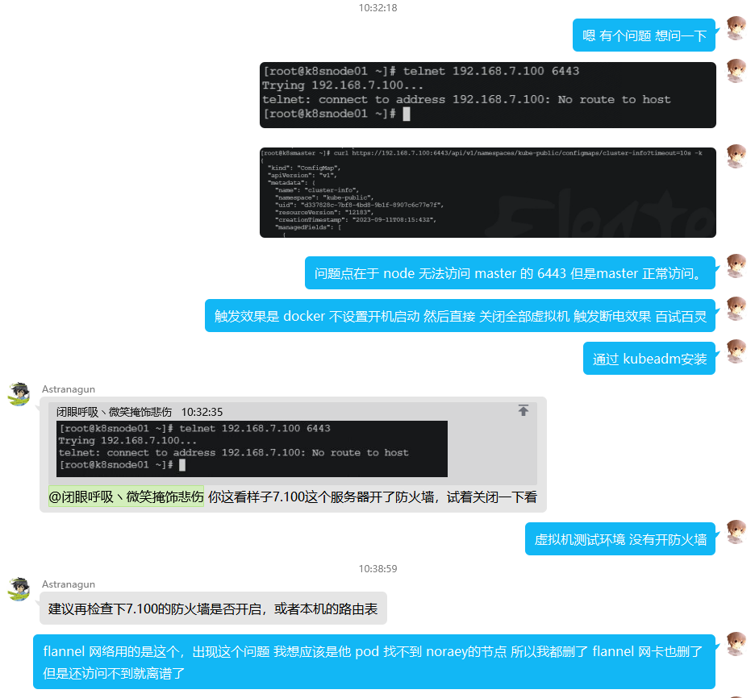

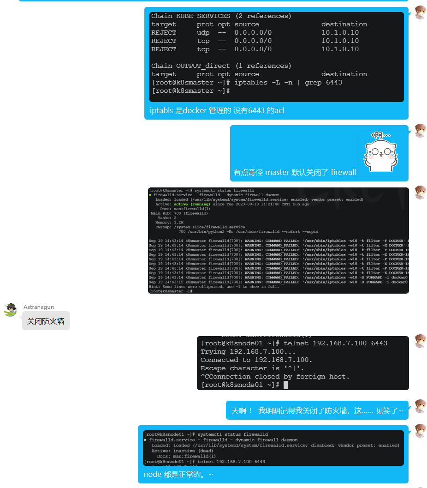

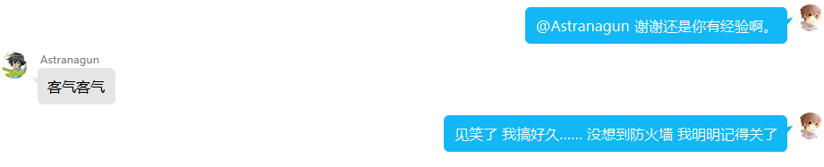

蠢哭了我，非常感谢@Astranagun

```powershell
" Let s test it again... If possible, I seriously suspect that the previous issue is also a firewall issue.

[root@k8snode01 ~]# curl https://192.168.7.100:6443 -k
{
  "kind": "Status",
  "apiVersion": "v1",
  "metadata": {},
  "status": "Failure",
  "message": "forbidden: User \"system:anonymous\" cannot get path \"/\"",
  "reason": "Forbidden",
  "details": {},
  "code": 403
}[root@k8snode01 ~]# 

[root@k8snode02 ~]# curl https://192.168.7.100:6443 -k
{
  "kind": "Status",
  "apiVersion": "v1",
  "metadata": {},
  "status": "Failure",
  "message": "forbidden: User \"system:anonymous\" cannot get path \"/\"",
  "reason": "Forbidden",
  "details": {},
  "code": 403
}[root@k8snode02 ~]#

" Node2, which has not been processed yet, has been delayed. This means that it can be repaired by itself through kubelet, which is very good. It seems that this experiment has come to an end and should be replicated again

[root@k8smaster ~]# kubectl get node
NAME        STATUS   ROLES                  AGE   VERSION
k8smaster   Ready    control-plane,master   8d    v1.23.6
k8snode02   Ready    <none>                 32m   v1.23.6
[root@k8smaster ~]# 


```

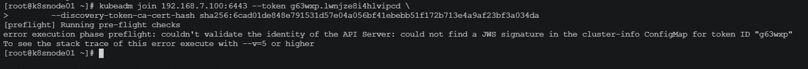

```powershell
[root@k8snode01 ~]# kubeadm join 192.168.7.100:6443 --token 8td0qd.7gvcyfe3wktijunm --discovery-token-ca-cert-hash sha256:6cad01de848e791531d57e04a056bf41ebebb51f172b713e4a9af23bf3a034da
[preflight] Running pre-flight checks
[preflight] Reading configuration from the cluster...
[preflight] FYI: You can look at this config file with 'kubectl -n kube-system get cm kubeadm-config -o yaml'
[kubelet-start] Writing kubelet configuration to file "/var/lib/kubelet/config.yaml"
[kubelet-start] Writing kubelet environment file with flags to file "/var/lib/kubelet/kubeadm-flags.env"
[kubelet-start] Starting the kubelet
[kubelet-start] Waiting for the kubelet to perform the TLS Bootstrap...

This node has joined the cluster:
* Certificate signing request was sent to apiserver and a response was received.
* The Kubelet was informed of the new secure connection details.

Run 'kubectl get nodes' on the control-plane to see this node join the cluster.

[root@k8snode01 ~]# kubectl get nodes
The connection to the server localhost:8080 was refused - did you specify the right host or port?
[root@k8snode01 ~]# 

[root@k8smaster ~]# kubectl get node
NAME        STATUS   ROLES                  AGE   VERSION
k8smaster   Ready    control-plane,master   8d    v1.23.6
k8snode01   Ready    <none>                 66s   v1.23.6
k8snode02   Ready    <none>                 37m   v1.23.6
[root@k8smaster ~]#

" Successfully, it seems that the previous token cannot take effect, and there will be an expiration date that needs to be retrieved again. The retrieval method is as follows. Although it was not successful before, the publication was successful.

[root@k8smaster ~]# kubeadm token create --print-join-command
kubeadm join 192.168.7.100:6443 --token 8td0qd.7gvcyfe3wktijunm --discovery-token-ca-cert-hash sha256:6cad01de848e791531d57e04a056bf41ebebb51f172b713e4a9af23bf3a034da 
[root@k8smaster ~]#


```


### node02

```powershell
[root@k8snode02 ~]# docker ps -a
Cannot connect to the Docker daemon at unix:///var/run/docker.sock. Is the docker daemon running?
[root@k8snode02 ~]# systemctl restart docker
[root@k8snode02 ~]# docker ps -a
CONTAINER ID   IMAGE                                                COMMAND                  CREATED      STATUS                       PORTS     NAMES
befe5b6209fd   d73868a08083                                         "/opt/bin/flanneld -…"   8 days ago   Exited (255) 4 seconds ago             k8s_kube-flannel_kube-flannel-ds-gpnpx_kube-flannel_c6a1656c-d0cf-4026-b0d7-ff8885f24c1a_0
80713a3f68d4   flannel/flannel                                      "cp -f /etc/kube-fla…"   8 days ago   Exited (0) 8 days ago                  k8s_install-cni_kube-flannel-ds-gpnpx_kube-flannel_c6a1656c-d0cf-4026-b0d7-ff8885f24c1a_0
354424bed696   flannel/flannel-cni-plugin                           "cp -f /flannel /opt…"   8 days ago   Exited (0) 8 days ago                  k8s_install-cni-plugin_kube-flannel-ds-gpnpx_kube-flannel_c6a1656c-d0cf-4026-b0d7-ff8885f24c1a_0
eb8137f30356   registry.aliyuncs.com/google_containers/kube-proxy   "/usr/local/bin/kube…"   8 days ago   Exited (255) 4 seconds ago             k8s_kube-proxy_kube-proxy-n95s6_kube-system_dee6cae8-47a8-4b79-8eb9-1aeea3f673dd_0
9de41647ef33   registry.aliyuncs.com/google_containers/pause:3.6    "/pause"                 8 days ago   Exited (255) 4 seconds ago             k8s_POD_kube-flannel-ds-gpnpx_kube-flannel_c6a1656c-d0cf-4026-b0d7-ff8885f24c1a_0
fa5300178a42   registry.aliyuncs.com/google_containers/pause:3.6    "/pause"                 8 days ago   Exited (255) 4 seconds ago             k8s_POD_kube-proxy-n95s6_kube-system_dee6cae8-47a8-4b79-8eb9-1aeea3f673dd_0
[root@k8snode02 ~]# 
[root@k8snode02 ~]# docker ps -a
CONTAINER ID   IMAGE                                                COMMAND                  CREATED      STATUS                        PORTS     NAMES
befe5b6209fd   d73868a08083                                         "/opt/bin/flanneld -…"   8 days ago   Exited (255) 12 seconds ago             k8s_kube-flannel_kube-flannel-ds-gpnpx_kube-flannel_c6a1656c-d0cf-4026-b0d7-ff8885f24c1a_0
80713a3f68d4   flannel/flannel                                      "cp -f /etc/kube-fla…"   8 days ago   Exited (0) 8 days ago                   k8s_install-cni_kube-flannel-ds-gpnpx_kube-flannel_c6a1656c-d0cf-4026-b0d7-ff8885f24c1a_0
354424bed696   flannel/flannel-cni-plugin                           "cp -f /flannel /opt…"   8 days ago   Exited (0) 8 days ago                   k8s_install-cni-plugin_kube-flannel-ds-gpnpx_kube-flannel_c6a1656c-d0cf-4026-b0d7-ff8885f24c1a_0
eb8137f30356   registry.aliyuncs.com/google_containers/kube-proxy   "/usr/local/bin/kube…"   8 days ago   Exited (255) 12 seconds ago             k8s_kube-proxy_kube-proxy-n95s6_kube-system_dee6cae8-47a8-4b79-8eb9-1aeea3f673dd_0
9de41647ef33   registry.aliyuncs.com/google_containers/pause:3.6    "/pause"                 8 days ago   Exited (255) 12 seconds ago             k8s_POD_kube-flannel-ds-gpnpx_kube-flannel_c6a1656c-d0cf-4026-b0d7-ff8885f24c1a_0
fa5300178a42   registry.aliyuncs.com/google_containers/pause:3.6    "/pause"                 8 days ago   Exited (255) 12 seconds ago             k8s_POD_kube-proxy-n95s6_kube-system_dee6cae8-47a8-4b79-8eb9-1aeea3f673dd_0
[root@k8snode02 ~]# docker ps -a
CONTAINER ID   IMAGE                                                COMMAND                  CREATED      STATUS                        PORTS     NAMES
befe5b6209fd   d73868a08083                                         "/opt/bin/flanneld -…"   8 days ago   Exited (255) 14 seconds ago             k8s_kube-flannel_kube-flannel-ds-gpnpx_kube-flannel_c6a1656c-d0cf-4026-b0d7-ff8885f24c1a_0
80713a3f68d4   flannel/flannel                                      "cp -f /etc/kube-fla…"   8 days ago   Exited (0) 8 days ago                   k8s_install-cni_kube-flannel-ds-gpnpx_kube-flannel_c6a1656c-d0cf-4026-b0d7-ff8885f24c1a_0
354424bed696   flannel/flannel-cni-plugin                           "cp -f /flannel /opt…"   8 days ago   Exited (0) 8 days ago                   k8s_install-cni-plugin_kube-flannel-ds-gpnpx_kube-flannel_c6a1656c-d0cf-4026-b0d7-ff8885f24c1a_0
eb8137f30356   registry.aliyuncs.com/google_containers/kube-proxy   "/usr/local/bin/kube…"   8 days ago   Exited (255) 14 seconds ago             k8s_kube-proxy_kube-proxy-n95s6_kube-system_dee6cae8-47a8-4b79-8eb9-1aeea3f673dd_0
9de41647ef33   registry.aliyuncs.com/google_containers/pause:3.6    "/pause"                 8 days ago   Exited (255) 14 seconds ago             k8s_POD_kube-flannel-ds-gpnpx_kube-flannel_c6a1656c-d0cf-4026-b0d7-ff8885f24c1a_0
fa5300178a42   registry.aliyuncs.com/google_containers/pause:3.6    "/pause"                 8 days ago   Exited (255) 14 seconds ago             k8s_POD_kube-proxy-n95s6_kube-system_dee6cae8-47a8-4b79-8eb9-1aeea3f673dd_0
[root@k8snode02 ~]# docker start fa5300178a429de41647ef33eb8137f30356befe5b6209fd
Error response from daemon: No such container: fa5300178a429de41647ef33eb8137f30356befe5b6209fd
Error: failed to start containers: fa5300178a429de41647ef33eb8137f30356befe5b6209fd
[root@k8snode02 ~]# docker start fa5300178a42 9de41647ef33  eb8137f30356 befe5b6209fd
fa5300178a42
9de41647ef33
eb8137f30356
befe5b6209fd
[root@k8snode02 ~]# docker ps -a
CONTAINER ID   IMAGE                                                COMMAND                  CREATED      STATUS                     PORTS     NAMES
befe5b6209fd   d73868a08083                                         "/opt/bin/flanneld -…"   8 days ago   Exited (1) 5 seconds ago             k8s_kube-flannel_kube-flannel-ds-gpnpx_kube-flannel_c6a1656c-d0cf-4026-b0d7-ff8885f24c1a_0
80713a3f68d4   flannel/flannel                                      "cp -f /etc/kube-fla…"   8 days ago   Exited (0) 8 days ago                k8s_install-cni_kube-flannel-ds-gpnpx_kube-flannel_c6a1656c-d0cf-4026-b0d7-ff8885f24c1a_0
354424bed696   flannel/flannel-cni-plugin                           "cp -f /flannel /opt…"   8 days ago   Exited (0) 8 days ago                k8s_install-cni-plugin_kube-flannel-ds-gpnpx_kube-flannel_c6a1656c-d0cf-4026-b0d7-ff8885f24c1a_0
eb8137f30356   registry.aliyuncs.com/google_containers/kube-proxy   "/usr/local/bin/kube…"   8 days ago   Exited (1) 5 seconds ago             k8s_kube-proxy_kube-proxy-n95s6_kube-system_dee6cae8-47a8-4b79-8eb9-1aeea3f673dd_0
9de41647ef33   registry.aliyuncs.com/google_containers/pause:3.6    "/pause"                 8 days ago   Up 6 seconds                         k8s_POD_kube-flannel-ds-gpnpx_kube-flannel_c6a1656c-d0cf-4026-b0d7-ff8885f24c1a_0
fa5300178a42   registry.aliyuncs.com/google_containers/pause:3.6    "/pause"                 8 days ago   Up 6 seconds                         k8s_POD_kube-proxy-n95s6_kube-system_dee6cae8-47a8-4b79-8eb9-1aeea3f673dd_0
[root@k8snode02 ~]# 

" Surprisingly, node02 succeeded without any processing, indicating that the problem was caused by the firewall intercepting port 6443 of the kube server API on the master node.
```

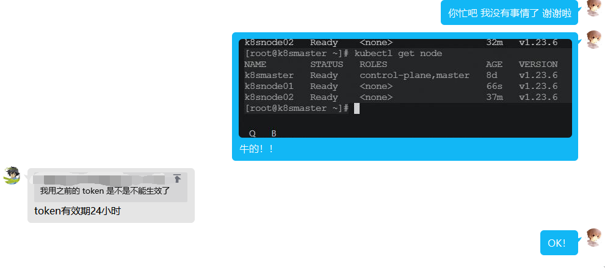

```powershell
" Thank you again to this friend in the group
```

## Recurrence of destructive operations 2

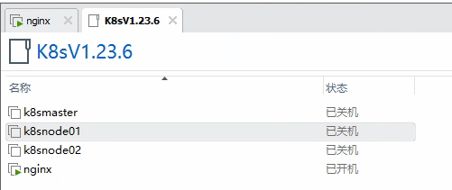

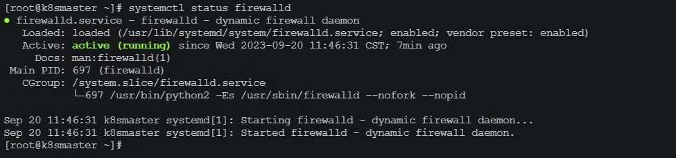

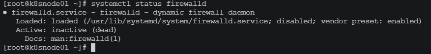

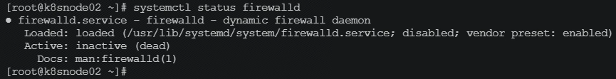

```powershell
[root@k8smaster ~]# systemctl status firewalld
● firewalld.service - firewalld - dynamic firewall daemon
   Loaded: loaded (/usr/lib/systemd/system/firewalld.service; enabled; vendor preset: enabled)
   Active: active (running) since Wed 2023-09-20 11:46:31 CST; 7min ago
     Docs: man:firewalld(1)
 Main PID: 697 (firewalld)
   CGroup: /system.slice/firewalld.service
           └─697 /usr/bin/python2 -Es /usr/sbin/firewalld --nofork --nopid

Sep 20 11:46:31 k8smaster systemd[1]: Starting firewalld - dynamic firewall daemon...
Sep 20 11:46:31 k8smaster systemd[1]: Started firewalld - dynamic firewall daemon.
[root@k8smaster ~]# systemctl disable firewalld
Removed symlink /etc/systemd/system/multi-user.target.wants/firewalld.service.
Removed symlink /etc/systemd/system/dbus-org.fedoraproject.FirewallD1.service.
[root@k8smaster ~]#

[root@k8smaster ~]# systemctl enable docker --now
Created symlink from /etc/systemd/system/multi-user.target.wants/docker.service to /usr/lib/systemd/system/docker.service.
[root@k8smaster ~]#

[root@k8smaster ~]# kubectl get node
NAME        STATUS   ROLES                  AGE   VERSION
k8smaster   Ready    control-plane,master   8d    v1.23.6
k8snode01   Ready    <none>                 8d    v1.23.6
k8snode02   Ready    <none>                 8d    v1.23.6
[root@k8smaster ~]# 

等会会变 等心跳...

```

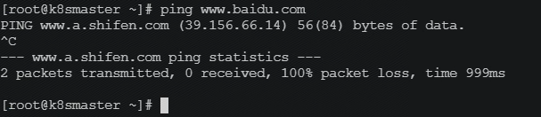

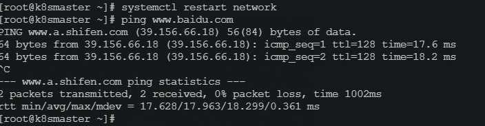

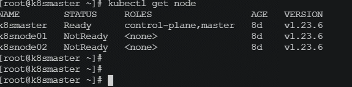

```powershell
[root@k8snode01 ~]# systemctl status firewalld
● firewalld.service - firewalld - dynamic firewall daemon
   Loaded: loaded (/usr/lib/systemd/system/firewalld.service; disabled; vendor preset: enabled)
   Active: inactive (dead)
     Docs: man:firewalld(1)
[root@k8snode01 ~]# 
[root@k8snode01 ~]# 
[root@k8snode01 ~]# 
[root@k8snode01 ~]# systemctl enable docker --now
Created symlink from /etc/systemd/system/multi-user.target.wants/docker.service to /usr/lib/systemd/system/docker.service.
[root@k8snode01 ~]# 

[root@k8snode01 ~]# systemctl status kubelet
● kubelet.service - kubelet: The Kubernetes Node Agent
   Loaded: loaded (/usr/lib/systemd/system/kubelet.service; enabled; vendor preset: disabled)
  Drop-In: /usr/lib/systemd/system/kubelet.service.d
           └─10-kubeadm.conf
   Active: active (running) since Wed 2023-09-20 12:00:18 CST; 1min 24s ago
     Docs: https://kubernetes.io/docs/
 Main PID: 2273 (kubelet)
    Tasks: 14
   Memory: 56.4M
   CGroup: /system.slice/kubelet.service
           └─2273 /usr/bin/kubelet --bootstrap-kubeconfig=/etc/kubernetes/bootstrap-kubelet.conf --kubeconfig=/etc/kubernetes/kubelet.conf --config=/var/lib/kubelet/config.yaml --network-plugin=cni --pod...

Sep 20 12:01:41 k8snode01 kubelet[2273]: E0920 12:01:41.916504    2273 kubelet.go:2461] "Error getting node" err="node \"k8snode01\" not found"
Sep 20 12:01:42 k8snode01 kubelet[2273]: E0920 12:01:42.017879    2273 kubelet.go:2461] "Error getting node" err="node \"k8snode01\" not found"
Sep 20 12:01:42 k8snode01 kubelet[2273]: E0920 12:01:42.118133    2273 kubelet.go:2461] "Error getting node" err="node \"k8snode01\" not found"
Sep 20 12:01:42 k8snode01 kubelet[2273]: E0920 12:01:42.219043    2273 kubelet.go:2461] "Error getting node" err="node \"k8snode01\" not found"
Sep 20 12:01:42 k8snode01 kubelet[2273]: E0920 12:01:42.319573    2273 kubelet.go:2461] "Error getting node" err="node \"k8snode01\" not found"
Sep 20 12:01:42 k8snode01 kubelet[2273]: E0920 12:01:42.420702    2273 kubelet.go:2461] "Error getting node" err="node \"k8snode01\" not found"
Sep 20 12:01:42 k8snode01 kubelet[2273]: E0920 12:01:42.522053    2273 kubelet.go:2461] "Error getting node" err="node \"k8snode01\" not found"
Sep 20 12:01:42 k8snode01 kubelet[2273]: E0920 12:01:42.622387    2273 kubelet.go:2461] "Error getting node" err="node \"k8snode01\" not found"
Sep 20 12:01:42 k8snode01 kubelet[2273]: E0920 12:01:42.723723    2273 kubelet.go:2461] "Error getting node" err="node \"k8snode01\" not found"
Sep 20 12:01:42 k8snode01 kubelet[2273]: E0920 12:01:42.825114    2273 kubelet.go:2461] "Error getting node" err="node \"k8snode01\" not found"
[root@k8snode01 ~]# 

[root@k8snode01 ~]# systemctl status kubelet
● kubelet.service - kubelet: The Kubernetes Node Agent
   Loaded: loaded (/usr/lib/systemd/system/kubelet.service; enabled; vendor preset: disabled)
  Drop-In: /usr/lib/systemd/system/kubelet.service.d
           └─10-kubeadm.conf
   Active: active (running) since Wed 2023-09-20 12:02:00 CST; 1s ago
     Docs: https://kubernetes.io/docs/
 Main PID: 2840 (kubelet)
    Tasks: 13
   Memory: 31.8M
   CGroup: /system.slice/kubelet.service
           └─2840 /usr/bin/kubelet --bootstrap-kubeconfig=/etc/kubernetes/bootstrap-kubelet.conf --kubeconfig=/etc/kubernetes/kubelet.conf --config=/var/lib/kubelet/config.yaml --network-plugin=cni --pod...

Sep 20 12:02:01 k8snode01 kubelet[2840]: E0920 12:02:01.907931    2840 kubelet.go:2461] "Error getting node" err="node \"k8snode01\" not found"
Sep 20 12:02:01 k8snode01 kubelet[2840]: W0920 12:02:01.991861    2840 reflector.go:324] k8s.io/client-go/informers/factory.go:134: failed to list *v1.Node: Get "https://192.168.7.100:6443/... route to host
Sep 20 12:02:01 k8snode01 kubelet[2840]: E0920 12:02:01.991913    2840 reflector.go:138] k8s.io/client-go/informers/factory.go:134: Failed to watch *v1.Node: failed to list *v1.Node: Get "https://192.168...
Sep 20 12:02:02 k8snode01 kubelet[2840]: E0920 12:02:02.009207    2840 kubelet.go:2461] "Error getting node" err="node \"k8snode01\" not found"
Sep 20 12:02:02 k8snode01 kubelet[2840]: E0920 12:02:02.109773    2840 kubelet.go:2461] "Error getting node" err="node \"k8snode01\" not found"
Sep 20 12:02:02 k8snode01 kubelet[2840]: E0920 12:02:02.210517    2840 kubelet.go:2461] "Error getting node" err="node \"k8snode01\" not found"
Sep 20 12:02:02 k8snode01 kubelet[2840]: E0920 12:02:02.311824    2840 kubelet.go:2461] "Error getting node" err="node \"k8snode01\" not found"
Sep 20 12:02:02 k8snode01 kubelet[2840]: E0920 12:02:02.413072    2840 kubelet.go:2461] "Error getting node" err="node \"k8snode01\" not found"
Sep 20 12:02:02 k8snode01 kubelet[2840]: E0920 12:02:02.514472    2840 kubelet.go:2461] "Error getting node" err="node \"k8snode01\" not found"
Sep 20 12:02:02 k8snode01 kubelet[2840]: E0920 12:02:02.614858    2840 kubelet.go:2461] "Error getting node" err="node \"k8snode01\" not found"
Hint: Some lines were ellipsized, use -l to show in full.
[root@k8snode01 ~]# 


[root@k8snode01 ~]# docker ps -a
CONTAINER ID   IMAGE                                                COMMAND                  CREATED      STATUS                           PORTS     NAMES
02d1b7ed4d94   nginx                                                "/docker-entrypoint.…"   8 days ago   Exited (255) About an hour ago             k8s_nginx_k8s-nginx-6d779d947c-59qh8_default_056c7a0e-ac54-40f0-ad4d-70d5ec6f2a92_0
ad3c063c2818   registry.aliyuncs.com/google_containers/pause:3.6    "/pause"                 8 days ago   Exited (255) About an hour ago             k8s_POD_k8s-nginx-6d779d947c-59qh8_default_056c7a0e-ac54-40f0-ad4d-70d5ec6f2a92_0
df414c590b55   d73868a08083                                         "/opt/bin/flanneld -…"   8 days ago   Exited (255) About an hour ago             k8s_kube-flannel_kube-flannel-ds-2bf4k_kube-flannel_5e1afce5-b4d3-45fd-9c58-4cace2b43283_0
70d322520704   flannel/flannel                                      "cp -f /etc/kube-fla…"   8 days ago   Exited (0) 8 days ago                      k8s_install-cni_kube-flannel-ds-2bf4k_kube-flannel_5e1afce5-b4d3-45fd-9c58-4cace2b43283_0
abac9835c972   flannel/flannel-cni-plugin                           "cp -f /flannel /opt…"   8 days ago   Exited (0) 8 days ago                      k8s_install-cni-plugin_kube-flannel-ds-2bf4k_kube-flannel_5e1afce5-b4d3-45fd-9c58-4cace2b43283_0
25d0c45d1b2d   registry.aliyuncs.com/google_containers/kube-proxy   "/usr/local/bin/kube…"   8 days ago   Exited (255) About an hour ago             k8s_kube-proxy_kube-proxy-zr2m6_kube-system_7e2bdbc0-11ee-4263-8752-5342d93e9c5f_0
f426822aee9e   registry.aliyuncs.com/google_containers/pause:3.6    "/pause"                 8 days ago   Exited (255) About an hour ago             k8s_POD_kube-proxy-zr2m6_kube-system_7e2bdbc0-11ee-4263-8752-5342d93e9c5f_0
f8f25a24e78f   registry.aliyuncs.com/google_containers/pause:3.6    "/pause"                 8 days ago   Exited (255) About an hour ago             k8s_POD_kube-flannel-ds-2bf4k_kube-flannel_5e1afce5-b4d3-45fd-9c58-4cace2b43283_0
[root@k8snode01 ~]# 

" It can be seen that although the Docker is started, even if Kubectl is restarted, it cannot start the container and requires manual processing. That is to say, it is the same as the initial report. So, can reinstallation without resetting the node be solved from the bottom level? We still need to study it.

[root@k8snode01 ~]# docker ps -a | grep flannel/flannel
70d322520704   flannel/flannel                                      "cp -f /etc/kube-fla…"   8 days ago   Exited (0) 8 days ago                      k8s_install-cni_kube-flannel-ds-2bf4k_kube-flannel_5e1afce5-b4d3-45fd-9c58-4cace2b43283_0
abac9835c972   flannel/flannel-cni-plugin                           "cp -f /flannel /opt…"   8 days ago   Exited (0) 8 days ago                      k8s_install-cni-plugin_kube-flannel-ds-2bf4k_kube-flannel_5e1afce5-b4d3-45fd-9c58-4cace2b43283_0
[root@k8snode01 ~]# docker ps -a | grep -v flannel/flannel
CONTAINER ID   IMAGE                                                COMMAND                  CREATED      STATUS                           PORTS     NAMES
02d1b7ed4d94   nginx                                                "/docker-entrypoint.…"   8 days ago   Exited (255) About an hour ago             k8s_nginx_k8s-nginx-6d779d947c-59qh8_default_056c7a0e-ac54-40f0-ad4d-70d5ec6f2a92_0
ad3c063c2818   registry.aliyuncs.com/google_containers/pause:3.6    "/pause"                 8 days ago   Exited (255) About an hour ago             k8s_POD_k8s-nginx-6d779d947c-59qh8_default_056c7a0e-ac54-40f0-ad4d-70d5ec6f2a92_0
df414c590b55   d73868a08083                                         "/opt/bin/flanneld -…"   8 days ago   Exited (255) About an hour ago             k8s_kube-flannel_kube-flannel-ds-2bf4k_kube-flannel_5e1afce5-b4d3-45fd-9c58-4cace2b43283_0
25d0c45d1b2d   registry.aliyuncs.com/google_containers/kube-proxy   "/usr/local/bin/kube…"   8 days ago   Exited (255) About an hour ago             k8s_kube-proxy_kube-proxy-zr2m6_kube-system_7e2bdbc0-11ee-4263-8752-5342d93e9c5f_0
f426822aee9e   registry.aliyuncs.com/google_containers/pause:3.6    "/pause"                 8 days ago   Exited (255) About an hour ago             k8s_POD_kube-proxy-zr2m6_kube-system_7e2bdbc0-11ee-4263-8752-5342d93e9c5f_0
f8f25a24e78f   registry.aliyuncs.com/google_containers/pause:3.6    "/pause"                 8 days ago   Exited (255) About an hour ago             k8s_POD_kube-flannel-ds-2bf4k_kube-flannel_5e1afce5-b4d3-45fd-9c58-4cace2b43283_0
[root@k8snode01 ~]# 

[root@k8snode01 ~]# docker start f426822aee9e
f426822aee9e
[root@k8snode01 ~]# docker start 25d0c45d1b2d
25d0c45d1b2d
[root@k8snode01 ~]# 


Sep 20 13:16:52 k8snode01 kubelet[21050]: E0920 13:16:52.421955   21050 kubelet.go:2461] "Error getting node" err="node \"k8snode01\" not found"

failed to ensure lease exists, will retry in 7s, error: Get "https://192.168.7.100:6443/apis/coordination.k8s.io/v1

[root@k8smaster ~]# curl https://192.168.7.100:6443 -k
{
  "kind": "Status",
  "apiVersion": "v1",
  "metadata": {},
  "status": "Failure",
  "message": "forbidden: User \"system:anonymous\" cannot get path \"/\"",
  "reason": "Forbidden",
  "details": {},
  "code": 403
}[root@k8smaster ~]# 

[root@k8snode01 ~]# curl https://192.168.7.100:6443
curl: (7) Failed connect to 192.168.7.100:6443; No route to host
[root@k8snode01 ~]#

[root@k8snode01 ~]# ping 192.168.7.100
PING 192.168.7.100 (192.168.7.100) 56(84) bytes of data.
64 bytes from 192.168.7.100: icmp_seq=1 ttl=64 time=0.222 ms
64 bytes from 192.168.7.100: icmp_seq=2 ttl=64 time=0.192 ms
^C
--- 192.168.7.100 ping statistics ---
2 packets transmitted, 2 received, 0% packet loss, time 999ms
rtt min/avg/max/mdev = 0.192/0.207/0.222/0.015 ms
[root@k8snode01 ~]# ping www.baidu.com
PING www.a.shifen.com (39.156.66.18) 56(84) bytes of data.
^C
--- www.a.shifen.com ping statistics ---
2 packets transmitted, 0 received, 100% packet loss, time 1000ms

[root@k8snode01 ~]# 

[root@k8smaster ~]# ping www.baidu.com
PING www.a.shifen.com (39.156.66.14) 56(84) bytes of data.
64 bytes from 39.156.66.14 (39.156.66.14): icmp_seq=1 ttl=128 time=27.1 ms
^C
--- www.a.shifen.com ping statistics ---
1 packets transmitted, 1 received, 0% packet loss, time 0ms
rtt min/avg/max/mdev = 27.111/27.111/27.111/0.000 ms
[root@k8smaster ~]# 

[root@k8snode01 ~]# systemctl restart network
[root@k8snode01 ~]# ping www.baidu.com
PING www.a.shifen.com (39.156.66.18) 56(84) bytes of data.
64 bytes from 39.156.66.18 (39.156.66.18): icmp_seq=1 ttl=128 time=17.1 ms
^C
--- www.a.shifen.com ping statistics ---
1 packets transmitted, 1 received, 0% packet loss, time 0ms
rtt min/avg/max/mdev = 17.197/17.197/17.197/0.000 ms
[root@k8snode01 ~]# 

[root@k8snode01 ~]# curl https://192.168.7.100:6443 -k
curl: (7) Failed connect to 192.168.7.100:6443; No route to host
[root@k8snode01 ~]# ping www.baidu.com
PING www.a.shifen.com (39.156.66.18) 56(84) bytes of data.
64 bytes from 39.156.66.18 (39.156.66.18): icmp_seq=1 ttl=128 time=17.2 ms
^C
--- www.a.shifen.com ping statistics ---
1 packets transmitted, 1 received, 0% packet loss, time 0ms
rtt min/avg/max/mdev = 17.265/17.265/17.265/0.000 ms
[root@k8snode01 ~]# 


[root@k8smaster ~]# kubectl get pods -n kube-system -o wide
NAME                                READY   STATUS    RESTARTS      AGE   IP              NODE        NOMINATED NODE   READINESS GATES
coredns-6d8c4cb4d-6jjh5             0/1     Running   1 (96m ago)   8d    10.244.0.4      k8smaster   <none>           <none>
coredns-6d8c4cb4d-d7st4             0/1     Running   1 (96m ago)   8d    10.244.0.5      k8smaster   <none>           <none>
etcd-k8smaster                      1/1     Running   1 (96m ago)   8d    192.168.7.100   k8smaster   <none>           <none>
kube-apiserver-k8smaster            1/1     Running   1 (96m ago)   8d    192.168.7.100   k8smaster   <none>           <none>
kube-controller-manager-k8smaster   1/1     Running   1 (96m ago)   8d    192.168.7.100   k8smaster   <none>           <none>
kube-proxy-2g5ql                    1/1     Running   1 (96m ago)   8d    192.168.7.100   k8smaster   <none>           <none>
kube-proxy-n95s6                    1/1     Running   0             8d    192.168.7.102   k8snode02   <none>           <none>
kube-proxy-zr2m6                    1/1     Running   0             8d    192.168.7.101   k8snode01   <none>           <none>
kube-scheduler-k8smaster            1/1     Running   1 (96m ago)   8d    192.168.7.100   k8smaster   <none>           <none>
[root@k8smaster ~]#

coredns ???

[root@k8smaster ~]# kubectl describe -n kube-system pods coredns-6d8c4cb4d-6jjh5 
Name:                 coredns-6d8c4cb4d-6jjh5
Namespace:            kube-system
Priority:             2000000000
Priority Class Name:  system-cluster-critical
Node:                 k8smaster/192.168.7.100
Start Time:           Mon, 11 Sep 2023 16:24:44 +0800
Labels:               k8s-app=kube-dns
                      pod-template-hash=6d8c4cb4d
Annotations:          <none>
Status:               Running
IP:                   10.244.0.4
IPs:
  IP:           10.244.0.4
Controlled By:  ReplicaSet/coredns-6d8c4cb4d
Containers:
  coredns:
    Container ID:  docker://96a944d2fb6962ffaac689e3cde2240fcd6d3b844a049ec2fa0d96a61eaf05f2
    Image:         registry.aliyuncs.com/google_containers/coredns:v1.8.6
    Image ID:      docker-pullable://registry.aliyuncs.com/google_containers/coredns@sha256:5b6ec0d6de9baaf3e92d0f66cd96a25b9edbce8716f5f15dcd1a616b3abd590e
    Ports:         53/UDP, 53/TCP, 9153/TCP
    Host Ports:    0/UDP, 0/TCP, 0/TCP
    Args:
      -conf
      /etc/coredns/Corefile
    State:          Running
      Started:      Wed, 20 Sep 2023 11:56:52 +0800
    Last State:     Terminated
      Reason:       Error
      Exit Code:    255
      Started:      Mon, 11 Sep 2023 16:24:44 +0800
      Finished:     Wed, 20 Sep 2023 11:56:40 +0800
    Ready:          False
    Restart Count:  1
    Limits:
      memory:  170Mi
    Requests:
      cpu:        100m
      memory:     70Mi
    Liveness:     http-get http://:8080/health delay=60s timeout=5s period=10s #success=1 #failure=5
    Readiness:    http-get http://:8181/ready delay=0s timeout=1s period=10s #success=1 #failure=3
    Environment:  <none>
    Mounts:
      /etc/coredns from config-volume (ro)
      /var/run/secrets/kubernetes.io/serviceaccount from kube-api-access-pmkws (ro)
Conditions:
  Type              Status
  Initialized       True 
  Ready             False 
  ContainersReady   False 
  PodScheduled      True 
Volumes:
  config-volume:
    Type:      ConfigMap (a volume populated by a ConfigMap)
    Name:      coredns
    Optional:  false
  kube-api-access-pmkws:
    Type:                    Projected (a volume that contains injected data from multiple sources)
    TokenExpirationSeconds:  3607
    ConfigMapName:           kube-root-ca.crt
    ConfigMapOptional:       <nil>
    DownwardAPI:             true
QoS Class:                   Burstable
Node-Selectors:              kubernetes.io/os=linux
Tolerations:                 CriticalAddonsOnly op=Exists
                             node-role.kubernetes.io/control-plane:NoSchedule
                             node-role.kubernetes.io/master:NoSchedule
                             node.kubernetes.io/not-ready:NoExecute op=Exists for 300s
                             node.kubernetes.io/unreachable:NoExecute op=Exists for 300s
Events:
  Type     Reason     Age                    From     Message
  ----     ------     ----                   ----     -------
  Warning  Unhealthy  2m34s (x650 over 97m)  kubelet  Readiness probe failed: HTTP probe failed with statuscode: 503
[root@k8smaster ~]# 

Readiness probe failed: HTTP probe failed with statuscode: 503


[root@k8smaster ~]# kubectl get pods -n kube-system -o wide
NAME                                READY   STATUS    RESTARTS       AGE   IP              NODE        NOMINATED NODE   READINESS GATES
coredns-6d8c4cb4d-6jjh5             0/1     Running   1 (101m ago)   8d    10.244.0.4      k8smaster   <none>           <none>
coredns-6d8c4cb4d-d7st4             0/1     Running   1 (101m ago)   8d    10.244.0.5      k8smaster   <none>           <none>
etcd-k8smaster                      1/1     Running   1 (101m ago)   8d    192.168.7.100   k8smaster   <none>           <none>
kube-apiserver-k8smaster            1/1     Running   1 (101m ago)   8d    192.168.7.100   k8smaster   <none>           <none>
kube-controller-manager-k8smaster   1/1     Running   1 (101m ago)   8d    192.168.7.100   k8smaster   <none>           <none>
kube-proxy-2g5ql                    1/1     Running   1 (101m ago)   8d    192.168.7.100   k8smaster   <none>           <none>
kube-proxy-n95s6                    1/1     Running   0              8d    192.168.7.102   k8snode02   <none>           <none>
kube-proxy-zr2m6                    1/1     Running   0              8d    192.168.7.101   k8snode01   <none>           <none>
kube-scheduler-k8smaster            1/1     Running   1 (101m ago)   8d    192.168.7.100   k8smaster   <none>           <none>
[root@k8smaster ~]# 

[root@k8smaster ~]# kubectl describe -n kube-system svc
Name:              kube-dns
Namespace:         kube-system
Labels:            k8s-app=kube-dns
                   kubernetes.io/cluster-service=true
                   kubernetes.io/name=CoreDNS
Annotations:       prometheus.io/port: 9153
                   prometheus.io/scrape: true
Selector:          k8s-app=kube-dns
Type:              ClusterIP
IP Family Policy:  SingleStack
IP Families:       IPv4
IP:                10.1.0.10
IPs:               10.1.0.10
Port:              dns  53/UDP
TargetPort:        53/UDP
Endpoints:         
Port:              dns-tcp  53/TCP
TargetPort:        53/TCP
Endpoints:         
Port:              metrics  9153/TCP
TargetPort:        9153/TCP
Endpoints:         
Session Affinity:  None
Events:            <none>
[root@k8smaster ~]# 

[root@k8smaster ~]# kubectl delete -n kube-system pods coredns-6d8c4cb4d-6jjh5 
pod "coredns-6d8c4cb4d-6jjh5" deleted
[root@k8smaster ~]# kubectl get pods -n kube-system -o wide
NAME                                READY   STATUS    RESTARTS       AGE   IP              NODE        NOMINATED NODE   READINESS GATES
coredns-6d8c4cb4d-d7st4             0/1     Running   1 (104m ago)   8d    10.244.0.5      k8smaster   <none>           <none>
coredns-6d8c4cb4d-dvqj5             0/1     Running   0              11s   10.244.0.6      k8smaster   <none>           <none>
etcd-k8smaster                      1/1     Running   1 (104m ago)   8d    192.168.7.100   k8smaster   <none>           <none>
kube-apiserver-k8smaster            1/1     Running   1 (104m ago)   8d    192.168.7.100   k8smaster   <none>           <none>
kube-controller-manager-k8smaster   1/1     Running   1 (104m ago)   8d    192.168.7.100   k8smaster   <none>           <none>
kube-proxy-2g5ql                    1/1     Running   1 (104m ago)   8d    192.168.7.100   k8smaster   <none>           <none>
kube-proxy-n95s6                    1/1     Running   0              8d    192.168.7.102   k8snode02   <none>           <none>
kube-proxy-zr2m6                    1/1     Running   0              8d    192.168.7.101   k8snode01   <none>           <none>
kube-scheduler-k8smaster            1/1     Running   1 (104m ago)   8d    192.168.7.100   k8smaster   <none>           <none>
[root@k8smaster ~]# 


[root@k8smaster ~]# kubectl delete node k8snode02
node "k8snode02" deleted
[root@k8smaster ~]# kubectl get node
NAME        STATUS     ROLES                  AGE   VERSION
k8smaster   Ready      control-plane,master   8d    v1.23.6
k8snode01   NotReady   <none>                 8d    v1.23.6
[root@k8smaster ~]# 

[root@k8snode02 ~]# kubeadm reset
[reset] WARNING: Changes made to this host by 'kubeadm init' or 'kubeadm join' will be reverted.
[reset] Are you sure you want to proceed? [y/N]: y
[preflight] Running pre-flight checks
W0920 13:59:28.261518   29403 removeetcdmember.go:80] [reset] No kubeadm config, using etcd pod spec to get data directory
[reset] No etcd config found. Assuming external etcd
[reset] Please, manually reset etcd to prevent further issues
[reset] Stopping the kubelet service
[reset] Unmounting mounted directories in "/var/lib/kubelet"
[reset] Deleting contents of config directories: [/etc/kubernetes/manifests /etc/kubernetes/pki]
[reset] Deleting files: [/etc/kubernetes/admin.conf /etc/kubernetes/kubelet.conf /etc/kubernetes/bootstrap-kubelet.conf /etc/kubernetes/controller-manager.conf /etc/kubernetes/scheduler.conf]
[reset] Deleting contents of stateful directories: [/var/lib/kubelet /var/lib/dockershim /var/run/kubernetes /var/lib/cni]

The reset process does not clean CNI configuration. To do so, you must remove /etc/cni/net.d

The reset process does not reset or clean up iptables rules or IPVS tables.
If you wish to reset iptables, you must do so manually by using the "iptables" command.

If your cluster was setup to utilize IPVS, run ipvsadm --clear (or similar)
to reset your system's IPVS tables.

The reset process does not clean your kubeconfig files and you must remove them manually.
Please, check the contents of the $HOME/.kube/config file.
[root@k8snode02 ~]# 
[root@k8snode02 ~]#


[root@k8smaster ~]# systemctl status firewalld
● firewalld.service - firewalld - dynamic firewall daemon
   Loaded: loaded (/usr/lib/systemd/system/firewalld.service; disabled; vendor preset: enabled)
   Active: active (running) since Wed 2023-09-20 11:46:31 CST; 2h 14min ago
     Docs: man:firewalld(1)
 Main PID: 697 (firewalld)
    Tasks: 2
   Memory: 1.2M
   CGroup: /system.slice/firewalld.service
           └─697 /usr/bin/python2 -Es /usr/sbin/firewalld --nofork --nopid

Sep 20 11:56:40 k8smaster firewalld[697]: WARNING: COMMAND_FAILED: '/usr/sbin/iptables -w10 -t filter -F DOCKER' failed: iptables: No chain/target/match by that name.
Sep 20 11:56:40 k8smaster firewalld[697]: WARNING: COMMAND_FAILED: '/usr/sbin/iptables -w10 -t filter -X DOCKER' failed: iptables: No chain/target/match by that name.
Sep 20 11:56:40 k8smaster firewalld[697]: WARNING: COMMAND_FAILED: '/usr/sbin/iptables -w10 -t filter -F DOCKER-ISOLATION-STAGE-1' failed: iptables: No chain/target/match by that name.
Sep 20 11:56:40 k8smaster firewalld[697]: WARNING: COMMAND_FAILED: '/usr/sbin/iptables -w10 -t filter -X DOCKER-ISOLATION-STAGE-1' failed: iptables: No chain/target/match by that name.
Sep 20 11:56:40 k8smaster firewalld[697]: WARNING: COMMAND_FAILED: '/usr/sbin/iptables -w10 -t filter -F DOCKER-ISOLATION-STAGE-2' failed: iptables: No chain/target/match by that name.
Sep 20 11:56:40 k8smaster firewalld[697]: WARNING: COMMAND_FAILED: '/usr/sbin/iptables -w10 -t filter -X DOCKER-ISOLATION-STAGE-2' failed: iptables: No chain/target/match by that name.
Sep 20 11:56:40 k8smaster firewalld[697]: WARNING: COMMAND_FAILED: '/usr/sbin/iptables -w10 -t filter -F DOCKER-ISOLATION' failed: iptables: No chain/target/match by that name.
Sep 20 11:56:40 k8smaster firewalld[697]: WARNING: COMMAND_FAILED: '/usr/sbin/iptables -w10 -t filter -X DOCKER-ISOLATION' failed: iptables: No chain/target/match by that name.
Sep 20 11:56:40 k8smaster firewalld[697]: WARNING: COMMAND_FAILED: '/usr/sbin/iptables -w10 -D FORWARD -i docker0 -o docker0 -j DROP' failed: iptables: Bad rule (does a matching rule exist in that chain?).
Sep 20 11:56:41 k8smaster firewalld[697]: WARNING: COMMAND_FAILED: '/usr/sbin/iptables -w10 -D FORWARD -i docker0 -o docker0 -j DROP' failed: iptables: Bad rule (does a matching rule exist in that chain?).
Hint: Some lines were ellipsized, use -l to show in full.
[root@k8smaster ~]# 


见鬼了！！！ 为什么又起来了


[root@k8smaster ~]# kubectl get pods -n kube-system -o wide
NAME                                READY   STATUS    RESTARTS       AGE   IP              NODE        NOMINATED NODE   READINESS GATES
coredns-6d8c4cb4d-dvqj5             1/1     Running   0              21m   10.244.0.6      k8smaster   <none>           <none>
coredns-6d8c4cb4d-vcxxc             1/1     Running   0              20m   10.244.0.7      k8smaster   <none>           <none>
etcd-k8smaster                      1/1     Running   1 (126m ago)   8d    192.168.7.100   k8smaster   <none>           <none>
kube-apiserver-k8smaster            1/1     Running   1 (126m ago)   8d    192.168.7.100   k8smaster   <none>           <none>
kube-controller-manager-k8smaster   1/1     Running   1 (126m ago)   8d    192.168.7.100   k8smaster   <none>           <none>
kube-proxy-2g5ql                    1/1     Running   1 (126m ago)   8d    192.168.7.100   k8smaster   <none>           <none>
kube-proxy-zr2m6                    1/1     Running   1 (47m ago)    8d    192.168.7.101   k8snode01   <none>           <none>
kube-scheduler-k8smaster            1/1     Running   1 (126m ago)   8d    192.168.7.100   k8smaster   <none>           <none>
[root@k8smaster ~]#

[root@k8smaster ~]# kubeadm token create --print-join-command
kubeadm join 192.168.7.100:6443 --token ouxhdj.a6xpj481ozbmkc7r --discovery-token-ca-cert-hash sha256:6cad01de848e791531d57e04a056bf41ebebb51f172b713e4a9af23bf3a034da 
[root@k8smaster ~]#

[root@k8snode02 ~]# curl https://192.168.7.100:6443 -k
{
  "kind": "Status",
  "apiVersion": "v1",
  "metadata": {},
  "status": "Failure",
  "message": "forbidden: User \"system:anonymous\" cannot get path \"/\"",
  "reason": "Forbidden",
  "details": {},
  "code": 403
}[root@k8snode02 ~]# kubeadm join 192.168.7.100:6443 --token ouxhdj.a6xpj481ozbmkc7r --discovery-token-ca-cert-hash sha256:6cad01de848e791531d57e04a056bf41ebebb51f172b713e4a9af23bf3a034da
[preflight] Running pre-flight checks
[preflight] Reading configuration from the cluster...
[preflight] FYI: You can look at this config file with 'kubectl -n kube-system get cm kubeadm-config -o yaml'
[kubelet-start] Writing kubelet configuration to file "/var/lib/kubelet/config.yaml"
[kubelet-start] Writing kubelet environment file with flags to file "/var/lib/kubelet/kubeadm-flags.env"
[kubelet-start] Starting the kubelet
[kubelet-start] Waiting for the kubelet to perform the TLS Bootstrap...

This node has joined the cluster:
* Certificate signing request was sent to apiserver and a response was received.
* The Kubelet was informed of the new secure connection details.

Run 'kubectl get nodes' on the control-plane to see this node join the cluster.

[root@k8snode02 ~]# 

[root@k8smaster ~]# kubectl get node
NAME        STATUS   ROLES                  AGE   VERSION
k8smaster   Ready    control-plane,master   8d    v1.23.6
k8snode01   Ready    <none>                 8d    v1.23.6
k8snode02   Ready    <none>                 28s   v1.23.6
[root@k8smaster ~]#

" It's still the firewall, but I remember I've already turned it off. It seems necessary to reproduce the problem again and pay attention to the status of the firewall to see which step can change it.


```

## Recurrence of destructive operations 3

```powershell
" Based on the analysis of the previous recurrence, it is necessary to first shut down the firewall, then turn on the Docker, and check the node status. If it is in the state of NORADY, it is necessary to turn on the Docker of other node nodes to check if there are any abnormal logs in the Kubelet service. If there are any problems, trace them back, and if not, solve the problem.


```

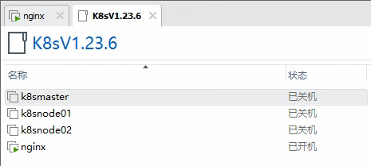


```powershell
[root@k8smaster ~]# systemctl status firewalld
● firewalld.service - firewalld - dynamic firewall daemon
   Loaded: loaded (/usr/lib/systemd/system/firewalld.service; enabled; vendor preset: enabled)
   Active: active (running) since Wed 2023-09-20 14:12:21 CST; 1h 16min ago
     Docs: man:firewalld(1)
 Main PID: 696 (firewalld)
   CGroup: /system.slice/firewalld.service
           └─696 /usr/bin/python2 -Es /usr/sbin/firewalld --nofork --nopid

Sep 20 14:12:20 k8smaster systemd[1]: Starting firewalld - dynamic firewall daemon...
Sep 20 14:12:21 k8smaster systemd[1]: Started firewalld - dynamic firewall daemon.
[root@k8smaster ~]# kubectl get node
The connection to the server 192.168.7.100:6443 was refused - did you specify the right host or port?
[root@k8smaster ~]# systemctl status docker kubelet
● docker.service - Docker Application Container Engine
   Loaded: loaded (/usr/lib/systemd/system/docker.service; disabled; vendor preset: disabled)
   Active: inactive (dead)
     Docs: https://docs.docker.com

● kubelet.service - kubelet: The Kubernetes Node Agent
   Loaded: loaded (/usr/lib/systemd/system/kubelet.service; enabled; vendor preset: disabled)
  Drop-In: /usr/lib/systemd/system/kubelet.service.d
           └─10-kubeadm.conf
   Active: active (running) since Wed 2023-09-20 15:29:09 CST; 415ms ago
     Docs: https://kubernetes.io/docs/
 Main PID: 6567 (kubelet)
   CGroup: /system.slice/kubelet.service
           └─6567 /usr/bin/kubelet --bootstrap-kubeconfig=/etc/kubernetes/bootstrap-kubelet.conf --kubeconfig=/etc/kubernetes/kubelet.conf --config=/var/lib/kubelet/config.yaml --network-plugin=cni --pod...

Sep 20 15:29:09 k8smaster systemd[1]: Stopped kubelet: The Kubernetes Node Agent.
Sep 20 15:29:09 k8smaster systemd[1]: Started kubelet: The Kubernetes Node Agent.
Sep 20 15:29:09 k8smaster kubelet[6567]: Flag --network-plugin has been deprecated, will be removed along with dockershim.
Sep 20 15:29:09 k8smaster kubelet[6567]: Flag --network-plugin has been deprecated, will be removed along with dockershim.
Sep 20 15:29:09 k8smaster kubelet[6567]: I0920 15:29:09.512373    6567 server.go:446] "Kubelet version" kubeletVersion="v1.23.6"
Sep 20 15:29:09 k8smaster kubelet[6567]: I0920 15:29:09.512613    6567 server.go:874] "Client rotation is on, will bootstrap in background"
Sep 20 15:29:09 k8smaster kubelet[6567]: I0920 15:29:09.514965    6567 certificate_store.go:130] Loading cert/key pair from "/var/lib/kubelet/pki/kubelet-client-current.pem".
Sep 20 15:29:09 k8smaster kubelet[6567]: I0920 15:29:09.515602    6567 container_manager_linux.go:980] "CPUAccounting not enabled for process" pid=6567
Sep 20 15:29:09 k8smaster kubelet[6567]: I0920 15:29:09.515612    6567 container_manager_linux.go:983] "MemoryAccounting not enabled for process" pid=6567
Sep 20 15:29:09 k8smaster kubelet[6567]: I0920 15:29:09.516055    6567 dynamic_cafile_content.go:156] "Starting controller" name="client-ca-bundle::/etc/kubernetes/pki/ca.crt"
[root@k8smaster ~]# 


[root@k8smaster ~]# systemctl disable firewalld --now
Removed symlink /etc/systemd/system/multi-user.target.wants/firewalld.service.
Removed symlink /etc/systemd/system/dbus-org.fedoraproject.FirewallD1.service.
[root@k8smaster ~]# systemctl status firewalld
● firewalld.service - firewalld - dynamic firewall daemon
   Loaded: loaded (/usr/lib/systemd/system/firewalld.service; disabled; vendor preset: enabled)
   Active: inactive (dead)
     Docs: man:firewalld(1)

Sep 20 14:12:20 k8smaster systemd[1]: Starting firewalld - dynamic firewall daemon...
Sep 20 14:12:21 k8smaster systemd[1]: Started firewalld - dynamic firewall daemon.
Sep 20 15:30:13 k8smaster systemd[1]: Stopping firewalld - dynamic firewall daemon...
Sep 20 15:30:14 k8smaster systemd[1]: Stopped firewalld - dynamic firewall daemon.
[root@k8smaster ~]# 


[root@k8smaster ~]# systemctl enable docker --now
Created symlink from /etc/systemd/system/multi-user.target.wants/docker.service to /usr/lib/systemd/system/docker.service.
[root@k8smaster ~]# systemctl status docker
● docker.service - Docker Application Container Engine
   Loaded: loaded (/usr/lib/systemd/system/docker.service; enabled; vendor preset: disabled)
   Active: active (running) since Wed 2023-09-20 15:30:43 CST; 3s ago
     Docs: https://docs.docker.com
 Main PID: 6771 (dockerd)
    Tasks: 15
   Memory: 160.8M
   CGroup: /system.slice/docker.service
           └─6771 /usr/bin/dockerd -H fd:// --containerd=/run/containerd/containerd.sock

Sep 20 15:30:43 k8smaster dockerd[6771]: time="2023-09-20T15:30:43.097193566+08:00" level=info msg="Removing stale sandbox b44baa42faa30d25a9ead8a8062be0ab4104739e36f843fe23142f3e4946df60 (...ab13f0f29d4b)"
Sep 20 15:30:43 k8smaster dockerd[6771]: time="2023-09-20T15:30:43.098028911+08:00" level=warning msg="Error (Unable to complete atomic operation, key modified) deleting object [endpoint 59... retrying...."
Sep 20 15:30:43 k8smaster dockerd[6771]: time="2023-09-20T15:30:43.207187374+08:00" level=info msg="Removing stale sandbox b667f6538bf7ec7cc97d1db2dc0deb2527d0efde76509863901bde441d3c1210 (...a56ca53dd811)"
Sep 20 15:30:43 k8smaster dockerd[6771]: time="2023-09-20T15:30:43.208019028+08:00" level=warning msg="Error (Unable to complete atomic operation, key modified) deleting object [endpoint 59... retrying...."
Sep 20 15:30:43 k8smaster dockerd[6771]: time="2023-09-20T15:30:43.228116137+08:00" level=info msg="Default bridge (docker0) is assigned with an IP address 172.17.0.0/16. Daemon option --bi...ed IP address"
Sep 20 15:30:43 k8smaster dockerd[6771]: time="2023-09-20T15:30:43.255168523+08:00" level=info msg="Loading containers: done."
Sep 20 15:30:43 k8smaster dockerd[6771]: time="2023-09-20T15:30:43.275654862+08:00" level=info msg="Docker daemon" commit=eeddea2 graphdriver(s)=overlay2 version=20.10.0
Sep 20 15:30:43 k8smaster dockerd[6771]: time="2023-09-20T15:30:43.275744204+08:00" level=info msg="Daemon has completed initialization"
Sep 20 15:30:43 k8smaster systemd[1]: Started Docker Application Container Engine.
Sep 20 15:30:43 k8smaster dockerd[6771]: time="2023-09-20T15:30:43.289489943+08:00" level=info msg="API listen on /var/run/docker.sock"
Hint: Some lines were ellipsized, use -l to show in full.
[root@k8smaster ~]# 

[root@k8smaster ~]# kubectl get node
NAME        STATUS   ROLES                  AGE   VERSION
k8smaster   Ready    control-plane,master   8d    v1.23.6
k8snode01   Ready    <none>                 8d    v1.23.6
k8snode02   Ready    <none>                 8d    v1.23.6
[root@k8smaster ~]# 
[root@k8smaster ~]# 
[root@k8smaster ~]# 

" The current state is fake. Wait a moment for the heartbeat to complete, and you can find that it is not ready

[root@k8smaster ~]# kubectl -n kube-system get pods
NAME                                READY   STATUS    RESTARTS       AGE
coredns-6d8c4cb4d-6jjh5             1/1     Running   1 (110s ago)   8d
coredns-6d8c4cb4d-d7st4             1/1     Running   1 (110s ago)   8d
etcd-k8smaster                      1/1     Running   1 (110s ago)   8d
kube-apiserver-k8smaster            1/1     Running   1 (110s ago)   8d
kube-controller-manager-k8smaster   1/1     Running   1 (110s ago)   8d
kube-proxy-2g5ql                    1/1     Running   1 (110s ago)   8d
kube-proxy-n95s6                    1/1     Running   0              8d
kube-proxy-zr2m6                    1/1     Running   0              8d
kube-scheduler-k8smaster            1/1     Running   1 (110s ago)   8d
[root@k8smaster ~]# 

[root@k8smaster ~]# kubectl -n kube-system get pods -owide
NAME                                READY   STATUS    RESTARTS       AGE   IP              NODE        NOMINATED NODE   READINESS GATES
coredns-6d8c4cb4d-6jjh5             1/1     Running   1 (2m6s ago)   8d    10.244.0.4      k8smaster   <none>           <none>
coredns-6d8c4cb4d-d7st4             1/1     Running   1 (2m6s ago)   8d    10.244.0.5      k8smaster   <none>           <none>
etcd-k8smaster                      1/1     Running   1 (2m6s ago)   8d    192.168.7.100   k8smaster   <none>           <none>
kube-apiserver-k8smaster            1/1     Running   1 (2m6s ago)   8d    192.168.7.100   k8smaster   <none>           <none>
kube-controller-manager-k8smaster   1/1     Running   1 (2m6s ago)   8d    192.168.7.100   k8smaster   <none>           <none>
kube-proxy-2g5ql                    1/1     Running   1 (2m6s ago)   8d    192.168.7.100   k8smaster   <none>           <none>
kube-proxy-n95s6                    1/1     Running   0              8d    192.168.7.102   k8snode02   <none>           <none>
kube-proxy-zr2m6                    1/1     Running   0              8d    192.168.7.101   k8snode01   <none>           <none>
kube-scheduler-k8smaster            1/1     Running   1 (2m6s ago)   8d    192.168.7.100   k8smaster   <none>           <none>
[root@k8smaster ~]# 

[root@k8smaster ~]# ping www.baidu.com
PING www.a.shifen.com (39.156.66.14) 56(84) bytes of data.
^C
--- www.a.shifen.com ping statistics ---
3 packets transmitted, 0 received, 100% packet loss, time 1999ms

[root@k8smaster ~]# 

[root@k8snode01 ~]# curl https://192.168.7.100:6443 -k
{
  "kind": "Status",
  "apiVersion": "v1",
  "metadata": {},
  "status": "Failure",
  "message": "forbidden: User \"system:anonymous\" cannot get path \"/\"",
  "reason": "Forbidden",
  "details": {},
  "code": 403
}[root@k8snode01 ~]#

[root@k8snode02 ~]# curl https://192.168.7.100:6443 -k
{
  "kind": "Status",
  "apiVersion": "v1",
  "metadata": {},
  "status": "Failure",
  "message": "forbidden: User \"system:anonymous\" cannot get path \"/\"",
  "reason": "Forbidden",
  "details": {},
  "code": 403
}[root@k8snode02 ~]# 
[root@k8snode02 ~]#

[root@k8smaster ~]# ip a
1: lo: <LOOPBACK,UP,LOWER_UP> mtu 65536 qdisc noqueue state UNKNOWN group default qlen 1000
    link/loopback 00:00:00:00:00:00 brd 00:00:00:00:00:00
    inet 127.0.0.1/8 scope host lo
       valid_lft forever preferred_lft forever
    inet6 ::1/128 scope host 
       valid_lft forever preferred_lft forever
2: ens33: <BROADCAST,MULTICAST,UP,LOWER_UP> mtu 1500 qdisc pfifo_fast state UP group default qlen 1000
    link/ether 00:0c:29:37:27:88 brd ff:ff:ff:ff:ff:ff
    inet 192.168.7.100/24 brd 192.168.7.255 scope global noprefixroute ens33
       valid_lft forever preferred_lft forever
    inet6 fe80::20c:29ff:fe37:2788/64 scope link noprefixroute 
       valid_lft forever preferred_lft forever
3: ens36: <BROADCAST,MULTICAST,UP,LOWER_UP> mtu 1500 qdisc pfifo_fast state UP group default qlen 1000
    link/ether 00:0c:29:37:27:92 brd ff:ff:ff:ff:ff:ff
    inet 192.168.157.149/24 brd 192.168.157.255 scope global noprefixroute dynamic ens36
       valid_lft 1463sec preferred_lft 1463sec
    inet6 fe80::bdcf:3ffc:b6f6:f1ed/64 scope link noprefixroute 
       valid_lft forever preferred_lft forever
4: docker0: <NO-CARRIER,BROADCAST,MULTICAST,UP> mtu 1500 qdisc noqueue state DOWN group default 
    link/ether 02:42:65:c8:4a:b9 brd ff:ff:ff:ff:ff:ff
    inet 172.17.0.1/16 brd 172.17.255.255 scope global docker0
       valid_lft forever preferred_lft forever
5: flannel.1: <BROADCAST,MULTICAST,UP,LOWER_UP> mtu 1450 qdisc noqueue state UNKNOWN group default 
    link/ether e2:ed:f0:72:ab:69 brd ff:ff:ff:ff:ff:ff
    inet 10.244.0.0/32 scope global flannel.1
       valid_lft forever preferred_lft forever
    inet6 fe80::e0ed:f0ff:fe72:ab69/64 scope link 
       valid_lft forever preferred_lft forever
6: cni0: <BROADCAST,MULTICAST,UP,LOWER_UP> mtu 1450 qdisc noqueue state UP group default qlen 1000
    link/ether 52:a7:bf:db:59:a3 brd ff:ff:ff:ff:ff:ff
    inet 10.244.0.1/24 brd 10.244.0.255 scope global cni0
       valid_lft forever preferred_lft forever
    inet6 fe80::50a7:bfff:fedb:59a3/64 scope link 
       valid_lft forever preferred_lft forever
7: veth7285a56a@if2: <BROADCAST,MULTICAST,UP,LOWER_UP> mtu 1450 qdisc noqueue master cni0 state UP group default 
    link/ether 46:f0:f3:af:36:5b brd ff:ff:ff:ff:ff:ff link-netnsid 0
    inet6 fe80::44f0:f3ff:feaf:365b/64 scope link 
       valid_lft forever preferred_lft forever
8: vethb854eded@if2: <BROADCAST,MULTICAST,UP,LOWER_UP> mtu 1450 qdisc noqueue master cni0 state UP group default 
    link/ether 46:52:fa:fc:ee:ed brd ff:ff:ff:ff:ff:ff link-netnsid 1
    inet6 fe80::4452:faff:fefc:eeed/64 scope link 
       valid_lft forever preferred_lft forever
[root@k8smaster ~]# 

[root@k8snode01 ~]# systemctl enable docker --now
Created symlink from /etc/systemd/system/multi-user.target.wants/docker.service to /usr/lib/systemd/system/docker.service.
[root@k8snode01 ~]# systemctl status docker
● docker.service - Docker Application Container Engine
   Loaded: loaded (/usr/lib/systemd/system/docker.service; enabled; vendor preset: disabled)
   Active: active (running) since Wed 2023-09-20 15:34:31 CST; 5s ago
     Docs: https://docs.docker.com
 Main PID: 6715 (dockerd)
    Tasks: 14
   Memory: 158.4M
   CGroup: /system.slice/docker.service
           └─6715 /usr/bin/dockerd -H fd:// --containerd=/run/containerd/containerd.sock

Sep 20 15:34:30 k8snode01 dockerd[6715]: time="2023-09-20T15:34:30.892492834+08:00" level=info msg="Removing stale sandbox 57a9b4742ec85b3df492edc09439c5e8e409304523747a415ea8fc8481fac4ad (...aad304d3ebf8)"
Sep 20 15:34:30 k8snode01 dockerd[6715]: time="2023-09-20T15:34:30.893089718+08:00" level=warning msg="Error (Unable to complete atomic operation, key modified) deleting object [endpoint 89... retrying...."
Sep 20 15:34:31 k8snode01 dockerd[6715]: time="2023-09-20T15:34:31.006257625+08:00" level=info msg="Removing stale sandbox 633febf88215dfdff293ef1dfa205399aee6621da0389ba0c8723c4998ba42b5 (...185267857329)"
Sep 20 15:34:31 k8snode01 dockerd[6715]: time="2023-09-20T15:34:31.007172079+08:00" level=warning msg="Error (Unable to complete atomic operation, key modified) deleting object [endpoint bf... retrying...."
Sep 20 15:34:31 k8snode01 dockerd[6715]: time="2023-09-20T15:34:31.031232069+08:00" level=info msg="Default bridge (docker0) is assigned with an IP address 172.17.0.0/16. Daemon option --bi...ed IP address"
Sep 20 15:34:31 k8snode01 dockerd[6715]: time="2023-09-20T15:34:31.055380159+08:00" level=info msg="Loading containers: done."
Sep 20 15:34:31 k8snode01 dockerd[6715]: time="2023-09-20T15:34:31.073805252+08:00" level=info msg="Docker daemon" commit=eeddea2 graphdriver(s)=overlay2 version=20.10.0
Sep 20 15:34:31 k8snode01 dockerd[6715]: time="2023-09-20T15:34:31.073903464+08:00" level=info msg="Daemon has completed initialization"
Sep 20 15:34:31 k8snode01 systemd[1]: Started Docker Application Container Engine.
Sep 20 15:34:31 k8snode01 dockerd[6715]: time="2023-09-20T15:34:31.085720295+08:00" level=info msg="API listen on /var/run/docker.sock"
Hint: Some lines were ellipsized, use -l to show in full.
[root@k8snode01 ~]#

[root@k8snode01 ~]# systemctl status kubelet
● kubelet.service - kubelet: The Kubernetes Node Agent
   Loaded: loaded (/usr/lib/systemd/system/kubelet.service; enabled; vendor preset: disabled)
  Drop-In: /usr/lib/systemd/system/kubelet.service.d
           └─10-kubeadm.conf
   Active: active (running) since Wed 2023-09-20 15:34:39 CST; 13s ago
     Docs: https://kubernetes.io/docs/
 Main PID: 6915 (kubelet)
    Tasks: 14
   Memory: 60.9M
   CGroup: /system.slice/kubelet.service
           └─6915 /usr/bin/kubelet --bootstrap-kubeconfig=/etc/kubernetes/bootstrap-kubelet.conf --kubeconfig=/etc/kubernetes/kubelet.conf --config=/var/lib/kubelet/config.yaml --network-plugin=cni --pod...

Sep 20 15:34:45 k8snode01 kubelet[6915]: E0920 15:34:45.630528    6915 cni.go:362] "Error adding pod to network" err="loadFlannelSubnetEnv failed: open /run/flannel/subnet.env: no such file or directory"...
Sep 20 15:34:45 k8snode01 kubelet[6915]: E0920 15:34:45.708526    6915 remote_runtime.go:209] "RunPodSandbox from runtime service failed" err="rpc error: code = Unknown desc = failed to set up sandbox co...
Sep 20 15:34:45 k8snode01 kubelet[6915]: E0920 15:34:45.708568    6915 kuberuntime_sandbox.go:70] "Failed to create sandbox for pod" err="rpc error: code = Unknown desc = failed to set up sandbox contain...
Sep 20 15:34:45 k8snode01 kubelet[6915]: E0920 15:34:45.708582    6915 kuberuntime_manager.go:833] "CreatePodSandbox for pod failed" err="rpc error: code = Unknown desc = failed to set up sandbox contain...
Sep 20 15:34:45 k8snode01 kubelet[6915]: E0920 15:34:45.708616    6915 pod_workers.go:951] "Error syncing pod, skipping" err="failed to \"CreatePodSandbox\" for \"k8s-nginx-6d779d947c-59qh8...d947c-59qh8_de
Sep 20 15:34:46 k8snode01 kubelet[6915]: I0920 15:34:46.351577    6915 docker_sandbox.go:402] "Failed to read pod IP from plugin/docker" err="networkPlugin cni failed on the status hook for pod \"k8s-ngi...
Sep 20 15:34:46 k8snode01 kubelet[6915]: I0920 15:34:46.355564    6915 pod_container_deletor.go:79] "Container not found in pod's containers" containerID="7aa18f7d9ae1383ad4d3b56d471a5bd2fc...e8484b43eb956"
Sep 20 15:34:46 k8snode01 kubelet[6915]: I0920 15:34:46.356589    6915 cni.go:334] "CNI failed to retrieve network namespace path" err="cannot find network namespace for the terminated cont...484b43eb956\""
Sep 20 15:34:46 k8snode01 kubelet[6915]: map[string]interface {}{"cniVersion":"0.3.1", "hairpinMode":true, "ipMasq":false, "ipam":map[string]interface {}{"ranges":[][]map[string]interface {}{[]map[string...
Sep 20 15:34:46 k8snode01 kubelet[6915]: delegateAdd: netconf sent to delegate plugin:
Hint: Some lines were ellipsized, use -l to show in full.
[root@k8snode01 ~]# 


" There is no error reported here, which means that this node will be ready in a little time. Let's take a look at the status of the container again to see if it is normal. In theory, it should be all exits. If possible, there should be an up state container.


[root@k8smaster ~]# kubectl -n kube-system get pods -owide
NAME                                READY   STATUS    RESTARTS        AGE   IP              NODE        NOMINATED NODE   READINESS GATES
coredns-6d8c4cb4d-6jjh5             1/1     Running   1 (5m14s ago)   8d    10.244.0.4      k8smaster   <none>           <none>
coredns-6d8c4cb4d-d7st4             1/1     Running   1 (5m14s ago)   8d    10.244.0.5      k8smaster   <none>           <none>
etcd-k8smaster                      1/1     Running   1 (5m14s ago)   8d    192.168.7.100   k8smaster   <none>           <none>
kube-apiserver-k8smaster            1/1     Running   1 (5m14s ago)   8d    192.168.7.100   k8smaster   <none>           <none>
kube-controller-manager-k8smaster   1/1     Running   1 (5m14s ago)   8d    192.168.7.100   k8smaster   <none>           <none>
kube-proxy-2g5ql                    1/1     Running   1 (5m14s ago)   8d    192.168.7.100   k8smaster   <none>           <none>
kube-proxy-n95s6                    1/1     Running   0               8d    192.168.7.102   k8snode02   <none>           <none>
kube-proxy-zr2m6                    1/1     Running   1 (86s ago)     8d    192.168.7.101   k8snode01   <none>           <none>
kube-scheduler-k8smaster            1/1     Running   1 (5m14s ago)   8d    192.168.7.100   k8smaster   <none>           <none>
[root@k8smaster ~]# 
[root@k8smaster ~]# 
[root@k8smaster ~]# kubectl get node
NAME        STATUS     ROLES                  AGE   VERSION
k8smaster   Ready      control-plane,master   8d    v1.23.6
k8snode01   Ready      <none>                 8d    v1.23.6
k8snode02   NotReady   <none>                 8d    v1.23.6
[root@k8smaster ~]# 

[root@k8snode01 ~]# docker ps -a
CONTAINER ID   IMAGE                                                COMMAND                  CREATED              STATUS                            PORTS     NAMES
ab0975612073   registry.aliyuncs.com/google_containers/pause:3.6    "/pause"                 About a minute ago   Up About a minute                           k8s_POD_k8s-nginx-6d779d947c-59qh8_default_056c7a0e-ac54-40f0-ad4d-70d5ec6f2a92_5
c03b735a2aae   d73868a08083                                         "/opt/bin/flanneld -…"   About a minute ago   Up About a minute                           k8s_kube-flannel_kube-flannel-ds-2bf4k_kube-flannel_5e1afce5-b4d3-45fd-9c58-4cace2b43283_1
03d13d05aa11   d73868a08083                                         "cp -f /etc/kube-fla…"   About a minute ago   Exited (0) About a minute ago               k8s_install-cni_kube-flannel-ds-2bf4k_kube-flannel_5e1afce5-b4d3-45fd-9c58-4cace2b43283_0
47a6e681a526   a55d1bad692b                                         "cp -f /flannel /opt…"   About a minute ago   Exited (0) About a minute ago               k8s_install-cni-plugin_kube-flannel-ds-2bf4k_kube-flannel_5e1afce5-b4d3-45fd-9c58-4cace2b43283_1
d04d1d3f3cc1   f21c8d21558c                                         "/usr/local/bin/kube…"   About a minute ago   Up About a minute                           k8s_kube-proxy_kube-proxy-zr2m6_kube-system_7e2bdbc0-11ee-4263-8752-5342d93e9c5f_1
e749d9f7377e   registry.aliyuncs.com/google_containers/pause:3.6    "/pause"                 About a minute ago   Up About a minute                           k8s_POD_kube-flannel-ds-2bf4k_kube-flannel_5e1afce5-b4d3-45fd-9c58-4cace2b43283_1
6a4394f7005b   registry.aliyuncs.com/google_containers/pause:3.6    "/pause"                 About a minute ago   Up About a minute                           k8s_POD_kube-proxy-zr2m6_kube-system_7e2bdbc0-11ee-4263-8752-5342d93e9c5f_1
02d1b7ed4d94   nginx                                                "/docker-entrypoint.…"   8 days ago           Exited (255) About a minute ago             k8s_nginx_k8s-nginx-6d779d947c-59qh8_default_056c7a0e-ac54-40f0-ad4d-70d5ec6f2a92_0
ad3c063c2818   registry.aliyuncs.com/google_containers/pause:3.6    "/pause"                 8 days ago           Exited (255) About a minute ago             k8s_POD_k8s-nginx-6d779d947c-59qh8_default_056c7a0e-ac54-40f0-ad4d-70d5ec6f2a92_0
df414c590b55   d73868a08083                                         "/opt/bin/flanneld -…"   8 days ago           Exited (255) About a minute ago             k8s_kube-flannel_kube-flannel-ds-2bf4k_kube-flannel_5e1afce5-b4d3-45fd-9c58-4cace2b43283_0
25d0c45d1b2d   registry.aliyuncs.com/google_containers/kube-proxy   "/usr/local/bin/kube…"   8 days ago           Exited (255) About a minute ago             k8s_kube-proxy_kube-proxy-zr2m6_kube-system_7e2bdbc0-11ee-4263-8752-5342d93e9c5f_0
f426822aee9e   registry.aliyuncs.com/google_containers/pause:3.6    "/pause"                 8 days ago           Exited (255) About a minute ago             k8s_POD_kube-proxy-zr2m6_kube-system_7e2bdbc0-11ee-4263-8752-5342d93e9c5f_0
f8f25a24e78f   registry.aliyuncs.com/google_containers/pause:3.6    "/pause"                 8 days ago           Exited (255) About a minute ago             k8s_POD_kube-flannel-ds-2bf4k_kube-flannel_5e1afce5-b4d3-45fd-9c58-4cace2b43283_0
[root@k8snode01 ~]# 

" Meet expected repair completion

node02:

[root@k8snode02 ~]# systemctl enable docker --now
Created symlink from /etc/systemd/system/multi-user.target.wants/docker.service to /usr/lib/systemd/system/docker.service.
[root@k8snode02 ~]# docker ps -a
CONTAINER ID   IMAGE                                                COMMAND                  CREATED        STATUS                              PORTS     NAMES
c5cdf47c46c1   f21c8d21558c                                         "/usr/local/bin/kube…"   1 second ago   Up Less than a second                         k8s_kube-proxy_kube-proxy-n95s6_kube-system_dee6cae8-47a8-4b79-8eb9-1aeea3f673dd_1
263676b81056   registry.aliyuncs.com/google_containers/pause:3.6    "/pause"                 1 second ago   Up Less than a second                         k8s_POD_kube-proxy-n95s6_kube-system_dee6cae8-47a8-4b79-8eb9-1aeea3f673dd_1
42710f515e6b   a55d1bad692b                                         "cp -f /flannel /opt…"   1 second ago   Exited (0) Less than a second ago             k8s_install-cni-plugin_kube-flannel-ds-gpnpx_kube-flannel_c6a1656c-d0cf-4026-b0d7-ff8885f24c1a_1
4b01f5b79d9b   registry.aliyuncs.com/google_containers/pause:3.6    "/pause"                 1 second ago   Up Less than a second                         k8s_POD_kube-flannel-ds-gpnpx_kube-flannel_c6a1656c-d0cf-4026-b0d7-ff8885f24c1a_1
3e4b9444378b   nginx                                                "/docker-entrypoint.…"   8 days ago     Exited (255) 3 seconds ago                    k8s_nginx_k8s-nginx-6d779d947c-wxhx2_default_43a547de-284a-4055-879b-7ecd926d0a41_0
25593b6e2880   nginx                                                "/docker-entrypoint.…"   8 days ago     Exited (255) 3 seconds ago                    k8s_nginx_k8s-nginx-6d779d947c-djzx7_default_01b1b881-d996-478c-bf7d-4f9491d0d63f_0
c4bba5dbdfb3   registry.aliyuncs.com/google_containers/pause:3.6    "/pause"                 8 days ago     Exited (255) 3 seconds ago                    k8s_POD_k8s-nginx-6d779d947c-djzx7_default_01b1b881-d996-478c-bf7d-4f9491d0d63f_0
d42203824011   registry.aliyuncs.com/google_containers/pause:3.6    "/pause"                 8 days ago     Exited (255) 3 seconds ago                    k8s_POD_k8s-nginx-6d779d947c-wxhx2_default_43a547de-284a-4055-879b-7ecd926d0a41_0
befe5b6209fd   d73868a08083                                         "/opt/bin/flanneld -…"   8 days ago     Exited (255) 3 seconds ago                    k8s_kube-flannel_kube-flannel-ds-gpnpx_kube-flannel_c6a1656c-d0cf-4026-b0d7-ff8885f24c1a_0
eb8137f30356   registry.aliyuncs.com/google_containers/kube-proxy   "/usr/local/bin/kube…"   8 days ago     Exited (255) 3 seconds ago                    k8s_kube-proxy_kube-proxy-n95s6_kube-system_dee6cae8-47a8-4b79-8eb9-1aeea3f673dd_0
9de41647ef33   registry.aliyuncs.com/google_containers/pause:3.6    "/pause"                 8 days ago     Exited (255) 3 seconds ago                    k8s_POD_kube-flannel-ds-gpnpx_kube-flannel_c6a1656c-d0cf-4026-b0d7-ff8885f24c1a_0
fa5300178a42   registry.aliyuncs.com/google_containers/pause:3.6    "/pause"                 8 days ago     Exited (255) 3 seconds ago                    k8s_POD_kube-proxy-n95s6_kube-system_dee6cae8-47a8-4b79-8eb9-1aeea3f673dd_0
[root@k8snode02 ~]# 

[root@k8smaster ~]# kubectl get node
NAME        STATUS   ROLES                  AGE   VERSION
k8smaster   Ready    control-plane,master   8d    v1.23.6
k8snode01   Ready    <none>                 8d    v1.23.6
k8snode02   Ready    <none>                 8d    v1.23.6
[root@k8smaster ~]#

```

## summarize

```powershell
" I really convinced myself, hahaha.
```

The triggering condition for this issue is the abnormal power outage of the K8S cluster, but there were several points that were overlooked during installation, resulting in problems during association. This is a loop. The problem points are that the master did not properly shut down the firewall, the docker did not self start, or the corresponding port policy was enabled. Because 6443 did not have a firewall policy enabled, the port cannot be accessed normally, Because the default firewall rejects all ports, while iptables opens all ports by default.
When this problem occurred, due to the ignored firewall switch issue, the experiment was repeated many times, specifically manifested as network issues, DNS issues, pod issues, node issues, and so on. In fact, the way to solve this problem is to turn off the firewall on the master node, turn on Docker, and enable the corresponding startup strategy. Then, the coredns will work normally, and after a while, it will be discovered that the proxy is not working properly, Just start the Docker of the node and set it to boot.
So how can we avoid such things happening? By enabling the corresponding services without restricting port interception and corresponding services, we can solve the above problems, as it is normal for beginners to encounter problems.
Another issue is that when the docker defaults to container management, pod management needs to be done through k8s, and the corresponding container cannot be started because k8s is the upper management layer of the docker. It will delete the corresponding container and restart it, which is reflected in pod management. This is correct, so the previous plan to start the corresponding container is incorrect.
The above is the organization and conclusion of the cluster crash caused by this abnormal shutdown, which has a significant impact on further learning of k8s and indirectly understanding some of the underlying interaction logic and principles of k8s. After all, without the previous four experiments, there would be no current conclusion.
Interestingly, these prompts remind you during initialization, so don't overly rely on the documentation or rely on the prompts from your own experimental environment.
If you encounter the same problem as me and solve it through my methods, then congratulations, you have taken another big step forward.
This document is a record of the experimental review, and the author reserves the original rights. If reproduction is required, a link to this page must be attached, otherwise it will be considered infringing.


