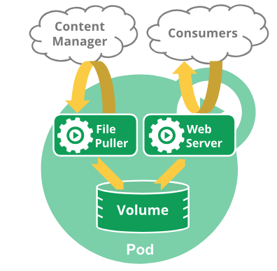

# Practical operation POD

作者：Heike07

## Knowledge 

**Pod** 是包含一个或多个容器的容器组，是 Kubernetes 中创建和管理的最小对象。

Pod 有以下特点：

- Pod是kubernetes中**最小的调度单位****（**原子单元**）**，Kubernetes直接管理Pod而不是容器。
- 同一个Pod中的容器总是会被自动安排到集群中的**同一节点**（物理机或虚拟机）上，并且**一起调度**。
- Pod可以理解为运行特定应用的“逻辑主机”，这些容器共享存储、网络和配置声明(如资源限制)。
- 每个 Pod 有唯一的 IP 地址。 **IP地址分配给Pod**，在同一个 Pod 内，所有容器共享一个 IP 地址和端口空间，Pod 内的容器可以使用`localhost`互相通信。

例如，你可能有一个容器，为共享卷中的文件提供 Web 服务器支持，以及一个单独的 "边车 (sidercar)" 容器负责从远端更新这些文件，如下图所示：



## Practical Operation

### Created & Manager POD

```shell
# 执行创建一个pod，但是使用错误的镜像nginx
controlplane $ kubectl run mynginx --image=ngnix
pod/mynginx created
# 查看pod的详细信息
controlplane $ kubectl  describe mynginx
error: the server doesn't have a resource type "mynginx"
controlplane $ kubectl  describe pod/mynginx 
Name:             mynginx
Namespace:        default
Priority:         0
Service Account:  default
Node:             node01/172.30.2.2
Start Time:       Fri, 01 Sep 2023 02:55:01 +0000
Labels:           run=mynginx
Annotations:      cni.projectcalico.org/containerID: 3a9d3304c9ff4c5723373efd523a7dc3672234bd199d565d5296345902f87ac4
                  cni.projectcalico.org/podIP: 192.168.1.3/32
                  cni.projectcalico.org/podIPs: 192.168.1.3/32
Status:           Pending
IP:               192.168.1.3
IPs:
  IP:  192.168.1.3
Containers:
  mynginx:
    Container ID:   
    Image:          ngnix
    Image ID:       
    Port:           <none>
    Host Port:      <none>
    State:          Waiting
      Reason:       ErrImagePull
    Ready:          False
    Restart Count:  0
    Environment:    <none>
    Mounts:
      /var/run/secrets/kubernetes.io/serviceaccount from kube-api-access-p88n8 (ro)
Conditions:
  Type              Status
  Initialized       True 
  Ready             False 
  ContainersReady   False 
  PodScheduled      True 
Volumes:
  kube-api-access-p88n8:
    Type:                    Projected (a volume that contains injected data from multiple sources)
    TokenExpirationSeconds:  3607
    ConfigMapName:           kube-root-ca.crt
    ConfigMapOptional:       <nil>
    DownwardAPI:             true
QoS Class:                   BestEffort
Node-Selectors:              <none>
Tolerations:                 node.kubernetes.io/not-ready:NoExecute op=Exists for 300s
                             node.kubernetes.io/unreachable:NoExecute op=Exists for 300s
Events:
  Type     Reason     Age   From               Message
  ----     ------     ----  ----               -------
  Normal   Scheduled  23s   default-scheduler  Successfully assigned default/mynginx to node01
  Normal   Pulling    18s   kubelet            Pulling image "ngnix"
  Warning  Failed     10s   kubelet            Failed to pull image "ngnix": rpc error: code = Unknown desc = failed to pull and unpack image "docker.io/library/ngnix:latest": failed to resolve reference "docker.io/library/ngnix:latest": failed to do request: Head "https://docker-mirror.killer.sh/v2/library/ngnix/manifests/latest?ns=docker.io": x509: certificate signed by unknown authority
  Warning  Failed     10s   kubelet            Error: ErrImagePull
  Normal   BackOff    9s    kubelet            Back-off pulling image "ngnix"
  Warning  Failed     9s    kubelet            Error: ImagePullBackOff
>> - 发现容器信息为ImagePullBackOff 再上看没有找到Back-off pulling image "ngnix" ngnix镜像，既失败。
controlplane $ kubectl  ge pod/mynginx 
error: unknown command "ge" for "kubectl"

Did you mean this?
        set
        get
        cp
# 查看pod列表
controlplane $ kubectl  get pod/mynginx  
NAME      READY   STATUS             RESTARTS   AGE
mynginx   0/1     ImagePullBackOff   0          45s
# 删除这个错误的pod
controlplane $ kubectl delete pod/mynginx 
pod "mynginx" deleted

controlplane $ 
# 执行运行一个pod 镜像为nginx
controlplane $ kubectl run mynginx --image=nginx
pod/mynginx created
# 查看pod的列表
controlplane $ kubectl get pod 
NAME      READY   STATUS              RESTARTS   AGE
mynginx   0/1     ContainerCreating   0          5s
controlplane $ kubectl describe pod mynginx
Name:             mynginx
Namespace:        default
Priority:         0
Service Account:  default
Node:             node01/172.30.2.2
Start Time:       Fri, 01 Sep 2023 02:57:16 +0000
Labels:           run=mynginx
Annotations:      cni.projectcalico.org/containerID: 7e681577f46cd544299c859e50bea3ce5ea3ac8012ec98542215b7df52ce455d
                  cni.projectcalico.org/podIP: 192.168.1.4/32
                  cni.projectcalico.org/podIPs: 192.168.1.4/32
Status:           Running
IP:               192.168.1.4
IPs:
  IP:  192.168.1.4
Containers:
  mynginx:
    Container ID:   containerd://0658801886336111d3a7060d1206857945d8193a09fee0a6d14159f5b792b210
    Image:          nginx
    Image ID:       docker.io/library/nginx@sha256:104c7c5c54f2685f0f46f3be607ce60da7085da3eaa5ad22d3d9f01594295e9c
    Port:           <none>
    Host Port:      <none>
    State:          Running
      Started:      Fri, 01 Sep 2023 02:57:24 +0000
    Ready:          True
    Restart Count:  0
    Environment:    <none>
    Mounts:
      /var/run/secrets/kubernetes.io/serviceaccount from kube-api-access-hh2kw (ro)
Conditions:
  Type              Status
  Initialized       True 
  Ready             True 
  ContainersReady   True 
  PodScheduled      True 
Volumes:
  kube-api-access-hh2kw:
    Type:                    Projected (a volume that contains injected data from multiple sources)
    TokenExpirationSeconds:  3607
    ConfigMapName:           kube-root-ca.crt
    ConfigMapOptional:       <nil>
    DownwardAPI:             true
QoS Class:                   BestEffort
Node-Selectors:              <none>
Tolerations:                 node.kubernetes.io/not-ready:NoExecute op=Exists for 300s
                             node.kubernetes.io/unreachable:NoExecute op=Exists for 300s
Events:
  Type    Reason     Age   From               Message
  ----    ------     ----  ----               -------
  Normal  Scheduled  17s   default-scheduler  Successfully assigned default/mynginx to node01
  Normal  Pulling    16s   kubelet            Pulling image "nginx"
  Normal  Pulled     9s    kubelet            Successfully pulled image "nginx" in 6.438664568s (6.438670086s including waiting)
  Normal  Created    9s    kubelet            Created container mynginx
  Normal  Started    9s    kubelet            Started container mynginx
>> - 发现状态为Successfully pulled image "nginx" 证明镜像是对的，然后再往下看 created了 然后started了 正常启动了。
controlplane $ kubectl get pod -oeide
error: unable to match a printer suitable for the output format "eide", allowed formats are: custom-columns,custom-columns-file,go-template,go-template-file,json,jsonpath,jsonpath-as-json,jsonpath-file,name,template,templatefile,wide,yaml
# 查看pod 在哪个节点上 wide 为显示pod的详细信息
controlplane $ kubectl get pod -owide
NAME      READY   STATUS    RESTARTS   AGE   IP            NODE     NOMINATED NODE   READINESS GATES
mynginx   1/1     Running   0          36s   192.168.1.4   node01   <none>           <none>
# 访问pod 的IP 发现可以正常访问
controlplane $ curl 192.168.1.4
<!DOCTYPE html>
<html>
<head>
<title>Welcome to nginx!</title>
<style>
html { color-scheme: light dark; }
body { width: 35em; margin: 0 auto;
font-family: Tahoma, Verdana, Arial, sans-serif; }
</style>
</head>
<body>
<h1>Welcome to nginx!</h1>
<p>If you see this page, the nginx web server is successfully installed and
working. Further configuration is required.</p>

<p>For online documentation and support please refer to
<a href="http://nginx.org/">nginx.org</a>.<br/>
Commercial support is available at
<a href="http://nginx.com/">nginx.com</a>.</p>

<p><em>Thank you for using nginx.</em></p>
</body>
</html>
# 进入到pod中 并通过bash程序进行回显
controlplane $ kubectl exec mynginx -it -- /bin/bash
# 在pod中访问自己 nginx 默认开启了80 端口 是可以成功的
root@mynginx:/# curl localhost
<!DOCTYPE html>
<html>
<head>
<title>Welcome to nginx!</title>
<style>
html { color-scheme: light dark; }
body { width: 35em; margin: 0 auto;
font-family: Tahoma, Verdana, Arial, sans-serif; }
</style>
</head>
<body>
<h1>Welcome to nginx!</h1>
<p>If you see this page, the nginx web server is successfully installed and
working. Further configuration is required.</p>

<p>For online documentation and support please refer to
<a href="http://nginx.org/">nginx.org</a>.<br/>
Commercial support is available at
<a href="http://nginx.com/">nginx.com</a>.</p>

<p><em>Thank you for using nginx.</em></p>
</body>
</html>
# 退出容器
root@mynginx:/# exit
exit
# 查看pod的列表
controlplane $ kubectl get po --watch
NAME      READY   STATUS    RESTARTS   AGE
mynginx   1/1     Running   0          2m9s
^Ccontrolplane $ 
# 创建一个临时pod 增加 --rm的参数 在退出时进行删除
controlplane $ kubectl run mynginx2 --image=nginx -it --rm -- /bin/bash
If you don't see a command prompt, try pressing enter.
root@mynginx2:/# exit
exit
Session ended, resume using 'kubectl attach mynginx2 -c mynginx2 -i -t' command when the pod is running
pod "mynginx2" deleted
>> - 发现mynginx2 的pod 已经退出后并删除了
# 查看pod列表
controlplane $ kubectl get pod 
NAME      READY   STATUS    RESTARTS   AGE
mynginx   1/1     Running   0          5m55s
# 删除pod
controlplane $ kubectl delete pod/mynginx 
pod "mynginx" deleted
controlplane $ kubectl get pod
No resources found in default namespace.
# 查看节点列表
controlplane $ kubectl get node
NAME           STATUS   ROLES           AGE   VERSION
controlplane   Ready    control-plane   23d   v1.27.1
node01         Ready    <none>          23d   v1.27.1
controlplane $ 
# END

```
###Containerd and Images

```shell
# 查看kubectl版本
controlplane $ kubectl version
WARNING: This version information is deprecated and will be replaced with the output from kubectl version --short.  Use --output=yaml|json to get the full version.
Client Version: version.Info{Major:"1", Minor:"27", GitVersion:"v1.27.1", GitCommit:"4c9411232e10168d7b050c49a1b59f6df9d7ea4b", GitTreeState:"clean", BuildDate:"2023-04-14T13:21:19Z", GoVersion:"go1.20.3", Compiler:"gc", Platform:"linux/amd64"}
Kustomize Version: v5.0.1
Server Version: version.Info{Major:"1", Minor:"27", GitVersion:"v1.27.1", GitCommit:"4c9411232e10168d7b050c49a1b59f6df9d7ea4b", GitTreeState:"clean", BuildDate:"2023-04-14T13:14:42Z", GoVersion:"go1.20.3", Compiler:"gc", Platform:"linux/amd64"}
controlplane $ kubectl --version
error: unknown flag: --version
See 'kubectl --help' for usage.
controlplane $ kubectl -version
error: invalid argument "ersion" for "-v, --v" flag: strconv.ParseInt: parsing "ersion": invalid syntax
See 'kubectl --help' for usage.
controlplane $ 
controlplane $ kubectl --version
error: unknown flag: --version
See 'kubectl --help' for usage.
# 查看docker版本
controlplane $ docker -v
Docker version 20.10.25, build 20.10.25-0ubuntu1~20.04.1
controlplane $ 
# containerd 下载镜像
controlplane $ crictl pull mysql:5.7-debian
Image is up to date for sha256:6dca1336186922918678a49811059c4f6bfa1759d853a4e7cde904879d2e9b83
# containerd 查看镜像
controlplane $ crictl images               
IMAGE                                      TAG                 IMAGE ID            SIZE
docker.io/calico/cni                       v3.24.1             67fd9ab484510       87.4MB
docker.io/calico/kube-controllers          v3.24.1             f9c3c1813269c       31.1MB
docker.io/calico/node                      v3.24.1             75392e3500e36       80.2MB
docker.io/library/mysql                    5.7-debian          6dca133618692       163MB
docker.io/rancher/local-path-provisioner   master-head         84361866bc3aa       14.7MB
quay.io/coreos/flannel                     v0.15.1             e6ea68648f0cd       21.7MB
registry.k8s.io/coredns/coredns            v1.10.1             ead0a4a53df89       16.2MB
registry.k8s.io/etcd                       3.5.7-0             86b6af7dd652c       102MB
registry.k8s.io/kube-apiserver             v1.27.1             6f6e73fa8162b       33.4MB
registry.k8s.io/kube-controller-manager    v1.27.1             c6b5118178229       31MB
registry.k8s.io/kube-proxy                 v1.27.1             fbe39e5d66b6a       23.9MB
registry.k8s.io/kube-scheduler             v1.27.1             6468fa8f98696       18.2MB
registry.k8s.io/pause                      3.5                 ed210e3e4a5ba       301kB
registry.k8s.io/pause                      3.9                 e6f1816883972       322kB
controlplane $ cont
containerd               containerd-shim-runc-v1  containerd-stress        
containerd-shim          containerd-shim-runc-v2  continue                 
controlplane $ cont
containerd               containerd-shim-runc-v1  containerd-stress        
containerd-shim          containerd-shim-runc-v2  continue
# 查看docker镜像list
controlplane $ docker images
REPOSITORY   TAG       IMAGE ID   CREATED   SIZE
# docker现下载镜像
controlplane $ docker pull alpine:3.16
3.16: Pulling from library/alpine
659d66d51139: Pull complete 
Digest: sha256:a8cbb8c69ee71561f4b69c066bad07f7e510caaa523da26fbfc606b10bd7934b
Status: Downloaded newer image for alpine:3.16
docker.io/library/alpine:3.16
# docker 镜像查看
controlplane $ docker images
REPOSITORY   TAG       IMAGE ID       CREATED       SIZE
alpine       3.16      187eae39ad94   3 weeks ago   5.54MB
# docker 保存镜像到文件
controlplane $ docker save alpine:3.16 > alpine.tar
# ctr 导入镜像
controlplane $ ctr -n k8s.io images import alpine.tar
unpacking docker.io/library/alpine:3.16 (sha256:00d437bc741e1c2eea79bcee599537f2b6a987cb266804719f3f9a37a3419fde)...done
# 查看containerd导入结果
controlplane $ crictl images
IMAGE                                      TAG                 IMAGE ID            SIZE
docker.io/calico/cni                       v3.24.1             67fd9ab484510       87.4MB
docker.io/calico/kube-controllers          v3.24.1             f9c3c1813269c       31.1MB
docker.io/calico/node                      v3.24.1             75392e3500e36       80.2MB
docker.io/library/alpine                   3.16                187eae39ad949       5.83MB
docker.io/library/mysql                    5.7-debian          6dca133618692       163MB
docker.io/rancher/local-path-provisioner   master-head         84361866bc3aa       14.7MB
quay.io/coreos/flannel                     v0.15.1             e6ea68648f0cd       21.7MB
registry.k8s.io/coredns/coredns            v1.10.1             ead0a4a53df89       16.2MB
registry.k8s.io/etcd                       3.5.7-0             86b6af7dd652c       102MB
registry.k8s.io/kube-apiserver             v1.27.1             6f6e73fa8162b       33.4MB
registry.k8s.io/kube-controller-manager    v1.27.1             c6b5118178229       31MB
registry.k8s.io/kube-proxy                 v1.27.1             fbe39e5d66b6a       23.9MB
registry.k8s.io/kube-scheduler             v1.27.1             6468fa8f98696       18.2MB
registry.k8s.io/pause                      3.5                 ed210e3e4a5ba       301kB
registry.k8s.io/pause                      3.9                 e6f1816883972       322kB
# containerd 导出镜像
controlplane $ ctr -n k8s.io images export mysql.tar docker.io/library/mysql:5.7-debian --platform linux/amd64
# containerd 导入镜像
controlplane $ ctr -n k8s.io images import mysql.tar
unpacking docker.io/library/mysql:5.7-debian (sha256:0821f3a5b3ecda79885d8bd40ec353f3d2cc1bc23586f9c367dfc76493737163)...done
# containerd 查看images list
controlplane $ crictl images
IMAGE                                      TAG                 IMAGE ID            SIZE
docker.io/calico/cni                       v3.24.1             67fd9ab484510       87.4MB
docker.io/calico/kube-controllers          v3.24.1             f9c3c1813269c       31.1MB
docker.io/calico/node                      v3.24.1             75392e3500e36       80.2MB
docker.io/library/alpine                   3.16                187eae39ad949       5.83MB
docker.io/library/mysql                    5.7-debian          6dca133618692       163MB
docker.io/rancher/local-path-provisioner   master-head         84361866bc3aa       14.7MB
quay.io/coreos/flannel                     v0.15.1             e6ea68648f0cd       21.7MB
registry.k8s.io/coredns/coredns            v1.10.1             ead0a4a53df89       16.2MB
registry.k8s.io/etcd                       3.5.7-0             86b6af7dd652c       102MB
registry.k8s.io/kube-apiserver             v1.27.1             6f6e73fa8162b       33.4MB
registry.k8s.io/kube-controller-manager    v1.27.1             c6b5118178229       31MB
registry.k8s.io/kube-proxy                 v1.27.1             fbe39e5d66b6a       23.9MB
registry.k8s.io/kube-scheduler             v1.27.1             6468fa8f98696       18.2MB
registry.k8s.io/pause                      3.5                 ed210e3e4a5ba       301kB
registry.k8s.io/pause                      3.9                 e6f1816883972       322kB
controlplane $ docker images
REPOSITORY   TAG       IMAGE ID       CREATED       SIZE
alpine       3.16      187eae39ad94   3 weeks ago   5.54MB
controlplane $ 
# END
```

> 参考文章：https://www.yuque.com/wukong-zorrm/qdoy5p/duqrrx