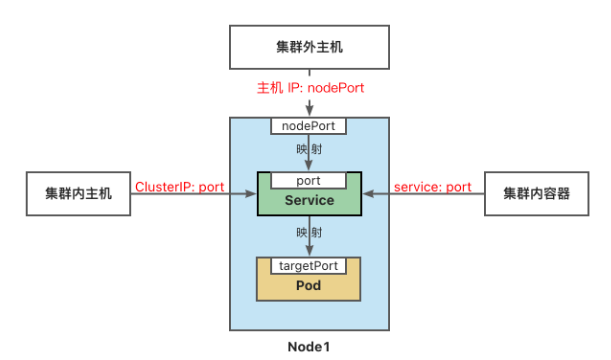

# Practical operation Service

Author: Heike07

> 参考文章：https://www.yuque.com/wukong-zorrm/qdoy5p/yhr041

## Knowledge

创建service对象

Service将运行在一组 [Pods](https://kubernetes.io/zh-cn/docs/concepts/workloads/pods/) 上的应用程序公开为网络服务的抽象方法。

Service为一组 Pod 提供相同的 DNS 名，并且在它们之间进行负载均衡。

Kubernetes 为 Pod 提供分配了IP 地址，但IP地址可能会发生变化。

集群内的容器可以通过service名称访问服务，而不需要担心Pod的IP发生变化。

------

Kubernetes Service 定义了这样一种抽象：

逻辑上的一组可以互相替换的 Pod，通常称为微服务。 

Service 对应的 Pod 集合通常是通过[选择算符](https://kubernetes.io/zh-cn/docs/concepts/overview/working-with-objects/labels/)来确定的。 

举个例子，在一个Service中运行了3个nginx的副本。这些副本是可互换的，我们不需要关心它们调用了哪个nginx，也不需要关注 Pod的运行状态，只需要调用这个服务就可以了。

- ClusterIP：将服务公开在集群内部。kubernetes会给服务分配一个集群内部的 IP，集群内的所有主机都可以通过这个Cluster-IP访问服务。集群内部的Pod可以通过service名称访问服务。
- [NodePort](https://kubernetes.io/zh-cn/docs/concepts/services-networking/service/#type-nodeport)：通过每个节点的主机IP 和静态端口（NodePort）暴露服务。 集群的外部主机可以使用节点IP和NodePort访问服务。
- [ExternalName](https://kubernetes.io/zh-cn/docs/concepts/services-networking/service/#externalname)：将集群外部的网络引入集群内部。
- [LoadBalancer](https://kubernetes.io/zh-cn/docs/concepts/services-networking/service/#loadbalancer)：使用云提供商的负载均衡器向外部暴露服务。 

访问service

1.NodePort端口是随机的，范围为:30000-32767。

2.集群中每一个主机节点的NodePort端口都可以访问。

3.如果需要指定端口，不想随机产生，需要使用配置文件来声明



## Practical Operation

```powershell
# 创建一个关联 deployment 的 service
controlplane $ kubectl expose deployment/nginx-deployment --name=nginx-service --type=ClusterIP --port=80 --target-port=80
Error from server (NotFound): deployments.apps "nginx-deployment" not found
>> - 这里失败是因为没有 nginx-deployment 的 deployment
controlplane $ 
controlplane $ 
# 创建deployment nginx-deployment
controlplane $ kubectl create deployment nginx-deployment --image=nginx:1.22 --replicas=3
deployment.apps/nginx-deployment created
# 再次创建一个关联 deployment 的 service 成功
controlplane $ kubectl expose deployment/nginx-deployment --name=nginx-service --type=ClusterIP --port=80 --target-port=80
>> - 这里的端口 （port是service端口,target-port是pod端口） 
service/nginx-service exposed
# 查看 service list
controlplane $ kubectl get svc
NAME            TYPE        CLUSTER-IP       EXTERNAL-IP   PORT(S)   AGE
kubernetes      ClusterIP   10.96.0.1        <none>        443/TCP   23d
nginx-service   ClusterIP   10.105.179.245   <none>        80/TCP    14s
# 通过cluster-ip 也就是 service 的ip 进行访问 发现可以访问成功
controlplane $ curl 10.105.179.245
<!DOCTYPE html>
<html>
<head>
<title>Welcome to nginx!</title>
<style>
html { color-scheme: light dark; }
body { width: 35em; margin: 0 auto;
font-family: Tahoma, Verdana, Arial, sans-serif; }
</style>
</head>
<body>
<h1>Welcome to nginx!</h1>
<p>If you see this page, the nginx web server is successfully installed and
working. Further configuration is required.</p>

<p>For online documentation and support please refer to
<a href="http://nginx.org/">nginx.org</a>.<br/>
Commercial support is available at
<a href="http://nginx.com/">nginx.com</a>.</p>

<p><em>Thank you for using nginx.</em></p>
</body>
</html>
controlplane $ kubectl get endpoints
endpoints                        endpointslices.discovery.k8s.io
# 查看endpoints 端点 发现是由3个pod 进行的负载均衡 端口都为80
controlplane $ kubectl get endpoints nginx-service 
NAME            ENDPOINTS                                         AGE
nginx-service   192.168.0.14:80,192.168.1.12:80,192.168.1.13:80   46s
# 查看pod list
controlplane $ kubectl get pod
NAME                               READY   STATUS    RESTARTS   AGE
nginx-deployment-978469b8b-97hkk   1/1     Running   0          69s
nginx-deployment-978469b8b-h477s   1/1     Running   0          69s
nginx-deployment-978469b8b-z7t5b   1/1     Running   0          69s
# 查看 deployment 的 nginx-deployment list
controlplane $ kubectl get deployments.apps nginx-deployment  
NAME               READY   UP-TO-DATE   AVAILABLE   AGE
nginx-deployment   3/3     3            3           79s
# 查看 deployment 的 nginx-deployment list 的详细节点状态
controlplane $ kubectl get deployments.apps nginx-deployment -o wide 
NAME               READY   UP-TO-DATE   AVAILABLE   AGE   CONTAINERS   IMAGES       SELECTOR
nginx-deployment   3/3     3            3           84s   nginx        nginx:1.22   app=nginx-deployment
# 查看 deployment 的 nginx-deployment list 的详细信息
controlplane $ kubectl describe deployments.apps nginx-deployment 
Name:                   nginx-deployment
Namespace:              default
CreationTimestamp:      Fri, 01 Sep 2023 05:55:14 +0000
Labels:                 app=nginx-deployment
Annotations:            deployment.kubernetes.io/revision: 1
Selector:               app=nginx-deployment
Replicas:               3 desired | 3 updated | 3 total | 3 available | 0 unavailable
StrategyType:           RollingUpdate
MinReadySeconds:        0
RollingUpdateStrategy:  25% max unavailable, 25% max surge
Pod Template:
  Labels:  app=nginx-deployment
  Containers:
   nginx:
    Image:        nginx:1.22
    Port:         <none>
    Host Port:    <none>
    Environment:  <none>
    Mounts:       <none>
  Volumes:        <none>
Conditions:
  Type           Status  Reason
  ----           ------  ------
  Available      True    MinimumReplicasAvailable
  Progressing    True    NewReplicaSetAvailable
OldReplicaSets:  <none>
NewReplicaSet:   nginx-deployment-978469b8b (3/3 replicas created)
Events:
  Type    Reason             Age   From                   Message
  ----    ------             ----  ----                   -------
  Normal  ScalingReplicaSet  103s  deployment-controller  Scaled up replica set nginx-deployment-978469b8b to 3
controlplane $ kubectl describe pod/nginx-deployment-978469b8b-
pod/nginx-deployment-978469b8b-97hkk  pod/nginx-deployment-978469b8b-h477s  pod/nginx-deployment-978469b8b-z7t5b
# 查看其中一个pod的详细信息
controlplane $ kubectl describe pod/nginx-deployment-978469b8b-97hkk 
Name:             nginx-deployment-978469b8b-97hkk
Namespace:        default
Priority:         0
Service Account:  default
Node:             node01/172.30.2.2
Start Time:       Fri, 01 Sep 2023 05:55:15 +0000
Labels:           app=nginx-deployment
                  pod-template-hash=978469b8b
Annotations:      cni.projectcalico.org/containerID: 3b103402d8dabcbda9297af6aa3e58388405509670f358eac45b84967de00707
                  cni.projectcalico.org/podIP: 192.168.1.13/32
                  cni.projectcalico.org/podIPs: 192.168.1.13/32
Status:           Running
IP:               192.168.1.13
IPs:
  IP:           192.168.1.13
Controlled By:  ReplicaSet/nginx-deployment-978469b8b
Containers:
  nginx:
    Container ID:   containerd://ae39714f9bdafb97ac5bbdcff05dff764f7cabd0f8e8ea3b8f9abce6e4748330
    Image:          nginx:1.22
    Image ID:       docker.io/library/nginx@sha256:fc5f5fb7574755c306aaf88456ebfbe0b006420a184d52b923d2f0197108f6b7
    Port:           <none>
    Host Port:      <none>
    State:          Running
      Started:      Fri, 01 Sep 2023 05:55:18 +0000
    Ready:          True
    Restart Count:  0
    Environment:    <none>
    Mounts:
      /var/run/secrets/kubernetes.io/serviceaccount from kube-api-access-p726c (ro)
Conditions:
  Type              Status
  Initialized       True 
  Ready             True 
  ContainersReady   True 
  PodScheduled      True 
Volumes:
  kube-api-access-p726c:
    Type:                    Projected (a volume that contains injected data from multiple sources)
    TokenExpirationSeconds:  3607
    ConfigMapName:           kube-root-ca.crt
    ConfigMapOptional:       <nil>
    DownwardAPI:             true
QoS Class:                   BestEffort
Node-Selectors:              <none>
Tolerations:                 node.kubernetes.io/not-ready:NoExecute op=Exists for 300s
                             node.kubernetes.io/unreachable:NoExecute op=Exists for 300s
Events:
  Type    Reason     Age    From               Message
  ----    ------     ----   ----               -------
  Normal  Scheduled  2m11s  default-scheduler  Successfully assigned default/nginx-deployment-978469b8b-97hkk to node01
  Normal  Pulled     2m8s   kubelet            Container image "nginx:1.22" already present on machine
  Normal  Created    2m8s   kubelet            Created container nginx
  Normal  Started    2m8s   kubelet            Started container nginx
controlplane $ 
# 将deployment 的 nginx-deploymeny 进行 service绑定 端口port service 的端口 和 svc 的端口 80
# 并通过映射主机随机端口方式进行绑定
controlplane $ kubectl expose deployment nginx-deployment --name=nginx-service2 --type=NodePort --port=80 --target-port=80
service/nginx-service2 exposed
controlplane $ 
# 查看service list
controlplane $ kubectl get svc
NAME             TYPE        CLUSTER-IP       EXTERNAL-IP   PORT(S)        AGE
kubernetes       ClusterIP   10.96.0.1        <none>        443/TCP        23d
nginx-service    ClusterIP   10.105.179.245   <none>        80/TCP         3m40s
nginx-service2   NodePort    10.111.156.58    <none>        80:30935/TCP   9s
# 通过service2 的pod ip进行访问发现可以访问
controlplane $ curl 10.111.156.58
<!DOCTYPE html>
<html>
<head>
<title>Welcome to nginx!</title>
<style>
html { color-scheme: light dark; }
body { width: 35em; margin: 0 auto;
font-family: Tahoma, Verdana, Arial, sans-serif; }
</style>
</head>
<body>
<h1>Welcome to nginx!</h1>
<p>If you see this page, the nginx web server is successfully installed and
working. Further configuration is required.</p>

<p>For online documentation and support please refer to
<a href="http://nginx.org/">nginx.org</a>.<br/>
Commercial support is available at
<a href="http://nginx.com/">nginx.com</a>.</p>

<p><em>Thank you for using nginx.</em></p>
</body>
</html>
controlplane $ kubectl localhost:30935
error: unknown command "localhost:30935" for "kubectl"
# 通过service2 的端口映射发现可以访问
controlplane $ curl localhost:30935
<!DOCTYPE html>
<html>
<head>
<title>Welcome to nginx!</title>
<style>
html { color-scheme: light dark; }
body { width: 35em; margin: 0 auto;
font-family: Tahoma, Verdana, Arial, sans-serif; }
</style>
</head>
<body>
<h1>Welcome to nginx!</h1>
<p>If you see this page, the nginx web server is successfully installed and
working. Further configuration is required.</p>

<p>For online documentation and support please refer to
<a href="http://nginx.org/">nginx.org</a>.<br/>
Commercial support is available at
<a href="http://nginx.com/">nginx.com</a>.</p>

<p><em>Thank you for using nginx.</em></p>
</body>
</html>
controlplane $ kubectl run nginx-test --image nginx1.22 -it --rm -- sh
^Ccontrolplane $ kubectl run nginx-test --image nginx:1.22 -it --rm -- sh
Error from server (AlreadyExists): pods "nginx-test" already exists
# 创建临时容器test 2 
controlplane $ kubectl run nginx-test2 --image nginx:1.22 -it --rm -- sh
If you don't see a command prompt, try pressing enter.
# 进行pod 名称的访问发现可以访问
# curl nginx-service
<!DOCTYPE html>
<html>
<head>
<title>Welcome to nginx!</title>
<style>
html { color-scheme: light dark; }
body { width: 35em; margin: 0 auto;
font-family: Tahoma, Verdana, Arial, sans-serif; }
</style>
</head>
<body>
<h1>Welcome to nginx!</h1>
<p>If you see this page, the nginx web server is successfully installed and
working. Further configuration is required.</p>

<p>For online documentation and support please refer to
<a href="http://nginx.org/">nginx.org</a>.<br/>
Commercial support is available at
<a href="http://nginx.com/">nginx.com</a>.</p>

<p><em>Thank you for using nginx.</em></p>
</body>
</html>
# 访问 service2 的svc 名称 发现可以访问
# curl nginx-server2
curl: (6) Could not resolve host: nginx-server2
# curl nginx-service2
<!DOCTYPE html>
<html>
<head>
<title>Welcome to nginx!</title>
<style>
html { color-scheme: light dark; }
body { width: 35em; margin: 0 auto;
font-family: Tahoma, Verdana, Arial, sans-serif; }
</style>
</head>
<body>
<h1>Welcome to nginx!</h1>
<p>If you see this page, the nginx web server is successfully installed and
working. Further configuration is required.</p>

<p>For online documentation and support please refer to
<a href="http://nginx.org/">nginx.org</a>.<br/>
Commercial support is available at
<a href="http://nginx.com/">nginx.com</a>.</p>

<p><em>Thank you for using nginx.</em></p>
</body>
</html>
# 退出临时容器
# exit
Session ended, resume using 'kubectl attach nginx-test2 -c nginx-test2 -i -t' command when the pod is running
pod "nginx-test2" deleted
>> - 发现临时容器进行了删除
# 查看 node list
controlplane $ kubectl get node
NAME           STATUS   ROLES           AGE   VERSION
controlplane   Ready    control-plane   23d   v1.27.1
node01         Ready    <none>          23d   v1.27.1
# 查看pod list
controlplane $ kubectl get pod
NAME                               READY   STATUS             RESTARTS   AGE
nginx-deployment-978469b8b-97hkk   1/1     Running            0          6m51s
nginx-deployment-978469b8b-h477s   1/1     Running            0          6m51s
nginx-deployment-978469b8b-z7t5b   1/1     Running            0          6m51s
nginx-test                         0/1     ImagePullBackOff   0          102s
# 查看deployment list
controlplane $ kubectl get deployments.apps 
NAME               READY   UP-TO-DATE   AVAILABLE   AGE
nginx-deployment   3/3     3            3           7m1s
# 查看service list
controlplane $ kubectl get svc
NAME             TYPE        CLUSTER-IP       EXTERNAL-IP   PORT(S)        AGE
kubernetes       ClusterIP   10.96.0.1        <none>        443/TCP        23d
nginx-service    ClusterIP   10.105.179.245   <none>        80/TCP         7m7s
nginx-service2   NodePort    10.111.156.58    <none>        80:30935/TCP   3m36s
# 清理环境 删除 svc nginx-service
controlplane $ kubectl delete service nginx-service
service "nginx-service" deleted
# 清理环境 删除 svc nginx-service2
controlplane $ kubectl delete service nginx-service2
service "nginx-service2" deleted
# 查看 svc list
controlplane $ kubectl get svc
NAME         TYPE        CLUSTER-IP   EXTERNAL-IP   PORT(S)   AGE
kubernetes   ClusterIP   10.96.0.1    <none>        443/TCP   23d
controlplane $ kubectl get deployments.apps 
NAME               READY   UP-TO-DATE   AVAILABLE   AGE
nginx-deployment   3/3     3            3           7m42s
# 清理环境 删除 deployment nginx-deployment 
controlplane $ kubectl delete deployments.apps nginx-deployment 
deployment.apps "nginx-deployment" deleted
# 查看 deployment list
controlplane $ kubectl get deployments.apps 
No resources found in default namespace.
# 查看全部环境 发现有一个残留的 nginx-test pod 需要进行删除
controlplane $ kubectl get all
NAME             READY   STATUS             RESTARTS   AGE
pod/nginx-test   0/1     ImagePullBackOff   0          3m25s

NAME                 TYPE        CLUSTER-IP   EXTERNAL-IP   PORT(S)   AGE
service/kubernetes   ClusterIP   10.96.0.1    <none>        443/TCP   23d
# 清理环境 删除 pod nginx-test
controlplane $ kubectl delete pods nginx-test 
pod "nginx-test" deleted
controlplane $ kubectl get all
NAME                 TYPE        CLUSTER-IP   EXTERNAL-IP   PORT(S)   AGE
service/kubernetes   ClusterIP   10.96.0.1    <none>        443/TCP   23d
controlplane $ 
# END
```

