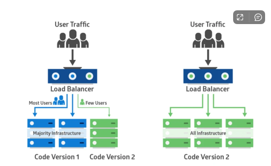
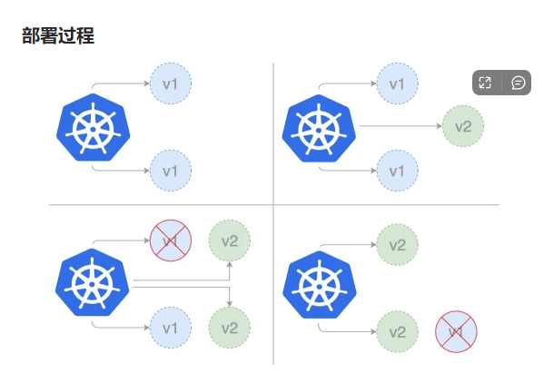
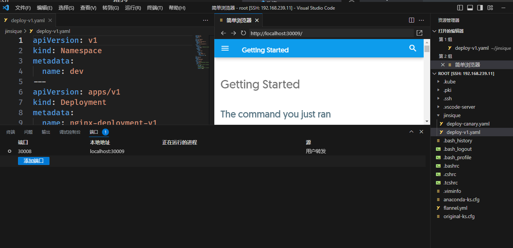

# Practical operation Canary Release Mode
作者：heike07
## Knowledge

**金丝雀部署(canary deployment)****也被称为灰度发布。**

早期，工人下矿井之前会放入一只金丝雀检测井下是否存在有毒气体。

采用金丝雀部署，你可以在生产环境的基础设施中小范围的部署新的应用代码。

一旦应用签署发布，只有少数用户被路由到它，最大限度的降低影响。

如果没有错误发生，则将新版本逐渐推广到整个基础设施。





```yaml
## deploy-v1.yaml  >> -- 版本1 的系统的yaml 示例
apiVersion: v1
kind: Namespace
metadata:
  name: dev
---
apiVersion: apps/v1
kind: Deployment
metadata:
  name: nginx-deployment-v1
  namespace: dev
  labels:
    app: nginx-deployment-v1
spec:
  replicas: 3
  selector:
    matchLabels: # 跟template.metadata.labels一致
      app: nginx
  template:
    metadata:
      labels:
        app: nginx
    spec:
      containers:
      - name: nginx
        image: nginx:1.22
        ports:
        - containerPort: 80
---
apiVersion: v1
kind: Service
metadata:
  name: canary-demo
  namespace: dev
spec:
  type: NodePort
  selector: # 更Deployment中的selector一致
    app: nginx
  ports:
      # By default and for convenience, the `targetPort` is set to the same value as the `port` field.
    - port: 80
      targetPort: 80
      # Optional field
      # By default and for convenience, the Kubernetes control plane will allocate a port from a range (default: 30000-32767)
      nodePort: 30008
```

```shell
## deploy-canary.yaml -- 新版本（通过金丝雀发布调度） 的系统的yaml 示例
apiVersion: apps/v1
kind: Deployment
metadata:
  name: nginx-deployment-canary
  namespace: dev
  labels:
    app: nginx-deployment-canary
spec:
  replicas: 1
  selector:
    matchLabels: # 跟template.metadata.labels一致
      app: nginx
  template:
    metadata:
      labels:
        app: nginx
        track: canary
    spec:
      containers:
        - name: new-nginx
          image: docker/getting-started
          ports:
            - containerPort: 80
```

##Practical Operation

```powershell
# 查看node 节点状态
[root@k8smaster ~]# kubectl get node
NAME        STATUS   ROLES                  AGE   VERSION
k8smaster   Ready    control-plane,master   41h   v1.23.6
k8snode01   Ready    <none>                 41h   v1.23.6
k8snode02   Ready    <none>                 41h   v1.23.6
# 查看dev 环境空间内容，是上一次实验 需要清理掉
[root@k8smaster ~]# kubectl get all -n dev
NAME                                       READY   STATUS    RESTARTS   AGE
pod/nginx-deployment-v1-65bc85f64b-b2mp7   1/1     Running   0          21h
pod/nginx-deployment-v1-65bc85f64b-pgvqt   1/1     Running   0          21h
pod/nginx-deployment-v1-65bc85f64b-wtdnl   1/1     Running   0          21h

NAME                  TYPE       CLUSTER-IP     EXTERNAL-IP   PORT(S)        AGE
service/canary-demo   NodePort   10.1.145.153   <none>        80:30008/TCP   21h

NAME                                      READY   UP-TO-DATE   AVAILABLE   AGE
deployment.apps/nginx-deployment-canary   0/0     0            0           21h
deployment.apps/nginx-deployment-v1       3/3     3            3           21h

NAME                                                 DESIRED   CURRENT   READY   AGE
replicaset.apps/nginx-deployment-canary-6f555c494d   0         0         0       21h
replicaset.apps/nginx-deployment-v1-65bc85f64b       3         3         3       21h
# 这里演示逐步进行删除，首先删除最新版本的应用
[root@k8smaster ~]# kubectl --namespace=dev delete deployments.apps nginx-deployment-canary 
deployment.apps "nginx-deployment-canary" deleted
# 查看发现 已经canary 已经删除
[root@k8smaster ~]# kubectl get all -n dev
NAME                                       READY   STATUS    RESTARTS   AGE
pod/nginx-deployment-v1-65bc85f64b-b2mp7   1/1     Running   0          21h
pod/nginx-deployment-v1-65bc85f64b-pgvqt   1/1     Running   0          21h
pod/nginx-deployment-v1-65bc85f64b-wtdnl   1/1     Running   0          21h

NAME                  TYPE       CLUSTER-IP     EXTERNAL-IP   PORT(S)        AGE
service/canary-demo   NodePort   10.1.145.153   <none>        80:30008/TCP   21h

NAME                                  READY   UP-TO-DATE   AVAILABLE   AGE
deployment.apps/nginx-deployment-v1   3/3     3            3           21h

NAME                                             DESIRED   CURRENT   READY   AGE
replicaset.apps/nginx-deployment-v1-65bc85f64b   3         3         3       21h
# 删除 canary-demo 的service 
[root@k8smaster ~]# kubectl --namespace=dev delete service canary-demo 
service "canary-demo" deleted
# 查看结果发现成功了
[root@k8smaster ~]# kubectl get all -n dev
NAME                                       READY   STATUS    RESTARTS   AGE
pod/nginx-deployment-v1-65bc85f64b-b2mp7   1/1     Running   0          21h
pod/nginx-deployment-v1-65bc85f64b-pgvqt   1/1     Running   0          21h
pod/nginx-deployment-v1-65bc85f64b-wtdnl   1/1     Running   0          21h

NAME                                  READY   UP-TO-DATE   AVAILABLE   AGE
deployment.apps/nginx-deployment-v1   3/3     3            3           21h

NAME                                             DESIRED   CURRENT   READY   AGE
replicaset.apps/nginx-deployment-v1-65bc85f64b   3         3         3       21h
# 删除 v1 版本应用
[root@k8smaster ~]# kubectl --namespace=dev delete deployments.apps nginx-deployment-v1 
deployment.apps "nginx-deployment-v1" deleted
# 查看dev 所有资源
[root@k8smaster ~]# kubectl get all -n dev
No resources found in dev namespace.
[root@k8smaster ~]# 
# 查看dev 状态发现资源已经全部删除了 成功
[root@k8smaster ~]# kubectl --namespace=dev  delete namespaces dev
warning: deleting cluster-scoped resources, not scoped to the provided namespace
namespace "dev" deleted
[root@k8smaster ~]# 
[root@k8smaster ~]# kubectl get all -n dev
No resources found in dev namespace.
[root@k8smaster ~]# 
[root@k8smaster ~]# 
[root@k8smaster ~]# 


# 进入到 金丝雀文件夹
[root@k8smaster ~]# cd /root/jinsique/
# 执行v1 版本应用
[root@k8smaster jinsique]# kubectl apply -f deploy-v1.yaml 
namespace/dev created
deployment.apps/nginx-deployment-v1 created
service/canary-demo created
# 查看dev 命名空间所有资源情况 发现v1 Deployment service namespace 都已经生效了
[root@k8smaster jinsique]# kubectl get all -n dev
NAME                                       READY   STATUS    RESTARTS   AGE
pod/nginx-deployment-v1-65bc85f64b-c2h4f   1/1     Running   0          8s
pod/nginx-deployment-v1-65bc85f64b-hg9pb   1/1     Running   0          8s
pod/nginx-deployment-v1-65bc85f64b-txhqj   1/1     Running   0          8s

NAME                  TYPE       CLUSTER-IP     EXTERNAL-IP   PORT(S)        AGE
service/canary-demo   NodePort   10.1.251.211   <none>        80:30008/TCP   8s

NAME                                  READY   UP-TO-DATE   AVAILABLE   AGE
deployment.apps/nginx-deployment-v1   3/3     3            3           9s

NAME                                             DESIRED   CURRENT   READY   AGE
replicaset.apps/nginx-deployment-v1-65bc85f64b   3         3         3       9s
# 访问sercice 的cluster-ip 发现 可以成访问到应用 v1
[root@k8smaster jinsique]# curl 10.1.251.211
<!DOCTYPE html>
<html>
<head>
<title>Welcome to nginx!</title>
<style>
html { color-scheme: light dark; }
body { width: 35em; margin: 0 auto;
font-family: Tahoma, Verdana, Arial, sans-serif; }
</style>
</head>
<body>
<h1>Welcome to nginx!</h1>
<p>If you see this page, the nginx web server is successfully installed and
working. Further configuration is required.</p>

<p>For online documentation and support please refer to
<a href="http://nginx.org/">nginx.org</a>.<br/>
Commercial support is available at
<a href="http://nginx.com/">nginx.com</a>.</p>

<p><em>Thank you for using nginx.</em></p>
</body>
</html>
# 通过端口访问发现也可以访问到 nodeport 模式下的 开放端口
[root@k8smaster jinsique]# curl localhost:30008
<!DOCTYPE html>
<html>
<head>
<title>Welcome to nginx!</title>
<style>
html { color-scheme: light dark; }
body { width: 35em; margin: 0 auto;
font-family: Tahoma, Verdana, Arial, sans-serif; }
</style>
</head>
<body>
<h1>Welcome to nginx!</h1>
<p>If you see this page, the nginx web server is successfully installed and
working. Further configuration is required.</p>

<p>For online documentation and support please refer to
<a href="http://nginx.org/">nginx.org</a>.<br/>
Commercial support is available at
<a href="http://nginx.com/">nginx.com</a>.</p>

<p><em>Thank you for using nginx.</em></p>
</body>
</html>
[root@k8smaster jinsique]# 


# 执行新版发布应用 修改内容为images
[root@k8smaster jinsique]# kubectl apply -f deploy-canary.yaml 
deployment.apps/nginx-deployment-canary created
# 查看dev 命名空间状态 可以发现 增加了一个 canary 新版本应用 并同时进行流量分发
[root@k8smaster jinsique]# kubectl get all -n dev
NAME                                           READY   STATUS    RESTARTS   AGE
pod/nginx-deployment-canary-6f555c494d-c9ggc   1/1     Running   0          9s
pod/nginx-deployment-v1-65bc85f64b-c2h4f       1/1     Running   0          2m51s
pod/nginx-deployment-v1-65bc85f64b-hg9pb       1/1     Running   0          2m51s
pod/nginx-deployment-v1-65bc85f64b-txhqj       1/1     Running   0          2m51s

NAME                  TYPE       CLUSTER-IP     EXTERNAL-IP   PORT(S)        AGE
service/canary-demo   NodePort   10.1.251.211   <none>        80:30008/TCP   2m51s

NAME                                      READY   UP-TO-DATE   AVAILABLE   AGE
deployment.apps/nginx-deployment-canary   1/1     1            1           9s
deployment.apps/nginx-deployment-v1       3/3     3            3           2m52s

NAME                                                 DESIRED   CURRENT   READY   AGE
replicaset.apps/nginx-deployment-canary-6f555c494d   1         1         1       9s
replicaset.apps/nginx-deployment-v1-65bc85f64b       3         3         3       2m52s
# 访问第一次 端口 访问到nginx
[root@k8smaster jinsique]# curl localhost:30008
<!DOCTYPE html>
<html>
<head>
<title>Welcome to nginx!</title>
<style>
html { color-scheme: light dark; }
body { width: 35em; margin: 0 auto;
font-family: Tahoma, Verdana, Arial, sans-serif; }
</style>
</head>
<body>
<h1>Welcome to nginx!</h1>
<p>If you see this page, the nginx web server is successfully installed and
working. Further configuration is required.</p>

<p>For online documentation and support please refer to
<a href="http://nginx.org/">nginx.org</a>.<br/>
Commercial support is available at
<a href="http://nginx.com/">nginx.com</a>.</p>

<p><em>Thank you for using nginx.</em></p>
</body>
</html>
# 第二次访问 访问到新版本应用 这个是docker 的开始 应用
[root@k8smaster jinsique]# curl localhost:30008
<!doctype html><html lang=en class=no-js> <head><meta charset=utf-8><meta name=viewport content="width=device-width,initial-scale=1"><meta http-equiv=x-ua-compatible content="ie=edge"><meta name=description content="Getting Started with Docker"><script>var anchor=window.location.hash.substr(1);location.href="/tutorial/"+(anchor?"#"+anchor:"")</script><meta http-equiv=refresh content="0; url=/tutorial/"><meta name=robots content=noindex><link href=/tutorial/ rel=canonical><meta name=author content=Docker><meta name=lang:clipboard.copy content="Copy to clipboard"><meta name=lang:clipboard.copied content="Copied to clipboard"><meta name=lang:search.language content=en><meta
...
arget=_blank rel=noopener> Material for MkDocs</a> </div> <div class=md-footer-social> <link rel=stylesheet href=assets/fonts/font-awesome.css> <a href=https://github.com/docker/getting-started target=_blank rel=noopener title=github-alt class="md-footer-social__link fa fa-github-alt"></a> </div> </div> </div> </footer> </div> <script src=assets/javascripts/application.c33a9706.js></script> <script>app.initialize({version:"1.3.0",url:{base:"."}})</script> </body> </html>[root@k8smaster jinsique]# 
[root@k8smaster jinsique]# 
# 第三次访问 nginx
[root@k8smaster jinsique]# curl localhost:30008
<!DOCTYPE html>
<html>
<head>
<title>Welcome to nginx!</title>
<style>
html { color-scheme: light dark; }
body { width: 35em; margin: 0 auto;
font-family: Tahoma, Verdana, Arial, sans-serif; }
</style>
</head>
<body>
<h1>Welcome to nginx!</h1>
<p>If you see this page, the nginx web server is successfully installed and
working. Further configuration is required.</p>

<p>For online documentation and support please refer to
<a href="http://nginx.org/">nginx.org</a>.<br/>
Commercial support is available at
<a href="http://nginx.com/">nginx.com</a>.</p>

<p><em>Thank you for using nginx.</em></p>
</body>
</html>
# kubectl describe svc canary-demo --namespace=dev 查看具体流量分发情况
# 将新版应用 分片pod设置为与v1 应用一致
[root@k8smaster jinsique]# kubectl -n=dev scale deployment nginx-deployment-canary --replicas=3
deployment.apps/nginx-deployment-canary scaled
# 再次查看dev 命名空间 发现有6个pod
[root@k8smaster jinsique]# kubectl get all -n dev
NAME                                           READY   STATUS    RESTARTS   AGE
pod/nginx-deployment-canary-6f555c494d-c9ggc   1/1     Running   0          108s
pod/nginx-deployment-canary-6f555c494d-dbvpv   1/1     Running   0          38s
pod/nginx-deployment-canary-6f555c494d-s6qhk   1/1     Running   0          38s
pod/nginx-deployment-v1-65bc85f64b-c2h4f       1/1     Running   0          4m30s
pod/nginx-deployment-v1-65bc85f64b-hg9pb       1/1     Running   0          4m30s
pod/nginx-deployment-v1-65bc85f64b-txhqj       1/1     Running   0          4m30s

NAME                  TYPE       CLUSTER-IP     EXTERNAL-IP   PORT(S)        AGE
service/canary-demo   NodePort   10.1.251.211   <none>        80:30008/TCP   4m30s

NAME                                      READY   UP-TO-DATE   AVAILABLE   AGE
deployment.apps/nginx-deployment-canary   3/3     3            3           108s
deployment.apps/nginx-deployment-v1       3/3     3            3           4m31s

NAME                                                 DESIRED   CURRENT   READY   AGE
replicaset.apps/nginx-deployment-canary-6f555c494d   3         3         3       108s
replicaset.apps/nginx-deployment-v1-65bc85f64b       3         3         3       4m31s
# 访问1 老应用
[root@k8smaster jinsique]# curl localhost:30008
<!DOCTYPE html>
<html>
<head>
<title>Welcome to nginx!</title>
<style>
html { color-scheme: light dark; }
body { width: 35em; margin: 0 auto;
font-family: Tahoma, Verdana, Arial, sans-serif; }
</style>
</head>
<body>
<h1>Welcome to nginx!</h1>
<p>If you see this page, the nginx web server is successfully installed and
working. Further configuration is required.</p>

<p>For online documentation and support please refer to
<a href="http://nginx.org/">nginx.org</a>.<br/>
Commercial support is available at
<a href="http://nginx.com/">nginx.com</a>.</p>

<p><em>Thank you for using nginx.</em></p>
</body>
</html>
# 访问2 新应用
[root@k8smaster jinsique]# curl localhost:30008
<!doctype html><html lang=en class=no-js> <head><meta charset=utf-8><meta name=viewport content="width=device-width,initial-scale=1"><meta http-equiv=x-ua-compatible content="ie=edge"><meta name=description content="Getting Started with Docker"><script>var 
...
src=assets/javascripts/application.c33a9706.js></script> <script>app.initialize({version:"1.3.0",url:{base:"."}})</script> </body> </html>
# 访问3 老应用
[root@k8smaster jinsique]# curl localhost:30008
<!DOCTYPE html>
<html>
<head>
<title>Welcome to nginx!</title>
<style>
html { color-scheme: light dark; }
body { width: 35em; margin: 0 auto;
font-family: Tahoma, Verdana, Arial, sans-serif; }
</style>
</head>
<body>
<h1>Welcome to nginx!</h1>
<p>If you see this page, the nginx web server is successfully installed and
working. Further configuration is required.</p>

<p>For online documentation and support please refer to
<a href="http://nginx.org/">nginx.org</a>.<br/>
Commercial support is available at
<a href="http://nginx.com/">nginx.com</a>.</p>

<p><em>Thank you for using nginx.</em></p>
</body>
</html>
# 访问4 新应用
[root@k8smaster jinsique]# curl localhost:30008
<!doctype html><html lang=en class=no-js> <head><meta charset=utf-8><meta name=viewport content="width=device-width,initial-scale=1"><meta http-equiv=x-ua-compatible content="ie=edge"><meta name=description content="Getting Started with Docker"><script>var 
...
<link rel=stylesheet href=assets/fonts/font-awesome.css> <a href=https://github.com/docker/getting-started target=_blank rel=noopener title=github-alt class="md-footer-social__link fa fa-github-alt"></a> </div> </div> </div> </footer> </div> <script src=assets/javascripts/application.c33a9706.js></script> <script>app.initialize({version:"1.3.0",url:{base:"."}})</script> </body> </html>
# 访问5 老应用
[root@k8smaster jinsique]# curl localhost:30008
<!DOCTYPE html>
<html>
<head>
<title>Welcome to nginx!</title>
<style>
html { color-scheme: light dark; }
body { width: 35em; margin: 0 auto;
font-family: Tahoma, Verdana, Arial, sans-serif; }
</style>
</head>
<body>
<h1>Welcome to nginx!</h1>
<p>If you see this page, the nginx web server is successfully installed and
working. Further configuration is required.</p>

<p>For online documentation and support please refer to
<a href="http://nginx.org/">nginx.org</a>.<br/>
Commercial support is available at
<a href="http://nginx.com/">nginx.com</a>.</p>

<p><em>Thank you for using nginx.</em></p>
</body>
</html>
# 访问6 新应用
[root@k8smaster jinsique]# curl localhost:30008
<!doctype html><html lang=en class=no-js> <head><meta charset=utf-8><meta name=viewport content="width=device-width,initial-scale=1"><meta http-equiv=x-ua-compatible content="ie=edge"><meta name=description content="Getting Started with Docker"><script>var anchor=window.location.hash.substr(1);location.href="/tutorial/"+(anchor?"#"+anchor:"")</script><meta http-equiv=refresh content="0; url=/tutorial/"><meta name=robots 
...
Docker </div> powered by <a href=https://www.mkdocs.org target=_blank rel=noopener>MkDocs</a> and <a href=https://squidfunk.github.io/mkdocs-material/ target=_blank rel=noopener> Material for MkDocs</a> </div> <div class=md-footer-social> <link rel=stylesheet href=assets/fonts/font-awesome.css> <a href=https://github.com/docker/getting-started target=_blank rel=noopener title=github-alt class="md-footer-social__link fa fa-github-alt"></a> </div> </div> </div> </footer> </div> <script src=assets/javascripts/application.c33a9706.js></script> <script>app.initialize({version:"1.3.0",url:{base:"."}})</script> </body> </html>[root@k8smaster jinsique]# 
# 可以分析流量分发为1：1 证实操作有效
# 可以将v1 版本应用下线了 将副本数设置为0
[root@k8smaster jinsique]# kubectl -n=dev scale deployment nginx-deployment-v1 --replicas=0
deployment.apps/nginx-deployment-v1 scaled
# 访问1 新应用
[root@k8smaster jinsique]# curl localhost:30008
<!doctype html><html lang=en class=no-js> <head><meta charset=utf-8><meta name=viewport content="width=device-width,initial-scale=1"><meta http-equiv=x-ua-compatible content="ie=edge"><meta name=description content="Getting Started with Docker"><script>var anchor=window.location.hash.substr(1);location.href="/tutorial/"+(anchor?"#"+anchor:"")
...
<a href=https://github.com/docker/getting-started target=_blank rel=noopener title=github-alt class="md-footer-social__link fa fa-github-alt"></a> </div> </div> </div> </footer> </div> <script src=assets/javascripts/application.c33a9706.js></script> <script>app.initialize({version:"1.3.0",url:{base:"."}})</script> </body> </html>
# 访问2 新应用
[root@k8smaster jinsique]# curl localhost:30008
<!doctype html><html lang=en class=no-js> <head><meta charset=utf-8><meta name=viewport content="width=device-width,initial-scale=1"><meta http-equiv=x-ua-compatible 
...
href=assets/fonts/font-awesome.css> <a href=https://github.com/docker/getting-started target=_blank rel=noopener title=github-alt class="md-footer-social__link fa fa-github-alt"></a> </div> </div> </div> </footer> </div> <script src=assets/javascripts/application.c33a9706.js></script> <script>app.initialize({version:"1.3.0",url:{base:"."}})</script> </body> </html>
# 查看dev 命名状态 已经满足预期 金丝雀发布成功！！！
[root@k8smaster jinsique]# kubectl get all -n dev
NAME                                           READY   STATUS    RESTARTS   AGE
pod/nginx-deployment-canary-6f555c494d-c9ggc   1/1     Running   0          3m13s
pod/nginx-deployment-canary-6f555c494d-dbvpv   1/1     Running   0          2m3s
pod/nginx-deployment-canary-6f555c494d-s6qhk   1/1     Running   0          2m3s

NAME                  TYPE       CLUSTER-IP     EXTERNAL-IP   PORT(S)        AGE
service/canary-demo   NodePort   10.1.251.211   <none>        80:30008/TCP   5m55s

NAME                                      READY   UP-TO-DATE   AVAILABLE   AGE
deployment.apps/nginx-deployment-canary   3/3     3            3           3m14s
deployment.apps/nginx-deployment-v1       0/0     0            0           5m57s

NAME                                                 DESIRED   CURRENT   READY   AGE
replicaset.apps/nginx-deployment-canary-6f555c494d   3         3         3       3m14s
replicaset.apps/nginx-deployment-v1-65bc85f64b       0         0         0       5m57s
[root@k8smaster jinsique]# 
[root@k8smaster jinsique]# 
[root@k8smaster jinsique]# 

# 删除 dev 命名空间全部应用 （慎用）
[root@k8smaster jinsique]# kubectl -n=dev delete all --all
pod "nginx-deployment-canary-6f555c494d-c9ggc" deleted
pod "nginx-deployment-canary-6f555c494d-dbvpv" deleted
pod "nginx-deployment-canary-6f555c494d-s6qhk" deleted
service "canary-demo" deleted
deployment.apps "nginx-deployment-canary" deleted
deployment.apps "nginx-deployment-v1" deleted
[root@k8smaster jinsique]# 
# 查看dev 发现没有应用了 满足预期
[root@k8smaster jinsique]# kubectl get all -n dev
No resources found in dev namespace.
# 查看node 状态
[root@k8smaster jinsique]# kubectl get node
NAME        STATUS   ROLES                  AGE   VERSION
k8smaster   Ready    control-plane,master   41h   v1.23.6
k8snode01   Ready    <none>                 41h   v1.23.6
k8snode02   Ready    <none>                 41h   v1.23.6
# 查看集群 状态
[root@k8smaster jinsique]# kubectl get all
NAME                 TYPE        CLUSTER-IP   EXTERNAL-IP   PORT(S)   AGE
service/kubernetes   ClusterIP   10.1.0.1     <none>        443/TCP   41h
[root@k8smaster jinsique]# 

```
附一张访问新应用的截图：



是一个docker getting started 的程序~

END

> 参考文章：https://www.yuque.com/wukong-zorrm/qdoy5p/rg4ewv