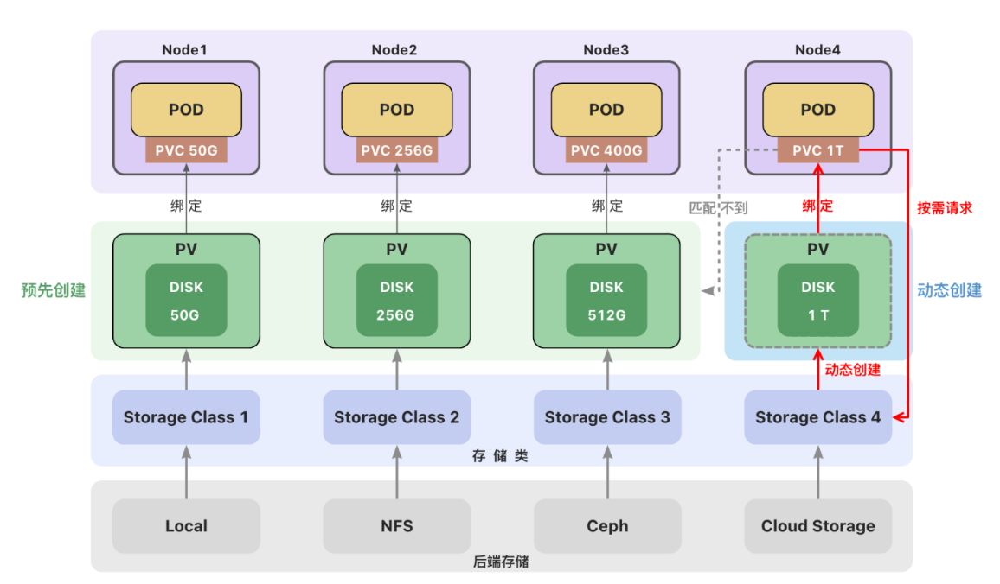

#Practical operation Volume

- 

##Knowledge

将数据存储在容器中，一旦容器被删除，数据也会被删除。

卷是独立于容器之外的一块存储区域，通过挂载(Mount)的方式供Pod中的容器使用。

- **使用场景**

- - 卷可以在多个容器之间共享数据。
  - 卷可以将容器数据存储在外部存储或云存储上。
  - 卷更容易备份或迁移。

- #### 常见的卷类型

- - **临时卷(Ephemeral Volume)：****与 Pod 一起创建和删除，生命周期与 Pod 相同**

- - - [emptyDir](https://kubernetes.io/zh-cn/docs/concepts/storage/volumes/#emptydir)  - 作为缓存或存储日志
    - [configMap](https://kubernetes.io/zh-cn/docs/concepts/storage/volumes/#configmap) 、[secret](https://kubernetes.io/zh-cn/docs/concepts/storage/volumes/#secret)、 [downwardAPI](https://kubernetes.io/zh-cn/docs/concepts/storage/volumes/#downwardapi) - 给Pod注入数据

- - **持久卷(Persistent Volume)：****删除Pod后，持久卷不会被删除**

- - - 本地存储 - [hostPath](https://kubernetes.io/zh-cn/docs/concepts/storage/volumes/#hostpath)、 [local](https://kubernetes.io/zh-cn/docs/concepts/storage/volumes/#local)

- - - 网络存储 - [NFS](https://kubernetes.io/zh-cn/docs/concepts/storage/volumes/#nfs)
    - 分布式存储 - Ceph([cephfs](https://kubernetes.io/zh-cn/docs/concepts/storage/volumes/#cephfs)文件存储、[rbd](https://kubernetes.io/zh-cn/docs/concepts/storage/volumes/#rbd)块存储)

- - **投射卷(Projected Volumes)：**[projected](https://kubernetes.io/zh-cn/docs/concepts/storage/projected-volumes/) 卷可以将多个卷映射到同一个目录上

    #### 后端存储

    一个集群中可以包含多种存储(如`local`、`NFS`、`Ceph`或云存储)。

    每种存储都对应一个**存储类（StorageClass）** ，存储类用来创建和管理持久卷，是集群与存储服务之间的桥梁。

    管理员创建持久卷(**PV**)时，通过设置不同的**StorageClass**来创建不同类型的持久卷。

    

##Practical operation

```shell
none
```


> 参考文章：https://www.yuque.com/wukong-zorrm/qdoy5p/df2ftr
>
> https://kubernetes.io/zh-cn/docs/concepts/storage/volumes/
>
> https://kubernetes.io/zh-cn/docs/concepts/storage/ephemeral-volumes/
>
> https://kubernetes.io/zh-cn/docs/tasks/configure-pod-container/configure-volume-storage/

