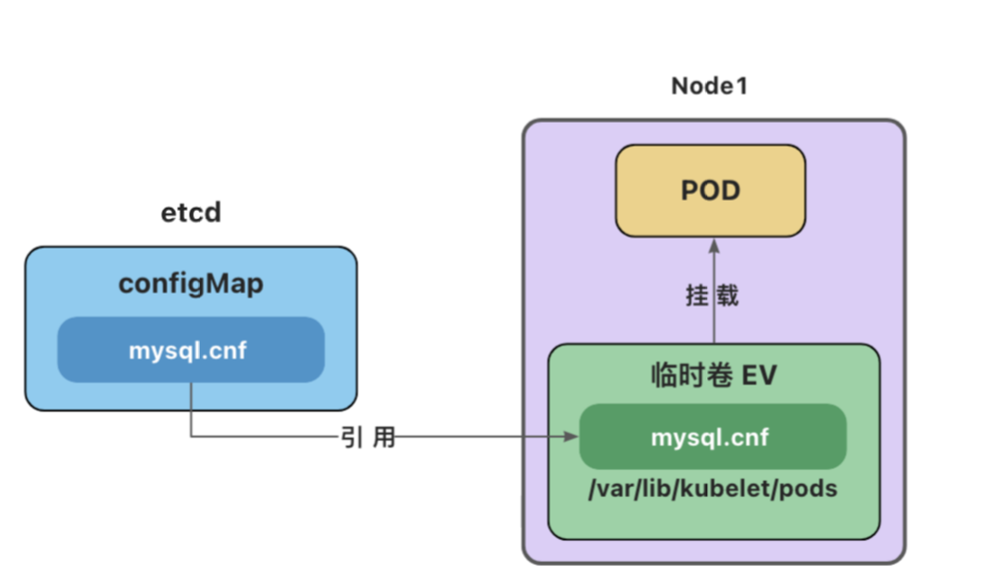
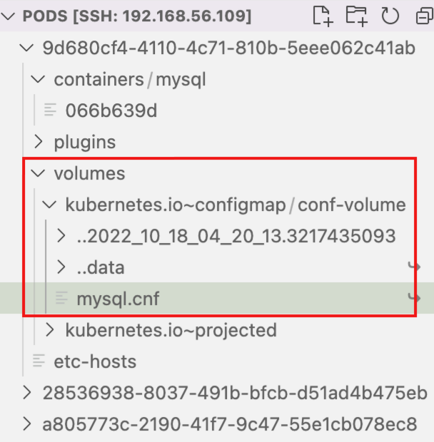

#Practical operation EV

##Knowledge

- **临时卷(Ephemeral Volume)**

- - **与 Pod 一起创建和删除，生命周期与 Pod 相同**
  - [emptyDir](https://kubernetes.io/zh-cn/docs/concepts/storage/volumes/#emptydir) - 初始内容为空的本地临时目录
  - [configMap](https://kubernetes.io/zh-cn/docs/concepts/storage/volumes/#configmap) - 为Pod注入配置文件
  - [secret](https://kubernetes.io/zh-cn/docs/concepts/storage/volumes/#secret) - 为Pod注入加密数据

- ## emptyDir

- emptyDir会创建一个初始状态为空的目录，存储空间来自本地的 kubelet 根目录或内存(需要将`emptyDir.medium`设置为`"Memory"`)。

- 通常使用本地临时存储来设置缓存、保存日志等。

- 例如，将redis的存储目录设置为emptyDir

- ```yaml
  apiVersion: v1
  kind: Pod
  metadata:
    name: redis-pod
  spec:
    containers:
    - name: redis
      image: redis
      volumeMounts:
      - name: redis-storage
        mountPath: /data/redis
    volumes:
    - name: redis-storage
      emptyDir: {}
  ```

- #### configMap卷和secret卷

- 注意：这里的configMap和secret代表的是卷的类型，不是configMap和secret对象。

- 删除Pod并不会删除ConfigMap对象和secret对象。

- 

- configMap卷和Secret卷是一种特殊类型的卷，kubelet引用configMap和Secret中定义的内容，在Pod所在节点上生成一个临时卷，将数据注入到Pod中。删除Pod，临时卷也会被删除。

- 临时卷位于Pod所在节点的`/var/lib/kubelet/pods`目录下

- 

##Practical operation

```shell
[root@k8smaster k8s_work]# kubectl apply -f redis-pod.yaml 
pod/redis-pod created
[root@k8smaster k8s_work]# kubcctl get pods redis-pod
bash: kubcctl: command not found
[root@k8smaster k8s_work]# kubectl get pods redis-pod 
NAME        READY   STATUS              RESTARTS   AGE
redis-pod   0/1     ContainerCreating   0          33s
[root@k8smaster k8s_work]# kubectl get pods redis-pod -owide
NAME        READY   STATUS              RESTARTS   AGE   IP       NODE        NOMINATED NODE   READINESS GATES
redis-pod   0/1     ContainerCreating   0          38s   <none>   k8snode02   <none>           <none>
[root@k8smaster k8s_work]# 

[root@k8smaster k8s_work]# kubectl get pods redis-pod -owide
NAME        READY   STATUS    RESTARTS   AGE   IP           NODE        NOMINATED NODE   READINESS GATES
redis-pod   1/1     Running   0          78s   10.244.2.4   k8snode02   <none>           <none>
[root@k8smaster k8s_work]# 

[root@k8smaster k8s_work]# kubectl describe pods redis-pod 
Name:         redis-pod
Namespace:    default
Priority:     0
Node:         k8snode02/192.168.7.102
Start Time:   Thu, 21 Sep 2023 10:30:52 +0800
Labels:       <none>
Annotations:  <none>
Status:       Running
IP:           10.244.2.4
IPs:
  IP:  10.244.2.4
Containers:
  redis:
    Container ID:   docker://6cb76172a4dd35776afb855ae43401dde9dc683a1a42593f1c6d9060bbff66e0
    Image:          redis
    Image ID:       docker-pullable://redis@sha256:2a2c7d6d79131e532fbf42a9973eb13a279f6b0b96bf7a44e496a9446549003c
    Port:           <none>
    Host Port:      <none>
    State:          Running
      Started:      Thu, 21 Sep 2023 10:31:32 +0800
    Ready:          True
    Restart Count:  0
    Environment:    <none>
    Mounts:
      /data/redis from redis-storage (rw)
      /var/run/secrets/kubernetes.io/serviceaccount from kube-api-access-l8cwg (ro)
Conditions:
  Type              Status
  Initialized       True 
  Ready             True 
  ContainersReady   True 
  PodScheduled      True 
Volumes:
  redis-storage:
    Type:       EmptyDir (a temporary directory that shares a pod's lifetime)
    Medium:     
    SizeLimit:  <unset>
  kube-api-access-l8cwg:
    Type:                    Projected (a volume that contains injected data from multiple sources)
    TokenExpirationSeconds:  3607
    ConfigMapName:           kube-root-ca.crt
    ConfigMapOptional:       <nil>
    DownwardAPI:             true
QoS Class:                   BestEffort
Node-Selectors:              <none>
Tolerations:                 node.kubernetes.io/not-ready:NoExecute op=Exists for 300s
                             node.kubernetes.io/unreachable:NoExecute op=Exists for 300s
Events:
  Type    Reason     Age    From               Message
  ----    ------     ----   ----               -------
  Normal  Scheduled  2m12s  default-scheduler  Successfully assigned default/redis-pod to k8snode02
  Normal  Pulling    2m13s  kubelet            Pulling image "redis"
  Normal  Pulled     93s    kubelet            Successfully pulled image "redis" in 39.588585403s
  Normal  Created    93s    kubelet            Created container redis
  Normal  Started    93s    kubelet            Started container redis
[root@k8smaster k8s_work]# 

# 查看要查看的mysql-pod 在node01 节点上
[root@k8smaster k8s_work]# kubectl get pod -owide
NAME        READY   STATUS    RESTARTS   AGE   IP            NODE        NOMINATED NODE   READINESS GATES
mysql-pod   1/1     Running   0          31m   10.244.1.11   k8snode01   <none>           <none>
redis-pod   1/1     Running   0          23m   10.244.2.4    k8snode02   <none>           <none>
# 进入该节点
[root@k8smaster k8s_work]# ssh k8snode01
root@k8snode01's password: n
Last login: Wed Sep 20 14:13:47 2023 from gateway
# 通过时间查看pod创建情况
[root@k8snode01 ~]# cd /var/lib/kubelet/pods
[root@k8snode01 pods]# ls -al
total 0
drwxr-x--- 5 root root 138 Sep 21 10:22 .
drwx------ 8 root root 208 Sep 11 16:22 ..
drwxr-x--- 5 root root  71 Sep 11 16:24 5e1afce5-b4d3-45fd-9c58-4cace2b43283
drwxr-x--- 5 root root  71 Sep 21 10:22 6f058b57-8bd8-48af-ab47-09549c7041c6
drwxr-x--- 5 root root  71 Sep 11 16:22 7e2bdbc0-11ee-4263-8752-5342d93e9c5f
# 进入到该目录
[root@k8snode01 pods]# cd 6f058b57-8bd8-48af-ab47-09549c7041c6
[root@k8snode01 6f058b57-8bd8-48af-ab47-09549c7041c6]# ls
containers  etc-hosts  plugins  volumes
[root@k8snode01 6f058b57-8bd8-48af-ab47-09549c7041c6]# cd volumes/
[root@k8snode01 volumes]# ls
kubernetes.io~configmap  kubernetes.io~projected
[root@k8snode01 volumes]# cd kubernetes.io~configmap/
[root@k8snode01 kubernetes.io~configmap]# ls
conf-volume
[root@k8snode01 kubernetes.io~configmap]# cd conf-volume/
[root@k8snode01 conf-volume]# ls
mysql.cnf
# 发现就是我们创建的 configmap
[root@k8snode01 conf-volume]# cat mysql.cnf 
[mysqld]
character-set-server=utf8mb4
collation-server=utf8mb4_general_ci
init-connect='SET NAMES utf8mb4'
# this is a new con
[client]
default-character-set=utf8mb4

[mysql]
default-character-set=utf8mb4
# 对应的就是之前的cm
[root@k8snode01 conf-volume]# kubelctl get cm
-bash: kubelctl: command not found
[root@k8snode01 conf-volume]# exit
logout
Connection to k8snode01 closed.
[root@k8smaster k8s_work]# kubectl get cm
NAME               DATA   AGE
kube-root-ca.crt   1      9d
mysql-config       1      35m
[root@k8smaster k8s_work]# 


```


> 参考文章：https://www.yuque.com/wukong-zorrm/qdoy5p/pfgc2w
>
> https://kubernetes.io/zh-cn/docs/concepts/storage/volumes/
>
> https://kubernetes.io/zh-cn/docs/concepts/storage/ephemeral-volumes/
>
> https://kubernetes.io/zh-cn/docs/tasks/configure-pod-container/configure-volume-storage/

