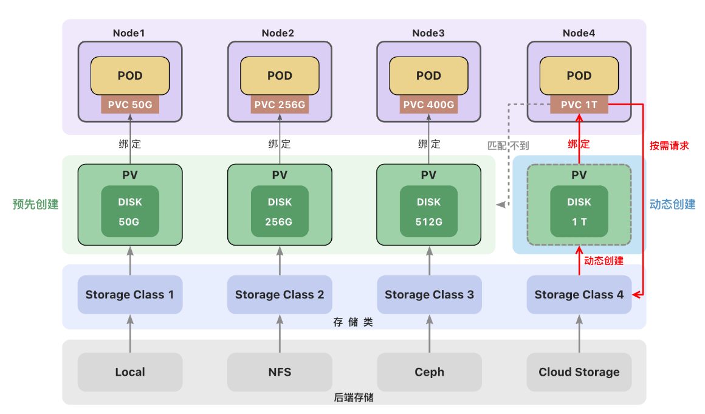

#Practical operation SC

##Knowledge

### 创建持久卷(PV)

- **静态创建**

- - 管理员预先手动创建
  - 手动创建麻烦、不够灵活（`local`卷不支持动态创建，必须手动创建PV）
  - 资源浪费（例如一个PVC可能匹配到比声明容量大的卷）
  - 对自动化工具不够友好

- **动态创建**

- - 根据用户请求按需创建持久卷，在用户请求时自动创建
  - 动态创建需要使用**存储类（StorageClass）**
  - 用户需要在持久卷声明(PVC)中指定存储类来自动创建声明中的卷。
  - 如果没有指定存储类，使用集群中默认的存储类。

### 存储类(StorageClass)

一个集群可以存在多个**存储类（StorageClass）**来创建和管理不同类型的存储。

每个 StorageClass 都有一个制备器（Provisioner），用来决定使用哪个卷插件创建持久卷。 该字段必须指定。



#### Local Path Provisioner

K3s自带了一个名为`local-path`的存储类(StorageClass)，它支持**动态创建**基于`hostPath`或`local`的持久卷。

创建PVC后，会自动创建PV，不需要再去手动的创建PV。

删除PVC，PV也会被自动删除。

```yaml
apiVersion: v1
kind: PersistentVolumeClaim
metadata:
  name: local-path-pvc
  namespace: default
spec:
  accessModes:
    - ReadWriteOnce
  storageClassName: local-path
  resources:
    requests:
      storage: 2Gi
---
apiVersion: v1
kind: Pod
metadata:
  name: mysql-pod
spec:
  containers:
    - name: mysql
      image: mysql:5.7
      env:
        - name: MYSQL_ROOT_PASSWORD
          value: "123456"
      ports:
        - containerPort: 3306
      volumeMounts:
        - mountPath: /var/lib/mysql #容器中的目录
          name: local-mysql-data
  volumes:
    - name: local-mysql-data
      persistentVolumeClaim:
        claimName: local-path-pvc
```

#### 卷绑定模式

**volumeBindingMode**用于控制什么时候动态创建卷和绑定卷。

- `Immediate`**立即创建**

​         创建PVC后，立即创建PV并完成绑定。

- `WaitForFirstConsumer` **延迟创建**

​         当使用该PVC的 Pod 被创建时，才会自动创建PV并完成绑定。

#### 回收策略（Reclaim Policy）

回收策略告诉集群，当用户删除PVC 对象时， 从PVC中释放出来的PV将被如何处理。

- **删除（Delete）**

如果没有指定，默认为`Delete`

当PVC被删除时，关联的PV 对象也会被自动删除。

- **保留（Retain）**

当 PVC 对象被删除时，PV 卷仍然存在，数据卷状态变为"已释放(`Released`)"。 

此时卷上仍保留有数据，该卷还不能用于其他PVC。需要手动删除PV。

## Practical operation

```powershell
[root@k8smaster k8s_work]# kubectl get sc
NAME            PROVISIONER                    RECLAIMPOLICY   VOLUMEBINDINGMODE   ALLOWVOLUMEEXPANSION   AGE
local-storage   kubernetes.io/no-provisioner   Delete          Immediate           false                  38m
[root@k8smaster k8s_work]# 

```


> 参考连接：https://www.yuque.com/wukong-zorrm/qdoy5p/syab24
>
> https://kubernetes.io/zh-cn/docs/concepts/storage/storage-classes/
>
> https://kubernetes.io/zh-cn/docs/concepts/storage/storage-classes/#volume-binding-mode
>
> https://rancher.com/docs/k3s/latest/en/storage/

