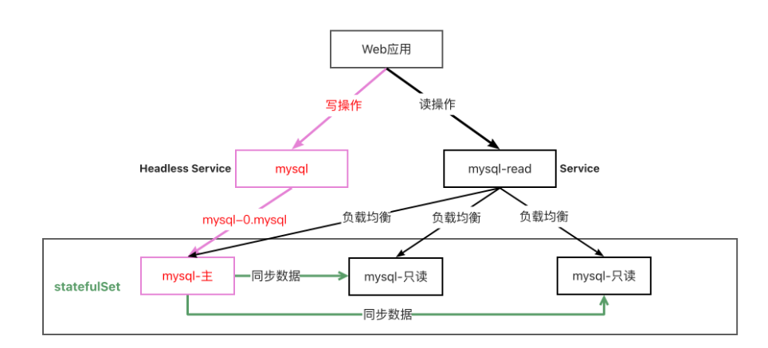
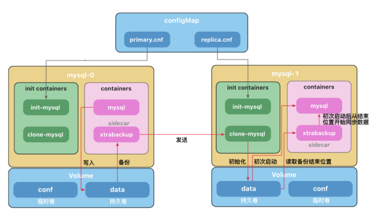

#Practical operation MySQL master-slave replication

##Knowledge

1.本例子配置比较复杂，仅用于讲解原理，无需掌握配置细节。

2.后面我们会讲使用helm自动化部署，用起来非常简单。

3.本例子不能用于生产，mysql的密码允许设置为空。

下面是部署一个读写分离Mysql数据库的示意图。

通过部署无头服务(Headless Service)将写操作指向固定的数据库。

部署一个Service用来做读操作的负载均衡。

数据库之间通过同步程序保持数据一致。



### Mysql主从复制

[运行一个有状态的应用程序](https://kubernetes.io/zh-cn/docs/tasks/run-application/run-replicated-stateful-application/)

------

**注意：**

1.官方的安装文档有错误，mysql镜像需要使用`mysql:5.7-debian`。否则会出现如下错误：


详见：https://github.com/kubernetes/website/pull/35857。

2.谷歌的镜像`gcr.io/google-samples/xtrabackup:1.0`访问不到，使用`ist0ne/xtrabackup:1.0`代替

```yaml
apiVersion: v1
kind: ConfigMap
metadata:
  name: mysql
  labels:
    app: mysql
    app.kubernetes.io/name: mysql
data:
  primary.cnf: |
    # 仅在主服务器上应用此配置
    [mysqld]
    log-bin    
  replica.cnf: |
    # 仅在副本服务器上应用此配置
    [mysqld]
    super-read-only  
---
# 为 StatefulSet 成员提供稳定的 DNS 表项的无头服务（Headless Service）
apiVersion: v1
kind: Service
metadata:
  name: mysql
  labels:
    app: mysql
    app.kubernetes.io/name: mysql
spec:
  ports:
  - name: mysql
    port: 3306
  clusterIP: None
  selector:
    app: mysql
---
# 用于连接到任一 MySQL 实例执行读操作的客户端服务
# 对于写操作，你必须连接到主服务器：mysql-0.mysql
apiVersion: v1
kind: Service
metadata:
  name: mysql-read
  labels:
    app: mysql
    app.kubernetes.io/name: mysql
    readonly: "true"
spec:
  ports:
  - name: mysql
    port: 3306
  selector:
    app: mysql
```

```yaml
apiVersion: apps/v1
kind: StatefulSet
metadata:
  name: mysql
spec:
  selector:
    matchLabels:
      app: mysql
      app.kubernetes.io/name: mysql
  serviceName: mysql
  replicas: 3
  template:
    metadata:
      labels:
        app: mysql
        app.kubernetes.io/name: mysql
    spec:
      initContainers:
      - name: init-mysql
        image: mysql:5.7-debian
        command:
        - bash
        - "-c"
        - |
          set -ex
          # 基于 Pod 序号生成 MySQL 服务器的 ID。
          [[ `hostname` =~ -([0-9]+)$ ]] || exit 1
          ordinal=${BASH_REMATCH[1]}
          echo [mysqld] > /mnt/conf.d/server-id.cnf
          # 添加偏移量以避免使用 server-id=0 这一保留值。
          echo server-id=$((100 + $ordinal)) >> /mnt/conf.d/server-id.cnf
          # 将合适的 conf.d 文件从 config-map 复制到 emptyDir。
          if [[ $ordinal -eq 0 ]]; then
            cp /mnt/config-map/primary.cnf /mnt/conf.d/
          else
            cp /mnt/config-map/replica.cnf /mnt/conf.d/
          fi          
        volumeMounts:
        - name: conf
          mountPath: /mnt/conf.d
        - name: config-map
          mountPath: /mnt/config-map
      - name: clone-mysql
        image: ist0ne/xtrabackup:1.0
        command:
        - bash
        - "-c"
        - |
          set -ex
          # 如果已有数据，则跳过克隆。
          [[ -d /var/lib/mysql/mysql ]] && exit 0
          # 跳过主实例（序号索引 0）的克隆。
          [[ `hostname` =~ -([0-9]+)$ ]] || exit 1
          ordinal=${BASH_REMATCH[1]}
          [[ $ordinal -eq 0 ]] && exit 0
          # 从原来的对等节点克隆数据。
          ncat --recv-only mysql-$(($ordinal-1)).mysql 3307 | xbstream -x -C /var/lib/mysql
          # 准备备份。
          xtrabackup --prepare --target-dir=/var/lib/mysql          
        volumeMounts:
        - name: data
          mountPath: /var/lib/mysql
          subPath: mysql
        - name: conf
          mountPath: /etc/mysql/conf.d
      containers:
      - name: mysql
        image: mysql:5.7-debian
        env:
        - name: MYSQL_ALLOW_EMPTY_PASSWORD
          value: "1"
        ports:
        - name: mysql
          containerPort: 3306
        volumeMounts:
        - name: data
          mountPath: /var/lib/mysql
          subPath: mysql
        - name: conf
          mountPath: /etc/mysql/conf.d
        resources:
          requests:
            cpu: 500m
            memory: 1Gi
        livenessProbe:
          exec:
            command: ["mysqladmin", "ping"]
          initialDelaySeconds: 30
          periodSeconds: 10
          timeoutSeconds: 5
        readinessProbe:
          exec:
            # 检查我们是否可以通过 TCP 执行查询（skip-networking 是关闭的）。
            command: ["mysql", "-h", "127.0.0.1", "-e", "SELECT 1"]
          initialDelaySeconds: 5
          periodSeconds: 2
          timeoutSeconds: 1
      - name: xtrabackup
        image: ist0ne/xtrabackup:1.0
        ports:
        - name: xtrabackup
          containerPort: 3307
        command:
        - bash
        - "-c"
        - |
          set -ex
          cd /var/lib/mysql

          # 确定克隆数据的 binlog 位置（如果有的话）。
          if [[ -f xtrabackup_slave_info && "x$(<xtrabackup_slave_info)" != "x" ]]; then
            # XtraBackup 已经生成了部分的 “CHANGE MASTER TO” 查询
            # 因为我们从一个现有副本进行克隆。(需要删除末尾的分号!)
            cat xtrabackup_slave_info | sed -E 's/;$//g' > change_master_to.sql.in
            # 在这里要忽略 xtrabackup_binlog_info （它是没用的）。
            rm -f xtrabackup_slave_info xtrabackup_binlog_info
          elif [[ -f xtrabackup_binlog_info ]]; then
            # 我们直接从主实例进行克隆。解析 binlog 位置。
            [[ `cat xtrabackup_binlog_info` =~ ^(.*?)[[:space:]]+(.*?)$ ]] || exit 1
            rm -f xtrabackup_binlog_info xtrabackup_slave_info
            echo "CHANGE MASTER TO MASTER_LOG_FILE='${BASH_REMATCH[1]}',\
                  MASTER_LOG_POS=${BASH_REMATCH[2]}" > change_master_to.sql.in
          fi

          # 检查我们是否需要通过启动复制来完成克隆。
          if [[ -f change_master_to.sql.in ]]; then
            echo "Waiting for mysqld to be ready (accepting connections)"
            until mysql -h 127.0.0.1 -e "SELECT 1"; do sleep 1; done

            echo "Initializing replication from clone position"
            mysql -h 127.0.0.1 \
                  -e "$(<change_master_to.sql.in), \
                          MASTER_HOST='mysql-0.mysql', \
                          MASTER_USER='root', \
                          MASTER_PASSWORD='', \
                          MASTER_CONNECT_RETRY=10; \
                        START SLAVE;" || exit 1
            # 如果容器重新启动，最多尝试一次。
            mv change_master_to.sql.in change_master_to.sql.orig
          fi

          # 当对等点请求时，启动服务器发送备份。
          exec ncat --listen --keep-open --send-only --max-conns=1 3307 -c \
            "xtrabackup --backup --slave-info --stream=xbstream --host=127.0.0.1 --user=root"          
        volumeMounts:
        - name: data
          mountPath: /var/lib/mysql
          subPath: mysql
        - name: conf
          mountPath: /etc/mysql/conf.d
        resources:
          requests:
            cpu: 100m
            memory: 100Mi
      volumes:
      - name: conf
        emptyDir: {}
      - name: config-map
        configMap:
          name: mysql
  volumeClaimTemplates:
  - metadata:
      name: data
    spec:
      accessModes: ["ReadWriteOnce"]
      resources:
        requests:
          storage: 2Gi
```



#### 初始化容器(Init Containers)

初始化容器(Init Containers)是一种特殊容器，它在 [Pod](https://kubernetes.io/zh-cn/docs/concepts/workloads/pods/) 内的应用容器启动之前运行。

初始化容器未执行完毕或以错误状态退出，Pod内的应用容器不会启动。

初始化容器需要在`initContainers`中定义，与`containers`同级。

基于上面的特性，初始化容器通常用于

- 生成配置文件 
- 执行初始化命令或脚本 
- 执行健康检查（检查依赖的服务是否处于Ready或健康Health的状态）

在本例子中，有两个初始化容器。

- `init-mysql`为MySQL实例分配`server-id`,并将`mysql-0`的配置文件设置为`primary.cnf`,其他副本设置为`replica.cnf`
- `clone-mysql`从前一个`Pod`中获取备份的数据文件放到自己的数据目录下

#### 边车Sidecar

Pod中运行了2个容器，MySQL 容器和一个充当辅助工具的 xtrabackup 容器，我们称之为边车(sidecar)。

Xtrabackup是一个开源的MySQL备份工具，支持在线热备份（备份时不影响数据读写），是目前各个云厂商普遍使用的MySQL备份工具。


`sidecar`容器负责将备份的数据文件发送给下一个`Pod`，并在副本服务器初次启动时，使用数据文件完成数据的导入。

MySQL使用`bin-log`同步数据，但是，当数据库运行一段时间后，产生了一些数据，这时候如果我们进行扩容，创建了一个新的副本，有可能追溯不到`bin-log`的源头(可能被手动清理或者过期自动删除)，因此需要将现有的数据导入到副本之后，再开启数据同步，`sidecar`只负责数据库初次启动时完成历史数据导入，后续的数据MySQL会自动同步。

## 客户端连接

### 写操作

写操作连接`mysql-0.mysql`

```bash
kubectl run mysql-client --image=mysql:5.7 -it --rm \
                         -- mysql -h mysql-0.mysql
CREATE DATABASE test;
CREATE TABLE test.messages (message VARCHAR(250));
INSERT INTO test.messages VALUES ('hello');
```

### 读操作

读操作连接到`mysql-read`，它是一个`service`，会自动将请求负载均衡到后端的三个`mysql`实例上。

```shell
kubectl run mysql-client --image=mysql:5.7 -it --rm \
                         -- mysql -h mysql-read
                         
SELECT * FROM test.messages                  
```


##Practical operation

```powershell

```


> Link: https://www.yuque.com/wukong-zorrm/qdoy5p/wxz37h
>
> https://kubernetes.io/zh-cn/docs/concepts/workloads/pods/init-containers/
>
> https://kubernetes.io/zh-cn/docs/tasks/run-application/run-replicated-stateful-application/
>
> [深入理解StatefulSet:有状态应用实践](https://learn.archervanderwaal.com/13-深入剖析Kubernetes/05-容器编排与Kubernetes作业管理 (15讲)/20丨深入理解StatefulSet（三）：有状态应用实践.html)

