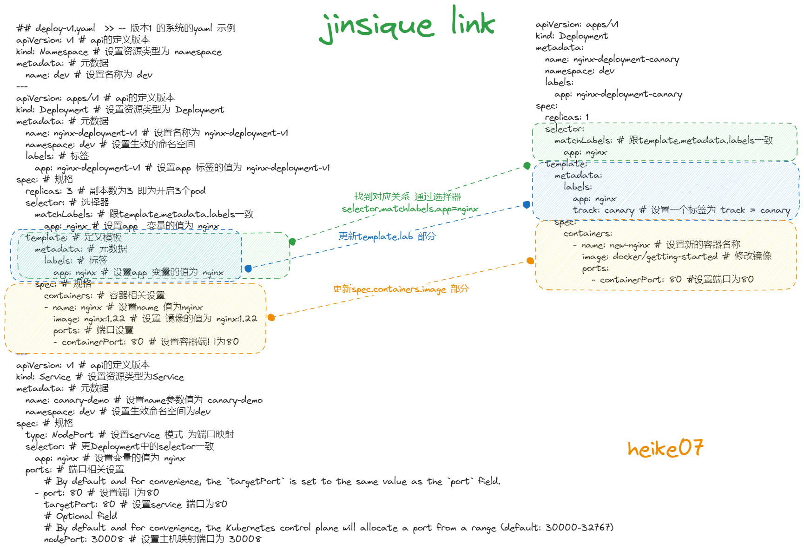

# deploy-v1.yaml

```powershell
## deploy-v1.yaml  >> -- 版本1 的系统的yaml 示例
apiVersion: v1 # api的定义版本
kind: Namespace # 设置资源类型为 namespace
metadata: # 元数据
  name: dev # 设置名称为 dev
---
apiVersion: apps/v1 # api的定义版本
kind: Deployment # 设置资源类型为 Deployment
metadata: # 元数据
  name: nginx-deployment-v1 # 设置名称为 nginx-deployment-v1
  namespace: dev # 设置生效的命名空间
  labels: # 标签
    app: nginx-deployment-v1 # 设置app 标签的值为 nginx-deployment-v1
spec: # 规格
  replicas: 3 # 副本数为3 即为开启3个pod
  selector: # 选择器
    matchLabels: # 跟template.metadata.labels一致
      app: nginx # 设置app  变量的值为 nginx
  template: # 定义模板
    metadata: # 元数据
      labels: # 标签
        app: nginx # 设置app 变量的值为 nginx
    spec: # 规格
      containers: # 容器相关设置
      - name: nginx # 设置name 值为nginx
        image: nginx:1.22 # 设置 镜像的值为 nginx:1.22
        ports: # 端口设置
        - containerPort: 80 # 设置容器端口为80
---
apiVersion: v1 # api的定义版本
kind: Service # 设置资源类型为Service
metadata: # 元数据
  name: canary-demo # 设置name参数值为 canary-demo
  namespace: dev # 设置生效命名空间为dev
spec: # 规格
  type: NodePort # 设置service 模式 为端口映射
  selector: # 更Deployment中的selector一致
    app: nginx # 设置变量的值为 nginx
  ports: # 端口相关设置
      # By default and for convenience, the `targetPort` is set to the same value as the `port` field.
    - port: 80 # 设置端口为80
      targetPort: 80 # 设置service 端口为80
      # Optional field
      # By default and for convenience, the Kubernetes control plane will allocate a port from a range (default: 30000-32767)
      nodePort: 30008 # 设置主机映射端口为 30008
```

这是一个Kubernetes的YAML示例文件，用于创建一个版本1的系统，包括一个命名空间（Namespace）、一个部署（Deployment）以及一个服务（Service）。让我对这个YAML文件的内容进行解释：

1. **Namespace 定义**：首先定义了一个命名空间（Namespace），名称为 "dev"。命名空间用于隔离和组织Kubernetes资源。
2. **Deployment 定义**：接下来定义了一个部署（Deployment）资源，名称为 "nginx-deployment-v1"，位于 "dev" 命名空间中。这个部署用于管理 nginx 容器的副本。以下是一些关键的属性：
   - `replicas`: 部署中的副本数量，这里设置为 3 个。
   - `selector`: 用于选择要管理的 Pod 的标签。它与模板中的标签匹配。
   - `template`: 定义了 Pod 模板，其中包含了容器的定义。这里使用了名为 "nginx" 的容器，并使用了 nginx:1.22 镜像，监听80端口。
3. **Service 定义**：最后定义了一个服务（Service）资源，名称为 "canary-demo"，也位于 "dev" 命名空间中。这个服务用于公开 Deployment 中的 nginx Pod。以下是一些关键的属性：
   - `type`: 服务类型，这里设置为 NodePort，允许外部访问服务。
   - `selector`: 用于选择要路由流量到的 Pod 的标签，与 Deployment 中的标签匹配。
   - `ports`: 指定服务端口以及目标端口。这里将服务端口和目标端口都设置为80，这意味着流量将从服务的80端口路由到 Pod 的80端口。另外，还设置了 `nodePort`，这是 NodePort 服务类型的节点端口，可以通过该端口访问服务。

通过这个YAML文件，你可以部署一个名为 "nginx-deployment-v1" 的副本集，它将在 "dev" 命名空间中运行，可以通过 NodePort 30008 访问。这个副本集中的 Pod 使用 nginx:1.22 镜像，并监听80端口。

# deploy-canary.yaml

```powershell
apiVersion: apps/v1
kind: Deployment
metadata:
  name: nginx-deployment-canary
  namespace: dev
  labels:
    app: nginx-deployment-canary
spec:
  replicas: 1
  selector:
    matchLabels: # 跟template.metadata.labels一致
      app: nginx
  template:
    metadata:
      labels:
        app: nginx
        track: canary # 设置一个标签为 track = canary
    spec:
      containers:
        - name: new-nginx # 设置新的容器名称
          image: docker/getting-started # 修改镜像
          ports:
            - containerPort: 80 #设置端口为80
```

这是一个Kubernetes的YAML示例文件，用于创建一个版本1的系统，包括一个命名空间（Namespace）、一个部署（Deployment）以及一个服务（Service）。让我对这个YAML文件的内容进行解释：

1. **Namespace 定义**：首先定义了一个命名空间（Namespace），名称为 "dev"。命名空间用于隔离和组织Kubernetes资源。
2. **Deployment 定义**：接下来定义了一个部署（Deployment）资源，名称为 "nginx-deployment-v1"，位于 "dev" 命名空间中。这个部署用于管理 nginx 容器的副本。以下是一些关键的属性：
   - `replicas`: 部署中的副本数量，这里设置为 3 个。
   - `selector`: 用于选择要管理的 Pod 的标签。它与模板中的标签匹配。
   - `template`: 定义了 Pod 模板，其中包含了容器的定义。这里使用了名为 "nginx" 的容器，并使用了 nginx:1.22 镜像，监听80端口。
3. **Service 定义**：最后定义了一个服务（Service）资源，名称为 "canary-demo"，也位于 "dev" 命名空间中。这个服务用于公开 Deployment 中的 nginx Pod。以下是一些关键的属性：
   - `type`: 服务类型，这里设置为 NodePort，允许外部访问服务。
   - `selector`: 用于选择要路由流量到的 Pod 的标签，与 Deployment 中的标签匹配。
   - `ports`: 指定服务端口以及目标端口。这里将服务端口和目标端口都设置为80，这意味着流量将从服务的80端口路由到 Pod 的80端口。另外，还设置了 `nodePort`，这是 NodePort 服务类型的节点端口，可以通过该端口访问服务。

通过这个YAML文件，你可以部署一个名为 "nginx-deployment-v1" 的副本集，它将在 "dev" 命名空间中运行，可以通过 NodePort 30008 访问。这个副本集中的 Pod 使用 nginx:1.22 镜像，并监听80端口。

# link

